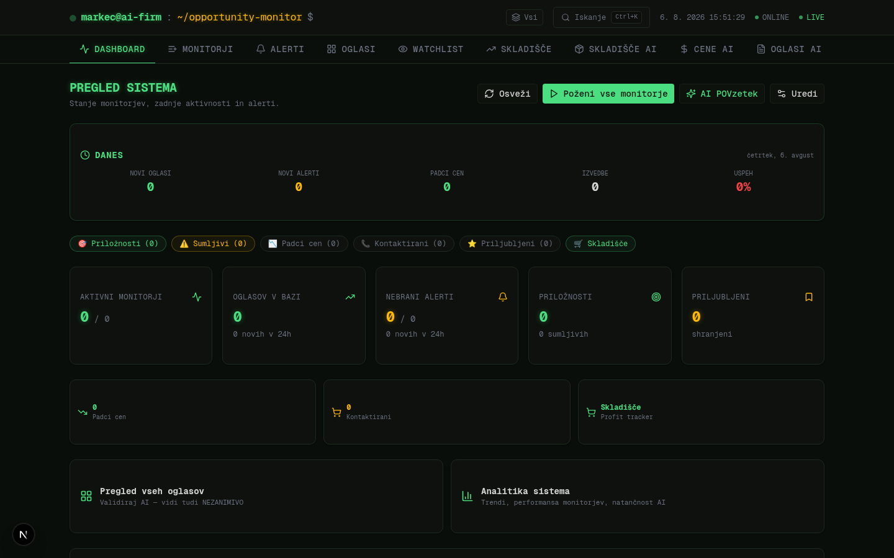

# Markec AI Firm — AI Trading Firm za slovenske oglase

[](./CHANGELOG.md)
[](./LICENSE)
[](https://github.com/markec12345678/markecaifirm/stargazers)
[](./AI_ENDPOINTS.md)
[](#)
[](https://nextjs.org/)
[](https://www.typescriptlang.org/)
[](#)
[](#)
[](#)
[](https://www.prisma.io/)
[](#-local-first--zero-cloud)
[](./CONTRIBUTING.md)

<div align="center">
  
  <p><em>Glavni dashboard z 17 zavihki, AI insights, real-time alerti in profit pipeline</em></p>
</div>

> **AI-powered trading firm** za Bolha, Facebook Marketplace, Vinted, Avtonet, mobile.de, Kleinanzeigen, Subito in Willhaben.
> **325 AI endpointov** + **67 analytics** + **10 cron automatizacij** + **11 Telegram ukazov** za iskanje, ocenjevanje, kupovanje in preprodajo.
> **Local-first** — vsi podatki ostanejo na tvojem računalniku. **Zero-cloud**. **0 vulnerabilities**. **37 tests**.

---

## 📑 Kazalo

- [Overview](#-overview)
- [Ključne funkcije](#-ključne-funkcije)
- [Tehnologija](#-tehnologija)
- [Hitri začetek](#-hitri-začetek)
- [AI provider konfiguracija](#-ai-provider-konfiguracija)
- [AI funkcije po kategorijah](#-ai-funkcije-po-kategorijah)
- [Local-first & Zero-cloud](#-local-first--zero-cloud)
- [Notifikacije](#-notifikacije)
- [Anti-detection](#-anti-detection)
- [API dokumentacija](#-api-dokumentacija)
- [Development](#-development)
- [Roadmap](#-roadmap)
- [Contributing](#-contributing)
- [License](#-license)
- [Changelog](#-changelog)

---

## 🎯 Overview

**Markec AI Firm** je celovit AI sistem za avtomatizirano iskanje, ocenjevanje, kupovanje in preprodajo
oglasev na slovenskih (in srednjeevropskih) oglasnih platformah. Aplikacija teče lokalno na tvojem
računalniku — brez cloud storitev, brez mesečnih naročnin, brez deljenja podatkov z zunanjimi strežniki.

### Čisto v eni povedi
Lovi podcenjene oglase na Bolhi/Facebooku/Vintedu z AI, jih kupi poceni, preprodaj drago z
AI-optimiziranimi oglasi, in avtomatiziraj celoten workflow od odkritja do prodaje.

### Verzija v7.86.0 (avgust 2026)

**325 AI endpointov** + **67 analytics** + **10 cron automatizacij** + **11 Telegram ukazov** + **~183 funkcij** organiziranih v 7 kategorij:
- **Statistike** (analytics, predictions, forecasting) — 35+ funkcij
- **Skladišče** (inventory management, aging, depreciation) — 20+ funkcij
- **Oglasi** (listing optimization, SEO, image analysis) — 25+ funkcij
- **Negotiation** (real-time bot, chatbot, playbook) — 8+ funkcij
- **Buyers/Customers** (segmentation, trust score, matching) — 12+ funkcij
- **Risk/Insurance** (hedging, fraud detection, claims) — 10+ funkcij
- **Finance/Profit** (margin, ROI, compounding, tax) — 16+ funkcij

### Kaj je novega v v7.56–v7.86 (31 verzij, 93 novih funkcij)

**v7.86 — AI Price Volatility Analyzer & AI Inventory Performance Forecaster & Deal Source Quality Tracker (3 funkcije):**
- **AI Price Volatility Analyzer** — AI analizira PRICE VOLATILITY (nihanje cen) čez kategorije zadnjih 90 dni z coefficient of variation (stddev / mean × 100 tedenskih povprečnih cen). Identificira high-volatility (risky but profitable) vs low-volatility (safe but lower profit) kategorije. "Elektronika: HIGH volatility (22%), AGGRESSIVE. Buy low, sell quick. Avto: VERY_LOW (3%), hold longer." categories: per category (iz monitor.source) — priceVolatility (% coefficient of variation), volatilityLevel (VERY_HIGH >30%/HIGH 20-30%/MODERATE 10-20%/LOW 5-10%/VERY_LOW <5%), riskProfile (AGGRESSIVE/BALANCED/CONSERVATIVE iz volatilityLevel), priceRange { min, max } (90d), priceChangePercent (% od first week do last week), priceDropFrequency (% listings z priceDroppedAt set), weeklyAvgPrices (13 weeks array, gap-fill z previous week), listingCount, tradingStrategy (slovenski max 250 chars — HIGH_VOL kupuj nizko/prodaj hitro/watch for dips, LOW_VOL drži dlje/stabilne marže), arbitragePotential (0-100 iz volScore 60% + dropScore 40%). analysis: volatilityAssessment (slovenski povzetek max 500 chars), bestVolatilityCategories (2-3 z optimal risk/reward — MODERATE/LOW volatilnost z visokim arbitragePotential), worstVolatilityCategories (2-3 z VERY_HIGH ali VERY_LOW volatilnostjo — preveč tveganje ali premajhna profit priložnost), riskMitigationActions (3-4 z action/priority HIGH/MEDIUM/LOW/detail). Compute: query listings zadnjih 90 dni z price/firstSeenAt/priceDroppedAt/monitor.source, group by category (monitor.source) × week (13 weeks), compute weeklyAvgPrices, coefficient of variation per category, classify volatilityLevel + riskProfile, build deterministic analysis z best/worst/actions. AI-enhanced z grounding (top 8 categories by listing count) + anti-hallucination (categoriesPatch: tradingStrategy max 250 chars + arbitragePotential ±20 od deterministic in clamped [0, 100]; volatilityAssessment max 500 chars; best/worstVolatilityCategories reasoning max 250 chars; riskMitigationActions action max 200/detail max 250; max lengths) + 6h cache (key `price-volatility-analyzer:${currentMonth}`) + deterministic fallback (compute iz coefficientOfVariation + thresholds). GET+POST (AI Hub runner kompatibilnost). Razlika od market-trend-momentum (v7.73 ki gleda ACCELERATION cen) — ta meri VOLATILITY (stddev cen) in classification VERY_HIGH..VERY_LOW. Razlika od market-trend (rising/falling prices) — ta gleda MAGNITUDE nihanja ne smer. Razlika od market-trend-forecaster-pro (v7.78 AI ki forecast-a future trend) — ta analizira HISTORICAL volatility in risk profile per category. Razlika od deal-quality-trend-analyzer (v7.83 pure DB ki analizira quality trends) — ta gleda CENOVNO volatilnost ne quality. Razlika od price-elasticity (ki meri kako demand odgovarja na ceno) — ta meri kako cene NIHajo čez čas. Razlika od price-history-forecaster (v7.83 ki forecast-a future cene) — ta meri HISTORICAL volatility coefficient of variation.
- **AI Inventory Performance Forecaster** — AI napove PORTFOLIO-level PERFORMANCE celotnega inventarja za naslednje 30/60/90 dni — projected profit, turnover, capital efficiency. Razlika od individual item forecasters (ki napovedujejo posamezne item-e) — ta je PORTFOLIO-level prediction. "Inventory: 8 items, 2400€ invested, estValue 3100€. 30d forecast: +450€ profit. Grade: B. Action: sell 2 aging items → grade A." inventory: totalItems, totalInvested (sum buyPrice), totalEstValue (sum aiEstimatedValue ali buyPrice fallback), categoryDistribution (array { category, percentage }), avgDealScore (avg dealScore čez held items z listing.dealScore), avgDaysHeld (avg age of inventory). historical: avgProfitPerItem (iz SOLD trades zadnjih 12m), avgHoldDays (avg daysBetween buyDate/sellDate), avgROI (%), sellRatePerWeek (items sold per week). forecast: projectedProfit30d/60d/90d (sellRate × weeks × avgProfitPerItem, clamped [0, totalEstValue × 0.5 / ×0.9 / ×1.2]), projectedSellRate30d (items/week, dealScoreBoost 0.7-1.2x), projectedCapitalEfficiency (% projected ROI = projectedProfit90d / totalInvested × 100 + avgROI × 0.5), projectedTurnoverRate (turns/year = projectedSellRate30d × 52 / totalItems), confidenceLevel (0-100 iz 6 dejavnikov: historical data sample + inventory size + avgDealScore - aged inventory), projectedPerformanceGrade (A+ do F iz weighted composite score: 30% capital efficiency + 25% turnover + 20% dealScore + 15% profit rel. + 10% confidence). analysis: performanceFactors (3-5 z factor/impact POSITIVE|NEGATIVE/weight 0-100/detail), performanceRisks (2-4 z risk/severity LOW|MEDIUM|HIGH/mitigation), performanceActions (3-5 z action/priority HIGH|MEDIUM/LOW/expectedImpact). Compute: query HELD trades z linked Listing (za aiEstimatedValue + dealScore) + SOLD trades zadnjih 12m za historical baseline (avgProfitPerItem/avgHoldDays/avgROI/sellRatePerWeek), compute inventory composition + historical baseline, build deterministic forecast z projected profit/turnover/grade. AI-enhanced z grounding (inventory + historical + deterministicForecast + profitCaps) + anti-hallucination (projectedProfit30d/60d/90d ±20% od deterministic in clamped [0, profitCap × 0.5/0.9/1.2]; projectedSellRate30d ±30% in clamped [0, 20]; projectedCapitalEfficiency ±10 in clamped [-30, 100]; projectedTurnoverRate ±2 in clamped [0, 30]; confidenceLevel ±15 in clamped [0, 100]; projectedPerformanceGrade validirana proti enum A+/A/B/C/D/F; max lengths na opisih — factor 100/detail 250, risk 100/mitigation 250, action 200/expectedImpact 200, summary 400) + 6h cache (key `inventory-performance-forecaster:${JSON.stringify(sorted heldItemIds)}`) + deterministic fallback (compute iz historical avg × current inventory). GET+POST (AI Hub runner kompatibilnost). Razlika od inventory-profit-maximizer (ki optimira profit za posamezne item-e) — ta forecast-a PORTFOLIO-level profit 30/60/90 dni. Razlika od inventory-value-tracker (v7.81 ki track-a current value) — ta napove FUTURE performance z projectedProfit in grade. Razlika od inventory-value-predictor (v7.73 ki predict-a future value) — ta gleda PERFORMANCE (profit + sell rate + capital efficiency) ne samo value. Razlika od inventory-aging-predictor-pro (v7.83 ki predict-a aging risk) — ta forecast-a PROFIT/turnover/capital efficiency ne aging. Razlika od profit-margin-forecaster-pro (v7.85 ki forecast-a margin) — ta gleda PORTFOLIO profit v EUR + performance grade ne margin %. Razlika od trade-performance-forecaster (ki forecast-a trade performance) — ta je INVENTORY-focused z current inventory composition.
- **Deal Source Quality Tracker** — tracks DEAL QUALITY per source over time — avg dealScore, prilika rate, aiRisk trends per source. Razlika od deal-source-performance-tracker (v7.85 ki track-a profit/ROI) — ta track-a QUALITY metrics (dealScore, aiScore, aiRisk, prilikaRate). "Bolha: quality 78/100 (IMPROVING, +1.2/mo). Vinted: 62/100 (STABLE). Best month: Jul (85). Rank: #1." sources: per source (iz listing.monitor.source) — currentMonth { avgDealScore, avgAiScore, avgAiRisk, prilikaRate (% listings z aiVerdict='PRILIKA'), qualityScore (0-100 composite: dealScore 40% + aiScore 20% + aiRisk inverse 20% + prilikaRate 20%) }, trends { dealScoreTrend12m (linear regression slope), qualityTrend (IMPROVING/STABLE/DECLINING iz quality slope ±0.5), qualityVolatility (stddev monthly quality scores), qualityConsistency (0-100, višja = bolj konsistenten) }, qualityScorecard { currentQualityScore, avgQualityScore12m, bestQualityMonth/worstQualityMonth { month, score }, qualityRank (1 = best, sort by currentQualityScore desc) }, monthlyData [{ month (YYYY-MM), avgDealScore, avgAiScore, avgAiRisk, prilikaRate, qualityScore }] (12 months). summary: totalSources, avgQualityAcrossSources, bestQualitySource, worstQualitySource, improvingSources, decliningSources, advice (slovenski povzetek z diversifikacijo/fokus priporočili). Compute: query SOLD trades zadnjih 12 mesecev z linked Listing (za monitor.source/dealScore/aiScore/aiRisk/aiVerdict), group by source AND month, compute monthly quality metrics, linear regression slope za dealScore in quality scores, classify qualityTrend, compute quality volatility/consistency, rank by currentQualityScore desc. Pure DB analytics — NO AI. Razlika od source-quality (v7.43 ki da CURRENT snapshot quality per monitor) — ta track-a QUALITY TRENDS čez 12 mesecev z monthly aggregation in quality scorecard 0-100. Razlika od deal-source-roi (ki meri ROI per source) — ta meri QUALITY ne profit. Razlika od deal-source-comparison-matrix (v7.70 ki primerja trenutne atribute) — ta gleda TIME-SERIES quality trende. Razlika od deal-source-intelligence (v7.82 AI ki da intelligence) — ta je pure DB HISTORICAL quality tracking. Razlika od deal-quality-trend-analyzer (v7.83 ki analizira quality trend overall) — ta track-a quality PER SOURCE z rank-om. Razlika od deal-quality-distribution (ki da quality distribution) — ta gleda SOURCE × quality over time.

**v7.85 — AI Profit Margin Forecaster Pro & Inventory Turnover Accelerator Pro & Deal Source Performance Tracker (3 funkcije):**
- **AI Profit Margin Forecaster Pro** — AI-powered PRO verzija ki forecast-a profit marže 30/60/90 dni naprej z SCENARIO analizo (BEST/BASE/WORST case marže) in confidence intervalsi. "Margin: 22% → base 20% v 30d, best 25%, worst 15%. Risk: cost increases. Action: negotiate lower prices." current: currentMargin (avg profit/revenue × 100 zadnjih 30 dni), avgMargin3m, avgMargin12m, marginVolatility (stddev monthly margins), marginTrend (linear regression slope). influencers: priceTrend (UP/FLAT/DOWN + impact), costTrend, feeTrend, categoryMixShift. forecast: baseCase { margin30d/60d/90d } (currentMargin + trend × 1/2/3, clamped [-50, 100]), bestCase (base + volatility), worstCase (base - volatility), confidenceInterval { low, high } (base ± 0.7 stddev za 30d), scenarioProbability { base, best, worst } (vsota 100, trend-weighted), projectedMarginTrend (IMPROVING/STABLE/DECLINING iz marginTrend ±0.5). analysis: keyMarginDrivers (3 z driver/impact POSITIVE|NEGATIVE/weight 0-100/detail), marginRiskFactors (2-4 z risk/severity LOW|MEDIUM|HIGH/mitigation), marginProtectionActions (3-4 z action/priority HIGH|MEDIUM|LOW/expectedMarginLift 0-15 percentage points). Compute: query SOLD trades zadnjih 12 mesecev, monthly aggregation (invested/profit/tradeCount/avgSellPrice/avgBuyPrice/avgFeePct/categorySet), linear regression slope za margin/price/cost/fee, influencers iz slopes, deterministic forecast z base/best/worst scenariji. AI-enhanced z grounding + anti-hallucination (baseCase ±10 od deterministic, bestCase ±5 in ≥ baseCase, worstCase ±5 in ≤ baseCase, confidenceInterval ±5 in low ≤ high, scenarioProbability ±15 in renormalize na 100, projectedMarginTrend validirana proti enum, expectedMarginLift clamped [0, 15], max lengths na opisih) + 6h cache (key `profit-margin-forecaster-pro:${currentMonth}`) + deterministic fallback (compute iz marginTrend + volatility). GET+POST (AI Hub runner kompatibilnost). Razlika od profit-margin-forecaster (basic ki da single margin forecast) — ta PRO verzija da SCENARIO-based margin forecasting z confidence intervals in scenarioProbability weights. Razlika od profit-margin-optimizer-v2 (ki optimira margin) — ta FORECAST-a future marže z base/best/worst scenariji. Razlika od profit-margin-trend-analyzer (v7.82 pure DB ki analizira historical margin trend) — ta je AI PRO ki forecast-a FUTURE margin z scenariji. Razlika od profit-margin-heatmap (ki prikaže category × price matrix) — ta projicira dinamične margin scenarije 30/60/90 dni. Razlika od profit-margin-predictor (basic ki da single margin prediction) — ta da scenario-based forecast z keyMarginDrivers in marginRiskFactors.
- **Inventory Turnover Accelerator Pro** — AI-powered PRO verzija ki identificira SPECIFIČNE akcije za pospešitev inventory turnover-a — ne samo "turn faster" ampak natančno kateri item-i, kakšno akcijo in pričakovane dni prihranjene. "PS5: 28d held, avg 22d → PRICE_DROP_5%, save 7d, sell by Sep 5. Priority: HIGH." items: per HELD item — tradeId, title, category, buyPrice, daysHeld, categoryAvgHoldDays (iz SOLD trades historical hold times per category), turnoverRiskScore 0-100 (computeTurnoverRiskScore iz ratio daysHeld vs categoryAvg — <0.5x LOW 0-30, 1x MEDIUM 30-60, 2x HIGH 60-80, 3x+ CRITICAL 80-100), accelerationPotential 0-100 (roomScore 0-50 + riskComponent 0-50), recommendedAction (PRICE_DROP_5% / PRICE_DROP_10% / PRICE_DROP_15% / RELIST_FRESH / CROSS_POST / BUNDLE / LIQUIDATE / HOLD — iz ratio thresholds), expectedDaysSaved (clamp [0, 60]), newTargetPrice (samo za PRICE_DROP_*/LIQUIDATE, clamped [0.5x, 1.2x] buyPrice, drugače null), expectedSellDate (ISO v prihodnosti), actionPriority (URGENT/HIGH/MEDIUM/LOW), reasoning (slovenski opis max 250 znakov). portfolio: currentAvgTurnoverDays (avg daysHeld čez items), projectedTurnoverWithActions (currentAvg - totalDaysSaved/items), totalDaysSaved (sum expectedDaysSaved), accelerationROI (EUR dodatnega profita iz hitrejšega turnover-ja), urgencyLevel (LOW/MEDIUM/HIGH/CRITICAL iz % URGENT/HIGH item-ov). Compute: query HELD trades z id/title/category/buyPrice/buyDate, query SOLD trades zadnjih 12 mesecev za historical hold times per category (computeCategoryAvgHoldDays — avg daysBetween(buyDate, sellDate) per category), compute per-item deterministic plan (turnoverRiskScore, accelerationPotential, recommendedAction, daysSaved, newTargetPrice, expectedSellDate, priority), portfolio summary. AI-enhanced z grounding (top 50 item-ov by risk) + anti-hallucination (recommendedAction validirana proti enum, expectedDaysSaved ±10 od deterministic in clamped [0, 60], newTargetPrice clamped [0.5x, 1.2x] buyPrice, expectedSellDate validiran v prihodnost, actionPriority validirana proti enum, reasoning max 250 chars, portfolio currentAvgTurnoverDays ±5, projectedTurnoverWithActions ±5, totalDaysSaved = sum clamped items, accelerationROI ±200 in clamped [0, 10000], urgencyLevel validirana proti enum) + 6h cache (key `inventory-turnover-accelerator-pro:${JSON.stringify(sorted heldItemIds)}`) + deterministic fallback (compute iz daysHeld vs categoryAvg ratio thresholds). GET+POST (AI Hub runner kompatibilnost). Razlika od inventory-turnover-accelerator (basic ki da general advice) — ta PRO verzija da PER-ITEM acceleration plan z recommendedAction, expectedDaysSaved in newTargetPrice. Razlika od inventory-turnover-optimizer (ki optimira turnover strategijo) — ta je PREDICTOR ki za vsak HELD item predlaga konkretne akcije. Razlika od inventory-turnover-predictor (ki napove future turnover) — ta je ACTION-oriented z per-item plan. Razlika od inventory-turnover-forecast (v7.78 ki forecast-a portfolio turnover) — ta je per-item accelerator z accelerationPotential in actionPriority. Razlika od inventory-aging-predictor-pro (v7.83 ki predict-a aging risk) — ta je ACTION-oriented z konkretnimi akcijami (PRICE_DROP/RELIST/CROSS_POST/BUNDLE/LIQUIDATE).
- **Deal Source Performance Tracker** — tracks performance metrics of each deal source over time — monthly ROI, win rate, trade volume trends, in performance scorecard. Pure DB analytics — NO AI. "Bolha: performance 82/100 (IMPROVING, ROI +2%/mo). Vinted: 58/100 (DECLINING). Best month: Jul (1200€)." sources: per source (iz listing.monitor.source) — currentMonth { profit, roi, winRate, volume, avgDealScore } (current month or last available), trends { profitTrend12m (linear regression slope €/mo), roiTrend12m (%/mo), volumeTrend12m (trades/mo), winRateTrend12m (%/mo), performanceDirection (IMPROVING/STABLE/DECLINING iz compositeTrend ±0.1) }, performanceScore 0-100 (30% ROI trend + 25% profit trend + 20% volume trend + 15% win rate trend + 10% consistency), performanceRank (1 = best), monthlyData [{ month (YYYY-MM), profit, roi, winRate, volume }] (12 months), bestMonth/worstMonth { month, profit }. summary: totalSources, improvingSources, decliningSources, bestPerformingSource, worstPerformingSource, advice (slovenski povzetek z diversifikacijo/fokus priporočili). Compute: query SOLD trades zadnjih 12 mesecev z linked Listing (za monitor.source in dealScore), group by source AND month, compute monthly metrics (profit, roi, winRate, volume, avgDealScore), linear regression slope za 4 trende, performance score weighted composite, rank by score desc. Pure DB analytics — NO AI. Razlika od deal-source-roi (ki da current snapshot ROI per source) — ta tracks PERFORMANCE TRENDS čez 12 mesecev z monthly ROI/win rate/volume trendi. Razlika od deal-source-comparison-matrix (v7.70 ki primerja trenutne atribute source-ov) — ta gleda TIME-SERIES trende in performance direction. Razlika od deal-source-intelligence (v7.82 AI ki da source intelligence) — ta je pure DB HISTORICAL performance tracking. Razlika od source-quality (ki meri quality) — ta gleda PERFORMANCE TRENDS z performance scorecard 0-100 in rank.

**v7.84 — AI Capital Efficiency Forecaster & Market Depth Forecaster & Seller Churn Predictor (3 funkcije):**
- **AI Capital Efficiency Forecaster** — AI napove kako učinkovito bo kapital uporabljen v naslednjih 30/60/90 dneh — projected utilization rate, idle capital in ROI per euro deployed. "Capital efficiency: 72% utilization, projected 65% v 30d (declining). Bottleneck: 3 items >60d. Action: liquidate → +8% efficiency." current: avgCapitalUtilization (totalInvested / (totalInvested + heldCapital) × 100), avgROIperEuroDeployed (totalProfit / totalInvested × 100), avgCapitalCycleTime (avg days buy→sell), idleCapitalRate (heldCapital / (heldCapital + totalInvested) × 100), heldCapital (sum buyPrice za HELD), availableCapital (net proceeds last 30d). forecast: projectedUtilization30d/60d/90d (current ± monthly slope × 1/2/3), projectedROIperEuro30d/60d/90d, projectedIdleCapital (heldCapital × (1 - utilization90d/100)), capitalEfficiencyTrend (IMPROVING/STABLE/DECLINING iz utilization slope ±2), projectedEfficiencyScore 0-100 (utilization 35% + ROI normalized 35% + cycle time 30%). analysis: efficiencyDrivers (3-5 z driver/impact POSITIVE|NEGATIVE/weight 0-100/detail), capitalBottlenecks (2-4 z bottleneck/impact/mitigation), optimizationActions (3-5 z action/priority HIGH|MEDIUM|LOW/expectedEfficiencyGain). Compute: query SOLD trades zadnjih 90 dni + HELD trades, compute capital metrics, monthly slopes (utilization + ROI) iz 6-mesečne SOLD zgodovine. AI-enhanced z grounding + anti-hallucination (projectedUtilization ±15 od deterministic, projectedROIperEuro ±20 od deterministic, projectedIdleCapital clamped [0, heldCapital], projectedEfficiencyScore ±10 od deterministic, capitalEfficiencyTrend validirana proti enum, max lengths na opisih) + 6h cache (key `capital-efficiency-forecaster:${currentMonth}`) + deterministic fallback (compute iz monthly slopes). GET+POST (AI Hub runner kompatibilnost). Razlika od inventory-capital-efficiency-optimizer (ki optimira CURRENT capital allocation) — ta FORECAST-a future capital efficiency 30/60/90 dni. Razlika od capital-allocation-optimizer (ki statično alocira kapital čez kategorije) — ta projicira DINAMIČNO capital efficiency (utilization rate, idle capital, ROI per euro) v prihodnost. Razlika od cash-flow-velocity (ki meri cash flow hitrost) — ta gleda CAPITAL EFFICIENCY z utilization in idle capital projekcijami. Razlika od cash-conversion-cycle (ki meri CCC) — ta forecast-a capital efficiency score 0-100 in drivers/bottlenecks. Razlika od profit-efficiency-analyzer (ki meri profit per dan) — ta gleda capital DEPLOYMENT efficiency z ROI per euro deployed.
- **Market Depth Forecaster** — projicira tržno GLOBINO 30/60/90 dni v prihodnost — ali bo trg postal globlji (bolj likviden) ali plitvejši (tanjši)? Pure DB analytics — NO AI. "Market depth: 65/100 (MEDIUM). Forecast: SHALLOWING v 60d (-8). Elektronika deepening (+12). Avto shallowing (-15)." current: depthScore 0-100 (listing count component 0-50 + price stability 0-50), liquidity HIGH/MEDIUM/LOW/VERY_LOW, listingCount, avgPriceStability. forecast: projectedDepth30d/60d/90d (current + listingCountTrend × N weeks × 2), depthDirection DEEPENING/STABLE/SHALLOWING (slope ±0.5 threshold), depthMomentum (2nd derivative — acceleration of depth change), projectedLiquidity30d/60d/90d (forecasted liquidity classification). byCategory: per source z currentDepth, projectedDepth30d, projectedDepth90d, depthDirection, listingCountTrend. historical: deepestWeek (when was market deepest), shallowestWeek (when was thinnest), depthVolatility (stddev weekly depth scores). recommendations: bestDeepeningCategory, shallowingCategories, advice. Compute: query listings zadnjih 180 dni (26 tednov) z price/firstSeenAt/aiVerdict/monitor.source. Weekly aggregation per ISO week (totalListings, pricedListings, sumPrice, prilikaCount). computeDepthScore iz listing count + price stability (1 - CV × 100). trendSlope za listingCount, acceleration (2nd derivative). Per-category trend. Pure DB analytics — NO AI. Razlika od market-depth-analyzer (v7.68, ki meri CURRENT depth in liquidity) — ta FORECAST-a future depth 30/60/90 dni z listingCountTrend in sellThroughRateTrend. Razlika od market-cycle-forecaster (v7.83, ki projicira 4-fazne cikle) — ta gleda DEPTH/GLOBINO specifično z listingCountAcceleration in depthVolatility. Razlika od market-saturation-forecaster (ki forecast-a saturacijo) — ta gleda DEPTH (koliko oglasov, kako porazdeljeni) ne saturacijo. Razlika od market-trend-momentum (ki gleda ACCELERATION cen) — ta gleda listingCountTrend + sellThroughRateTrend za depth projekcijo.
- **AI Seller Churn Predictor** — AI napove kateri PRODAJALCI (dobavitelji) bodo verjetno prenehali prodajati (churn) in kdaj. Pomaga proaktivno vzdrževati odnose z dobavitelji. "Marjan: HIGH churn risk (45d since last trade, avg 20d). Retention: 'Imam nove iPhone-e!' URGENT." sellers: per seller (2+ trades) z sellerName, totalTrades, lastTradeDate, daysSinceLastTrade, avgDaysBetweenTrades, expectedNextTradeDate (lastTrade + avgDays), tradeFrequency (trades/month), tradeFrequencyTrend (INCREASING/STABLE/DECREASING iz first half vs second half gaps), totalSpent (sum buyPrice + buyFees), avgDealScore, successRate (% profitable sold), churnRiskScore 0-100 (ratio daysSinceLastTrade vs avgDaysBetweenTrades 0-60 + trend 0-20 + successRate 0-20), churnRiskLevel LOW/MEDIUM/HIGH/CRITICAL (iz score — <35 LOW, 35-59 MEDIUM, 60-79 HIGH, 80+ CRITICAL), predictedChurnDate (expectedNextTradeDate + grace period), daysUntilChurn, churnAssessment (slovenski opis tveganja), retentionActions (2-4 konkretne akcije), retentionMessage (slovensko personalizirano sporočilo za prodajalca), retentionPriority URGENT/HIGH/MEDIUM/LOW (iz score). summary: totalSellers, lowRiskCount, mediumRiskCount, highRiskCount, criticalRiskCount, supplierHealthScore 0-100 (100 - avg churnRiskScore), urgentRetentionCount, advice. Compute: query trades z linked Listing (za sellerName, dealScore), aggregate per seller (2+ trades), compute churn indicators, build deterministic churn assessment + retention actions + message. AI-enhanced z grounding + anti-hallucination (churnRiskScore AI can adjust max ±10 od deterministic, churnRiskLevel ALWAYS recomputed iz clamped score — ne AI, retentionPriority validirana proti enum, predictedChurnDate v prihodnosti, daysUntilChurn clamped [0, 365], supplierHealthScore ±5 od deterministic, max lengths na opisih) + 6h cache (key `seller-churn-predictor:${totalSellers}`) + deterministic fallback (compute iz daysSinceLastTrade vs avgDaysBetweenTrades). GET+POST (AI Hub runner kompatibilnost). Razlika od buyer-churn-predictor-v2 (v6.81, ki napove odhod KUPCEV) — ta napove odhod PRODAJALCEV (supplier side). Razlika od buyer-churn-prevention-strategist (ki predlaga strategije za kupce) — ta forecast-a churn za prodajalce z retentionActions + retentionMessage. Razlika od seller-reliability-scorecard (v7.80, ki ocenjuje reliability prodajalcev) — ta PREDICT-a future churn z daysUntilChurn in predictedChurnDate. Razlika od seller-performance-analytics (v7.77, ki meri performance) — ta gleda CHURN RISK z retention priority. Razlika od supplier-crm (ki je CRM za spremljanje) — ta je AI PREDICTOR churn-a z supplierHealthScore.

**v7.83 — AI Inventory Aging Predictor Pro & Market Cycle Forecaster & Deal Quality Trend Analyzer (3 funkcije):**
- **AI Inventory Aging Predictor Pro** — AI napove KDAJ bo vsak HELD item postal "stale" (problematsko staranje) in priporoči PROAKTIVNE akcije PREDEN staranje postane problem. "PS5: 28d held, avg 22d → MEDIUM risk. Stale in 32d. Preventive: drop 5% in 14d." items: per HELD item — tradeId, title, category, buyPrice, daysHeld, categoryAvgHoldDays (iz SOLD trades historical hold times per category), agingRiskScore 0-100 (computeAgingRiskScore iz ratio daysHeld vs category avg — <0.5 LOW, 0.5-1.0 MEDIUM, >1.0 <60d HIGH, ≥60d CRITICAL), agingRiskLevel LOW/MEDIUM/HIGH/CRITICAL (iz score), predictedStaleDate (buyDate + 60d), predictedDeadDate (buyDate + 90d), daysUntilStale (max 0, 60 - daysHeld), preventiveAction (slovenski concrete action glede na risk level — CRITICAL: -15% v 7d, HIGH: -10% v 14d, MEDIUM: -5% v 21d, LOW: spremljaj), optimalSellWindow (start now, end 14d pred stale date), priceAdjustmentTimeline (2-3 koraki z trigger/daysFromNow/adjustment — npr. "V 14 dneh: znižaj za 10% na 90€"). portfolioRisk: totalAgingRiskScore 0-100 (avg vseh itemov), itemsAtRisk (count HIGH/CRITICAL), projectedStaleItems30d, projectedDeadItems60d, urgencyLevel LOW/MEDIUM/HIGH/CRITICAL. Compute: query HELD trades z linked Listing (firstSeenAt, dealScore), compute categoryAvgHoldDays iz SOLD trades per category (default 30d če ni zgodovine), compute agingRiskScore per item iz ratio, build deterministic preventive plan + price timeline + sell window. AI-enhanced z grounding + anti-hallucination (agingRiskScore AI can adjust max ±10 od deterministic, agingRiskLevel ALWAYS recomputed iz score — ne AI, preventiveAction max 250 chars, optimalSellWindow datumi validirani, portfolioRisk score recomputed iz clamped individual scores, urgencyLevel validirana proti enum, projected counts clamped [0, items.length]) + 6h cache (key `inventory-aging-predictor-pro:${JSON.stringify(sorted heldItemIds)}`) + deterministic fallback (compute iz agingRiskScore + agingRiskLevel). GET+POST (AI Hub runner kompatibilnost). Razlika od inventory-aging-predictor-v2 (v6.80, ki analizira CURRENT aging buckets in devaluation curve) — ta PREDICT-a future aging z predictedStaleDate/predictedDeadDate/daysUntilStale in PROACTIVE preventive actions. Razlika od inventory-aging-strategist (ki generira strategijo za aging items) — ta forecast-a WHEN item bo postal problem z priceAdjustmentTimeline in optimalSellWindow. Razlika od inventory-aging (osnovni aging report) — ta je AI-powered PROACTIVE prediction z agingRiskScore 0-100 + agingRiskLevel + portfolio aging risk scorecard. Razlika od inventory-lifecycle-stage-classifier (v7.70, ki klasificira lifecycle stage) — ta gleda AGING RISK z dni-do-stale countdown in preventive plan.
- **Market Cycle Forecaster** — projicira tržne cikle faz 90 dni v prihodnost — kdaj se bo končal ACCUMULATION? Kdaj bo MARKUP dosegel vrh? Kdaj bo začel DISTRIBUTION? Pure DB analytics — NO AI. "Current: MARKUP (70% progress, ends ~Sep 15). Next: DISTRIBUTION (est. 6 weeks). Prepare to SELL." current: phase (ACCUMULATION/MARKUP/DISTRIBUTION/DECLINE — Wyckoff-inspired klasifikacija iz price90d/price30d/volume90d/volume30d trendov + volatilityIndex), phaseProgress 0-100 (weeksInPhase / avgDurationForPhase × 100, max 95%), weeksInPhase (consecutive weeks at end with same phase), projectedPhaseEnd (now + (avgDuration - weeksInPhase) weeks ISO date). forecast: nextPhase (next in canonical cycle), projectedNextPhaseStart (= projectedPhaseEnd), nextPhaseDuration (avg historical duration te faze v tednih), projectedPhase90d (phase we'll be in 90 days from now — walk through phases from now until 90d ahead using avg durations), phaseTransitionConfidence 0-100 (50% phaseProgress + 50% phaseStability iz historical occurrences ratio). byCategory: per source (category) z currentPhase, phaseProgress, projectedPhaseEnd, nextPhase. historical: phaseFrequency (per phase occurrences + avgDuration v tednih), avgPhaseDuration (Record phase→weeks), cycleLength (total weeks / complete cycles, kjer complete cycle = 4 transitions accumulation→markup→distribution→decline). recommendations: currentPhaseAction (BUY_AGGRESSIVELY v ACCUMULATION / BUY v MARKUP / SELL v DISTRIBUTION / WAIT v DECLINE — slovenski concrete action), nextPhasePreparation (kaj pripraviti za naslednjo fazo), timeHorizon (npr. "3 tednov do DISTRIBUTION (~21 dni)"), advice (slovenski povzetek z direction, projected dates, 90d outlook). Compute: query listings zadnjih 365 dni (52 tednov) z monitor.source, zgradi weekly aggregates (totalListings, pricedListings, sumPrice, sumDealScore, dealScoreCount) overall + per source. computeWeekPhases: za vsak teden klasificiraj fazo iz trailing 4-week window (priceDir/volDir iz linearRegression slope, volIndex iz stddev/mean priced listings). groupPhaseRuns: grupiraj consecutive weeks of same phase v runs z startMs/endMs/weeks. Iz runs zračunaj phaseFrequency (occurrences per phase) + avgPhaseDuration + cycleLength (total weeks / complete cycles). Current phase = zadnji teden, weeksInPhase = consecutive enakih na koncu. Forecast 90d: walk through phases from now dokler ne prideš do 90d vnaprej. Pure DB analytics — NO AI. Razlika od market-cycle-detector (v7.77, ki identificira current phase) — ta FORECAST-a future phases 90 dni vnaprej z projectedPhaseEnd, projectedNextPhaseStart in phaseTransitionConfidence. Razlika od market-trend-momentum (ki gleda ACCELERATION) — ta gleda 4-fazni cikel z avg phase duration in cycle length. Razlika od market-saturation-forecaster (ki forecast-a saturacijo) — ta gleda CYLE PHASE projections (kdaj markup → distribution). Razlika od market-gap-forecaster (ki napove market gaps) — ta gleda CYCLE timing za buy/sell odločitve.
- **Deal Quality Trend Analyzer** — analizira kako se deal QUALITY spreminja čez čas — ali trg producira boljše ali slabše deal-e? Track-a dealScore, estValue accuracy, in prilika rate trends. Pure DB analytics — NO AI. "Quality trend: IMPROVING (+1.2/wk, momentum +0.3). Prilika rate: 32% (+5%/mo). Best: elektronika (+2.1/wk)." trend: currentDealScore (zadnji teden avg), avgDealScore26w (avg vseh 26 tednov), bestDealScore26w (max), dealScoreTrend (linear regression slope per week), dealScoreTrend3m (slope zadnjih 13 tednov), qualityDirection (IMPROVING če slope > 0.2 / DECLINING < -0.2 / STABLE sicer), qualityVolatility (stddev weekly dealScores), qualityMomentum (recent13 slope - prior13 slope — acceleration). weeklyData: per "YYYY-Www" z avgDealScore, avgAiScore, avgAiRisk, prilikaRate (% listings z aiVerdict='PRILIKA'), avgEstValue, listingCount. byCategory: per source (category) z currentDealScore (avg zadnje 4 tedne), trend26w (slope), direction (IMPROVING/STABLE/DECLINING), qualityRank (1 = best improving trend, sort by trend26w desc). Skip kategorije z <3 scored listings ali <2 tednov podatkov. prilikaAnalysis: currentPrilikaRate (% zadnji teden), prilikaTrend (slope per week), bestPrilikaWeek (teden z najvišjo prilika rate z ≥5 listings — meaningful sample), opportunityOutlook (INCREASING/STABLE/DECREASING iz prilikaTrend ±0.2). insights: qualityPercentile (% tednov z dealScore ≤ currentDealScore), bestImprovingCategory (top 1 če trend26w > 0), worstDecliningCategory (bottom 1 če trend26w < 0), advice (slovenski concrete povzetek z direction, momentum, volatilnost, best/worst 26w, percentile, prilika rate, outlook, in buy/rebalance priporočilo — DECLINING → zmanjšaj fokus na declining kat; IMPROVING+momentum > 0 → povečaj fokus na improving; STABLE → optimiraj mix). Compute: query listings zadnjih 180 dni (26 tednov) z dealScore/aiScore/aiRisk/aiVerdict/aiEstimatedValue/monitor.source. Weekly aggregation per ISO week (isoWeekStart Monday) — sum/count za dealScore/aiScore/aiRisk, prilikaCount (aiVerdict='PRILIKA'), estValueSum/count, totalListings. Linear regression slope za 26w in 3m, momentum (recent13 - prior13 slope). Per-category trend (sort by trend26w desc → rank). Prilika trend analysis (slope, best week z ≥5 listings). Pure DB analytics — NO AI. Razlika od deal-quality-distribution (v7.74, snapshot distribucije dealScore) — ta analizira TREND quality-ja čez 26 tednov z linear regression + momentum. Razlika od deal-quality-forecaster (v7.79, AI ki napove quality posameznega deal-a po dnevu tedna) — ta gleda HISTORICAL quality trend čez celoten portfelj z direction (IMPROVING/STABLE/DECLINING). Razlika od deal-quality-scorecard (v7.79, ki score-a posamezne deal-e) — ta gleda aggregate quality trend z byCategory ranking. Razlika od deal-conversion-funnel-analyzer (ki gleda conversion) — ta gleda quality SCORE trend in prilika rate trend. Razlika od deal-velocity (ki meri market temperature) — ta gleda QUALITY direction z momentum in volatility.

**v7.82 — AI Deal Source Intelligence & Market Opportunity Scanner & Profit Margin Trend Analyzer (3 funkcije):**
- **AI Deal Source Intelligence** — AI generira celovit INTELLIGENCE report za vsak deal source (Bolha, Vinted, Facebook, mobile.de) — kombinira ROI, risk, reliability, opportunity in trend v eno intelligence scorecard per source. "Bolha: A grade (88/100, HIGH strategic value). Strengths: high ROI, fast turnover. Increase focus." sources: per source — metrics (totalTrades, totalProfit, avgROI, winRate, avgDealScore, avgRiskScore 0-100 normalized 1-10 aiRisk × 10, avgHoldDays, reliabilityScore 0-100 iz winRate×0.6 + profit stability (100-CV normalized)×0.4, opportunityScore 0-100 iz volume×0.3 + profit potential×0.4 + deal quality×0.3, trendScore 0-100 iz recent 6m vs prior 6m profit ratio), scorecard (overallIntelligenceScore 0-100 weighted composite — reliability 25% + opportunity 25% + ROI normalized 25% + winRate 15% + trend 10%, intelligenceGrade A+/A/B/C/D/F iz score, strengths/weaknesses 2-3 each, strategicValue HIGH/MEDIUM/LOW, recommendedAction INCREASE_FOCUS/MAINTAIN/REDUCE/EXIT). ranking (1 = best by overall score). crossSourceOpportunities (0-3 multi-source synergies z opportunity/sources/expectedProfit 0-10000). riskAssessment (per source z riskLevel LOW/MEDIUM/HIGH in riskFactors 2-4). summary. Compute: query SOLD trades z linked Listing za monitor.source/dealScore/aiRisk, aggregate per source, compute 10 metrik per source, weighted composite intelligence score, deterministic strengths/weaknesses/riskFactors from metrics. AI-enhanced z grounding + anti-hallucination (overallIntelligenceScore AI can adjust max ±15 od deterministic, grade/strategic/action ALWAYS recomputed from clamped score — ne AI, strengths/weaknesses max 80 chars, recommendedAction validirana proti enum, expectedProfit clamped [0, 10000]) + 6h cache (key `deal-source-intelligence:${currentMonth}`) + deterministic fallback (compute iz metrics). GET+POST (AI Hub runner kompatibilnost). Razlika od deal-source-roi (v7.58, ki gleda ROI per source) — ta generira COMPOSITE intelligence scorecard (overall 0-100 + grade A+ do F) z strengths/weaknesses/strategicValue/recommendedAction per source + cross-source opportunities + risk assessment. Razlika od deal-source-comparison-matrix (v7.70, ki primerja source × category) — ta gleda STRATEGIC intelligence per source z recommended action (INCREASE_FOCUS/MAINTAIN/REDUCE/EXIT) + crossSourceOpportunities. Razlika od source-quality (ki ocenjuje monitore po listing quality) — ta gleda celovit INTELLIGENCE (ROI + reliability + opportunity + trend) z composite score + grade.
- **Market Opportunity Scanner** — AI skenira trg za NOVIMI priložnostmi — underserved kategorije, price discrepancies, emerging trendi, arbitrage možnosti. "Top opportunity: UNDERSERVED_CATEGORY (moda accessories, +400€ potential, 85% confidence). Action: search Bolha za 'nakit'." topOpportunities: 5-10 ranked z opportunityType (UNDERSERVED_CATEGORY/PRICE_DISCREPANCY/EMERGING_TREND/ARBITRAGE), category, description, expectedProfit 0-10000, confidenceScore 0-100, timeWindow, actionRequired (2-4 konkretne akcije). marketGaps: 3-5 z gap/category/gapScore 0-100/potential. trendingOpportunities: 3-5 z trend/category/growthRate 0-500/stage (EARLY/GROWING/ACCELERATING/PEAK). riskFlags: 2-4 z opportunity/risk/mitigation. prioritizedActions: 3-5 z action/priority HIGH/MEDIUM/LOW/expectedROI/timeline. summary. Compute: query listings zadnjih 30 dni z monitor.source/aiEstimatedValue/dealScore/isBookmarked/contactStatus, aggregate per category (total, bookmarked, contacted, recentCount 14d, priorCount 14-28d, avgPrice, avgEstValue, priceDiscrepancySum, sources Set), compute 4 opportunity signals (underserved: demandScore vs supplyScore gap ≥ 55, priceDiscrepancies: avgDiscount ≥ 10% z ≥ 2 samples, emergingTrends: recentCount ≥ 3 + growthRate ≥ 50%, arbitrage: multi-source ≥ 2). Deterministic top opportunities (sort by confidence desc, top 10). AI-enhanced z grounding + anti-hallucination (expectedProfit clamped [0, 10000], confidenceScore clamped [0, 100], growthRate clamped [0, 500], opportunityType validirana proti enum, priority validirana proti enum, max lengths na opisih) + 6h cache (key `market-opportunity-scanner:${currentWeek}`) + deterministic fallback (compute iz signal analysis). GET+POST (AI Hub runner kompatibilnost). Razlika od market-gap-finder (ki najde current gaps) — ta je AI-powered opportunity DISCOVERY z opportunity type klasifikacijo (UNDERSERVED/PRICE_DISCREPANCY/EMERGING_TREND/ARBITRAGE) in prioritized actions. Razlika od market-gap-forecaster (v7.71, ki napove future gaps) — ta generira ranked top opportunities z confidence 0-100 + timeWindow + actionRequired. Razlika od bundle-opportunity-detector (ki išče bundle priložnosti) — ta gleda MARKET-WIDE priložnosti (underserved, discrepancy, trend, arbitrage) z riskFlags + prioritizedActions. Razlika od inventory-opportunity-scanner (ki išče inventory priložnosti) — ta gleda MARKET priložnosti (ne inventory) z opportunityType klasifikacijo.
- **Profit Margin Trend Analyzer** — analizira profit margin TRENDE čez čas — ali se marže izboljšujejo, stabilne ali padajo? Identificira kaj gnani spremembe marže. Pure DB analytics — NO AI. "Margin trend: IMPROVING (+2.3%/mo, momentum +0.5). Driver: price increases. Best: elektronika (+5%/mo). Worst: avto (-2%/mo)." trend: currentMargin (% zadnji mesec), avgMargin12m, bestMargin12m, worstMargin12m, marginTrend12m (linear regression slope %/mo), marginTrend3m (zadnji 3 meseci slope), marginDirection (IMPROVING/STABLE/DECLINING ±0.5 threshold), marginVolatility (stddev monthly margins), marginMomentum (recent3 slope - prior3 slope — acceleration). monthlyData: per YYYY-MM z avgMargin (% per trade), avgProfit, avgROI, tradeCount. drivers: priceDriver (trend revenue/trade — POSITIVE če ↑), costDriver (trend cost/trade — POSITIVE če ↓), feeDriver (trend fees/revenue ratio — POSITIVE če ↓), efficiencyDriver (trend hold days — POSITIVE če ↓). byCategory: per kategorija z currentMargin, trend12m, direction (IMPROVING/STABLE/DECLINING), rank (1 = best margin trend). insights: marginPercentile (koliko % mesecev je imelo ≤ trenutno maržo), bestImprovingCategory, worstDecliningCategory, advice (slovenski povzetek z direction, momentum, drivers, best/worst kategorije, buy/rebalance priporočilo). Compute: query SOLD trades zadnjih 12 mesecev z buyPrice/buyFees/sellPrice/sellFees/category/buyDate/sellDate, monthly aggregation (profit/revenue/cost/fees/holdDays/roiSum/marginSum), linear regression slope za 12m in 3m, momentum (recent3 - prior3 slope), drivers trend slopes, per-category trend (sort by trend12m desc → rank). Pure DB analytics — NO AI. Razlika od profit-margin-heatmap (ki prikaže category × price matrix) — ta gleda margin TREND čez 12 mesecev z direction (IMPROVING/STABLE/DECLINING) in drivers (price/cost/fee/efficiency). Razlika od profit-margin-forecaster (v7.80, AI ki napove future margin) — ta analizira HISTORICAL margin trend z 12m/3m linear regression + momentum. Razlika od profit-margin-optimizer-v2 (ki optimira margin) — ta gleda DRIVERS margin sprememb (price/cost/fee/efficiency trend). Razlika od profit-efficiency-analyzer (ki gleda profit per day) — ta gleda margin PERCENT trend z drivers. Razlika od profit-margin-predictor (AI ki napove future margin) — ta je pure DB HISTORICAL analysis.

**v7.81 — AI Profit Growth Predictor & Market Demand Forecaster Pro & Inventory Value Tracker (3 funkcije):**
- **AI Profit Growth Predictor** — AI napove profit GROWTH rate za naslednjih 6 mesecev — kako hitro bo profit rastel in kateri faktorji bodo to gnali ali zavirali. "Growth: ACCELERATING (+15%/mo, accel +5%). 6m projection: 3,200€. Driver: volume (+3 trades/mo). Hit 2x in 5 months." current: currentMonthlyProfit, currentMonthlyGrowth (zadnji mesec vs prejšnji), avgMonthlyGrowth6m, growthAcceleration (recent 3m vs prior 3m), growthVolatility (stddev mesečnih growth ratov). drivers: volumeGrowth (trend trade-ov/mo), priceGrowth (trend profit/trade), efficiencyGrowth (trend hold days — inverted), topGrowthCategory (fastest-growing kategorija 6m vs prior 6m). prediction: growthPrediction6m (€), growthRate6m (clamped [-50, 200]), compoundGrowthRate (CAGR clamped [-50, 200]), growthPotential 0-100 (headroom — višji ko je growth rate positive + acceleration positive + low volatility), growthStage (EARLY <6m data / ACCELERATING acceleration>2 + growth>0 / MATURING stable positive / SATURATING high volatility ali deceleration), projectedMilestones (2x, 3x, 5x current profit z monthsToReach in projectedDate — prazni če growth ≤ 0). analysis: growthDrivers (top 3 z driver, weight 0-100, detail), growthInhibitors (top 3 z inhibitor, impact, mitigation), growthActions (3-5 z action, priority HIGH/MEDIUM/LOW, expectedGrowthLift npr. "+5%/mo"). Compute: query SOLD trades zadnjih 12 mesecev, aggregate per month (profit, tradeCount, avgHoldDays), compute monthly growth rates, trend slope za drivers, per-category growth (6m vs prior 6m). AI-enhanced z grounding + anti-hallucination (growthRate6m clamped [-50, 200], compoundGrowthRate clamped [-50, 200], growthPotential clamped [0, 100], growthStage validirana proti enum, milestones recompute iz AI growth rate — ne AI generation) + 6h cache (key `profit-growth-predictor:${currentMonth}`) + deterministic fallback (compute iz 6m avg growth rate). GET+POST z handleProfitGrowthPredictor(req) shared function (AI Hub runner kompatibilnost). Razlika od profit-trajectory-forecaster (v7.72, ki napove growth trajectory scenarije) — ta identificira GROWTH DRIVERS in inhibitors (kaj gnali rast) z growth stage classification (EARLY/ACCELERATING/MATURING/SATURATING). Razlika od profit-forecast (ki napove absolutni profit) — ta gleda GROWTH RATE in growth potential 0-100. Razlika od profit-stream-predictor (v7.70, ki napove profit streams) — ta gleda COMPOUND growth rate in milestones. Razlika od profit-momentum-tracker (v7.75, ki track-a momentum) — ta forecast-a future growth rate z drivers/inhibitors in milestone projections. Razlika od profit-accelerator (v7.71, ki pospeši profit) — ta PREDICT-a growth rate in growth potential (how much headroom). Razlika od profit-leakage-detector (v7.69, ki detektira leakage) — ta gleda GROWTH (positive direction) z drivers + inhibitors in growth stage. Razlika od inventory-roi-optimizer (v7.79, ki optimira ROI) — ta gleda PROFIT GROWTH RATE prek 6 mesecev z drivers/inhibitors in milestone projections (2x, 3x, 5x). Razlika od trade-performance-forecaster (v7.80, ki forecast-a individual trades) — ta gleda AGGREGATE profit growth trajectory z drivers + actions.
- **Market Demand Forecaster Pro** — napredno demand forecasting ki kombinatorično združi 5 demand signalov (search, bookmark, contact, sell-through, velocity) v celovit demand index 0-100 per kategorija. "Elektronika: VERY_HIGH demand (88/100, RISING). Tight market (ratio 1.8). Buy aggressively. Moda: LOW demand (25)." Pure DB analytics — NO AI. categories: per kategorija (monitor.source) — demandIndex 0-100 (25% sellThroughDemandScore + 25% contactDemandScore + 20% bookmarkDemandScore + 15% searchDemandScore + 15% velocityDemandScore — vse normalizirane 0-100 čez kategorije), demandLevel (VERY_HIGH 80+ / HIGH 60-79 / MODERATE 40-59 / LOW 20-39 / VERY_LOW <20), signals (searchDemandScore 0-100 iz total listings count, bookmarkDemandScore 0-100 iz bookmarked count, contactDemandScore 0-100 iz contacted count, sellThroughDemandScore 0-100 iz sold listings %, velocityDemandScore 0-100 iz 100-avgDaysToFirstEngagement/maxDays norm), forecast (projectedDemand30d = demandIndex × (1 + momentum/100) clamped 0-100, demandDirection RISING/STABLE/FALLING glede na ±5 momentum, demandMomentum = current 4w engagement rate - previous 4w engagement rate), demandSupplyRatio (engaged + sold) / total — višji = demand > supply, marketTightness TIGHT (ratio ≥ 1.3) / BALANCED / LOOSE (≤ 0.7), demandRank (1 = highest demand). trend: currentAvgDemand (zadnje 4 tedne) vs previousAvgDemand (prejšnje 4 tedne) + trend (IMPROVING/STABLE/DECLINING ±5%). summary: totalCategories, veryHighDemandCount (HIGH + VERY_HIGH), lowDemandCount (LOW + VERY_LOW), bestDemandCategory, tightestMarket, advice (slovenski concrete nasvet z beste/worst/tightest kategorije + trend). Compute: query listings zadnjih 90 dni z contactStatus/isBookmarked/bookmarkedAt/contactedAt + SOLD trades za sell-through; group by kategorija, compute 5 signalov, normalize 0-100, composite index z weighted avg. Pure DB analytics. Razlika od demand-forecast (ki napove demand za posamezno kategorijo) — ta kombinatorično združi 5 signalov (search/bookmark/contact/sell-through/velocity) v demand INDEX 0-100 z demand level classification in demand-supply ratio. Razlika od demand-forecast-v6 (v6.12) — ta da COMPOSITE demand index z demand direction in market tightness per kategorija. Razlika od inventory-demand-forecaster (ki napove demand za inventar) — ta gleda MARKET demand čez vse kategorije z 5-signals. Razlika od supply-demand-balance (v7.68, ki gleda balance) — ta da demand INDEX 0-100 per kategorija z demand direction in market tightness. Razlika od market-liquidity-analyzer (v7.80, ki gleda likvidnost) — ta gleda DEMAND (interest signals) z demand forecast 30d in momentum. Razlika od market-sentiment-pulse (v7.75, ki gleda sentiment) — ta gleda KVANTITATIVNE demand signale z composite index in rank. Razlika od market-momentum (ki gleda BULLISH/BEARISH) — ta da DEMAND SCORE per kategorija z direction. Razlika od market-trend-forecaster-pro (v7.78, ki napove tržne trende) — ta gleda CURRENT demand z 5 signals in demand-supply ratio.
- **Inventory Value Tracker** — track-a VREDNOTE HELD inventarja skozi čas — ali inventar aprecira, deprecira ali je stabilen. Monitor-a unrealized gains/losses in value trends. "Inventory value: 4500€ invested, 5200€ estValue (+15.6% unrealized). Elektronika appreciating +22%. Avto depreciating -5%." Pure DB analytics — NO AI. portfolio: totalItems, totalBuyPrice (invested capital), totalEstValue (sum aiEstimatedValue ali buyPrice fallback), totalUnrealizedGain, totalUnrealizedGainPercent, avgDaysHeld, avgValueChangeRate (€/day). perItem: per HELD trade z linked Listing — buyPrice, currentEstValue (aiEstimatedValue ali buyPrice fallback), unrealizedGain, unrealizedGainPercent, daysHeld, valueChangeRate (unrealizedGain / daysHeld €/day), appreciationStatus (APPRECIATING gain>2% / FLAT |gain|≤2% / DEPRECIATING gain<-2%). byCategory: per kategorija — itemCount, totalBuyPrice, totalEstValue, avgUnrealizedGainPercent, appreciationRank (1 = best appreciating). valueTrend: appreciatingItems, depreciatingItems, flatItems, appreciationRate (%). valueByAge: total estValue per age bucket (<7d, 7-30d, 30-60d, 60-90d, 90d+) z avgUnrealizedGainPercent (older items may have lower value). insights: bestAppreciatingCategory, worstDepreciatingCategory, valueAdvice (slovenski concrete nasvet z appreciation rate, best/worst kategorije, hold/liquidate recommendation). Compute: query HELD trades z linked Listing za aiEstimatedValue, compute unrealized gain/loss per item, group by category in age bucket. Pure DB analytics. Razlika od inventory-value-predictor (v7.73, ki napove future value) — ta track-a CURRENT value z unrealized gains in appreciation status per item. Razlika od inventory-roi-optimizer (v7.79, ki optimira ROI) — ta gleda VREDNOST inventarja (appreciation/depreciation) z value aging buckets. Razlika od inventory-profitability-analyzer (ki gleda profitabilnost kategorij) — ta track-a VALUE HELD inventarja z valueChangeRate €/day. Razlika od inventory-profit-maximizer (ki maksimizira profit) — ta gleda UNREALIZED VALUE spremembe in appreciation rate. Razlika od inventory-profit-margin-tracker (ki track-a margin) — ta gleda VALUE appreciations z aging buckets. Razlika od inventory-lifecycle-stage-classifier (v7.70, ki klasificira lifecycle stage) — ta track-a VALUE change rate €/day in appreciation status. Razlika od inventory-insurance-calculator (ki računa insurance) — ta gleda VALUE TREND z unrealized gain/loss in byCategory appreciation rank. Razlika od inventory-aging-tracker (ki gleda aging) — ta gleda VALUE spremembe v aging buckets z appreciation rate. Razlika od inventory-depreciation-tracker (ki track-a depreciation) — ta gleda APPRECIATION + DEPRECIATION z unrealized gain/loss in byCategory.

**v7.80 — AI Trade Performance Forecaster & Market Liquidity Analyzer & Seller Reliability Scorecard (3 funkcije):**
- **AI Trade Performance Forecaster** — AI napove individualno trade performance za vsak HELD item — predvidi izid (profit, hold time, sell probability) glede na zgodovinske vzorce. "PS5 bo verjetno prodan v 18 dneh za 380€ (72% verjetnost)." Per-item forecast z estimated sell date range (earliest/latest), sell price, profit, ROI, sell probability (0-100%), predicted hold days, confidence level (0-100), keyFactors (top 3 z POSITIVE/NEGATIVE impact + weight), performanceOutlook (EXCELLENT/GOOD/AVERAGE/POOR/VERY_POOR). portfolio: totalItems, avgSellProbability, avgPredictedROI, totalPredictedProfit, avgConfidence, outlookDistribution (count per 5 levels). Compute: query HELD trades z linked Listing (aiEstimatedValue, dealScore) + SOLD trades za historical model (per-category avg hold time/profit/ROI/sell probability, per-price-range patterns, recentSellRate). For each held item: categoryFactor (historical), priceFactor (current vs estValue), ageFactor (daysHeld vs avg), dealScoreFactor, marketFactor. AI generira per-item forecast z override; anti-hallucination: sellProbability clamped [0, 100], predictedSellPrice clamped [0.5x, 1.3x] estValue, predictedROI clamped [-100, 500], confidenceLevel clamped [10, 95], performanceOutlook validirana proti enum, keyFactors impact validirana proti POSITIVE/NEGATIVE. AI cache key `trade-performance-forecaster:${JSON.stringify(sorted heldItemIds)}` (6h TTL). Deterministic fallback (compute iz category averages). GET+POST z handleTradePerformanceForecaster(req) shared function (AI Hub runner kompatibilnost). Razlika od inventory-roi-optimizer (v7.79, ki optimira ROI z rebalance actions) — ta FORECAST-a individual trade performance z sell probability in date range. Razlika od inventory-turnover-forecast (v7.78, ki napove turnover RATE) — ta gleda POSAMEZNE HELD item-e z sellProbability in predictedSellDate. Razlika od deal-quality-forecaster (ki napove quality po dnevih) — ta gleda POSAMEZNE HELD inventar z per-item prediction.
- **Market Liquidity Analyzer** — meri kako "likvidna" je vsaka kategorija — kako hitro lahko inventar pretvoriš v gotovino? Kombinira sell-through rate, povprečne dni na trgu, stabilnost cen in volume. "Elektronika: HIGHLY_LIQUID (85/100, 14d cash conversion). Avto: ILLIQUID (25/100, 65d). Najboljši za quick cash: elektronika." Pure DB analytics — NO AI. categories: per kategorija — liquidityScore 0-100 (30% sellThroughRate + 25% (100-avgDaysToList) + 20% priceStabilityIndex + 15% volumeIndex + 10% demandIndex), classification (HIGHLY_LIQUID 80+ / LIQUID 60-79 / MODERATE 40-59 / ILLIQUID 20-39 / HIGHLY_ILLIQUID <20), metrics (sellThroughRate, avgDaysToList, priceStabilityIndex 0-100 iz 100-CV×100, volumeIndex 0-100, demandIndex 0-100), cashConversionTime (estimated days to convert to cash = avgDaysToList), liquidityRank (1 = most liquid). trend: currentAvgLiquidity (zadnje 4 tedne) vs previousAvgLiquidity (prejšnje 4 tedne) + trend (IMPROVING/STABLE/DECLINING ±5%). summary: totalCategories, highlyLiquidCount, illiquidCount, bestCategory, worstCategory, avgCashConversionTime, advice (slovenski concrete nasvet z beste/worst kategorije + cash conversion). Compute: query listings zadnjih 90 dni, group by kategorija (monitor.source), compute sell-through (engaged/total), avg days listed, price stability (100-CV), volume, demand. Normalize volume/demand 0-100. Pure DB analytics. Razlika od market-depth-analyzer (v7.68, ki gleda market depth bid/ask) — ta gleda LIKVIDNOST kategorij z 5-metričnim score-om in cash conversion time. Razlika od market-sentiment-pulse (v7.75, ki gleda sentiment) — ta gleda LIKVIDNOST (how fast you can sell). Razlika od market-momentum (ki gleda BULLISH/BEARISH) — ta gleda CASH CONVERTIBILITY per kategorija.
- **Seller Reliability Scorecard** — celovit scorecard za vsakega prodajalca, s katerim si posloval — oceni 5 dimenzij (deal quality, pricing, consistency, value, reliability) z grade A+ do F. "Top seller: Elektro Marjan (A grade, 88/100). Best dimension: reliability (95). Buy more from: Marjan, Modna Kraljica." Pure DB analytics — NO AI. scorecards: per seller — totalDeals, dimensions (dealQualityScore 0-100 iz avg dealScore listings, pricingScore 0-100 iz avg ROI/profit, consistencyScore 0-100 iz 100-variance/500×100, valueScore 0-100 iz avg profit, reliabilityScore 0-100 iz % profitabilnih prodaj), overallScore (weighted 20% vsaka), grade (A+ 90+ / A 80-89 / B 70-79 / C 60-69 / D 50-59 / F <50), insights (top 2-3), improvementAreas (2-3 konkretni nasveti glede na šibke dimenzije <60). portfolio: avgOverallScore, gradeDistribution (count per A+/A/B/C/D/F), bestDimension (slovensko ime), weakestDimension, totalSellers. byCategory: per kategorija bestSeller, avgSellerScore, dealCount. recommendations: buyMoreFrom (top 3 z grade A+/A), avoidSellers (bottom 3 z grade D/F), advice (slovenski povzetek z dimenzije, grade distribucija, buyMoreFrom/avoid). Compute: query SOLD in HELD trades z linked Listing za sellerName, dealScore, sellPrice, fees; group by seller, compute 5 dimenzij per seller; weighted overall; grade. Pure DB analytics. Razlika od seller-reliability-v2 (AI seller reliability v2) — ta je descriptivna analiza ZGODOVINSKIH trade-ov z 5-dimenzionalnim scorecard in grade per seller. Razlika od seller-trust-score-v2 (AI trust score) — ta da SCORECARD z 5 dimenzijami in grade distribucijo. Razlika od vendor-reliability (vendor reliability) — ta gleda POSAMEZNE sellerje z dimensional scoring. Razlika od seller-performance-analytics (v7.77, seller analytics) — ta da 5-DIMENZIONALNI scorecard z A+ do F grade in buyMoreFrom/avoidSellers priporočila.

**v7.79 — AI Inventory ROI Optimizer & Listing Engagement Analytics & Deal Quality Scorecard (3 funkcije):**
- **AI Inventory ROI Optimizer** — AI optimira ROI čez celoten HELD inventar — identificira kateri item-i imajo najboljši/najslabši ROI potencial in predlaga rebalancing (sell nizko-ROI item-e, hold visoko-ROI). "Portfolio ROI: 18% → projected 24% z optimizacijami. Sell 2 negativnih item-ov, hold 3 visoko-ROI. +320€ izboljšanje." portfolio: totalItems, totalInvested, totalEstimatedValue, currentAvgROI, projectedAvgROI, roiOptimizationPotential (%). items: per HELD item — buyPrice, aiEstimatedValue, currentROI ((estValue-buyPrice)/buyPrice×100 unrealized), projectedROI (AI projection z aging decay in holding cost impact), roiPotential (projected-current), urgencyScore 0-100 (aging-based), roiCategory (HIGH_ROI >30% / MEDIUM_ROI 10-30% / LOW_ROI 0-10% / NEGATIVE_ROI <0%), action (HOLD / SELL_NOW / PRICE_ADJUST / BUNDLE_WITH_OTHER / LIQUIDATE), newTargetPrice (če PRICE_ADJUST, clamped [0.5x, 1.3x] buyPrice — anti-hallucination), expectedROIAfterAction, timingAdvice, reasoning. optimization: portfolioROIOptimization (strategija), projectedPortfolioROI (clamped [-50, 200]), riskMitigation (diversifikacija), totalExpectedImprovement € (clamped [0, 100000]). Compute: query HELD trades z linked Listing za aiEstimatedValue/dealScore, compute per-item currentROI in projectedROI z aging decay (fresh <14d → 95% achievement, mid 14-30d → 80%, aging 30-60d → 65%, old >60d → 50%) in holding cost impact (daysHeld × 0.50€/buyPrice × 100), categorize ROI in 4 buckets, determine rebalance action deterministično (NEGATIVE+potential<0 → LIQUIDATE, NEGATIVE+potential≥0 → PRICE_ADJUST, potential<0 → SELL_NOW, LOW+potential<5 → BUNDLE, else HOLD). AI-enhanced z grounding + anti-hallucination (newTargetPrice clamped [0.5x, 1.3x] buyPrice, ROI projections clamped [-50, 200], actions validirane proti enum, urgencyScore clamped [0, 100], kategorije niso od AI-ja — deterministic) + 6h cache (key per heldItemIds JSON) + deterministic fallback (compute iz ROI categories in aging decay). GET+POST (AI Hub runner kompatibilnost). Razlika od inventory-profit-maximizer (ki maksimizira profit na posameznem item-u) — ta optimira PORTFOLIO ROI z rebalancing actions. Razlika od inventory-profitability-analyzer (ki analizira profitabilnost kategorij) — ta gleda POSAMEZNE HELD item-e z ROI potential in urgency. Razlika od refurb-roi-calculator (ki računa ROI za refurb projekt) — ta gleda UNREALIZED ROI na current HELD inventar z AI projection. Razlika od roi-leaderboard (ki rank-a best brands by ROI) — ta optimira TRENUTNI inventar z actionable rebalance plan. Razlika od deal-source-roi (ki gleda ROI po viru nakupa) — ta gleda INDIVIDUAL held item-e z urgency score. Razlika od inventory-liquidation-optimizer (ki likvidira zastarele item-e) — ta optimira ROI z diversified rebalance (HOLD/SELL/PRICE_ADJUST/BUNDLE/LIQUIDATE). Razlika od inventory-rebalancer-v3 (ki rebalancira po kategorijah) — ta optimira ROI na posameznem item-u z AI projection + urgency.
- **Listing Engagement Analytics** — celovita analiza engagement-a listingov — track-a views (prek contactStatus kot proxy), bookmarks, price drops in time-to-engagement vzorce. Pure DB analytics — NO AI. "Engagement rate: 35% (175/500 listingov). Najboljši: elektronika (52% engagement). Price drops povečajo engagement +40%." portfolio: totalListings (zadnjih 90 dni), engagedCount, highEngagementCount (score 70+), mediumEngagementCount (40-69), lowEngagementCount (10-39), noEngagementCount (0-9), avgEngagementScore, engagementRate (%), avgDaysToEngagement. engagementScore = (hasContact ? 40 : 0) + (isBookmarked ? 30 : 0) + (hasPriceDrop ? 20 : 0) + (hasImage ? 10 : 0) — 0-100. engagementLevel (HIGH 70+ / MEDIUM 40-69 / LOW 10-39 / NONE 0-9). daysToFirstEngagement (prvi signal od firstSeenAt). byCategory: per kategorija (monitor.source) totalListings, engagedCount, engagementRate, avgEngagementScore, avgDaysToEngagement, rank (1 = most engaging). trend: currentWeekEngagement (zadnje 4 tedne) vs previousWeekEngagement (prejšnje 4 tedne) + trend (IMPROVING/STABLE/DECLINING glede na ±5% delta). priceDropAnalysis: priceDropCount, avgPriceDropPercent (% reduction), engagementAfterPriceDrop (% listingov z drop-om, ki so dobili engagement PO drop-u), recommendation (slovenski). recommendations: bestEngagingCategory, worstEngagingCategory, advice, improvementActions (top 5). Compute: query listings zadnjih 90 dni z contactStatus/isBookmarked/priceDroppedAt/imageUrl, compute engagement score per listing, group by kategorija in ISO week za trend. Pure DB analytics — NO AI. Razlika od listing-exposure-score (v7.63, ki da EXPOSURE score za posamezni HELD inventar) — ta je PORTFOLIO analiza engagement-a čez vse listinge z byCategory in trend. Razlika od listing-engagement-predictor (ki napove engagement za posamezni listing) — ta je descriptivna analiza zgodovine z engagement levels in time-to-engagement. Razlika od buyer-engagement-optimizer (ki optimira buyer engagement) — ta gleda LISTING engagement (contact/bookmark/price drop). Razlika od deal-conversion-funnel-analyzer (v7.78, ki gleda funnel fazami) — ta gleda ENGAGEMENT signale z levels in trend.
- **Deal Quality Scorecard** — generira celovit "scorecard" za vsak deal (pretekli) — oceni 6 dimenzij (cena, timing, risk, tržne razmere, prodajalec, rezultat) z grade A+ do F. Pure DB analytics — NO AI. "Portfolio scorecard: povprečno 72/100 (B). Najmočnejša dimenzija: cena (85). Najšibkejša: timing (58). Trend: IZBOLJŠUJOČ (+8)." scorecards: per SOLD trade — 6 dimenzij (priceScore 0-100 glede na discount vs aiEstimatedValue, timingScore 0-100 glede na day-of-week + hold time, riskScore 0-100 glede na aiRisk + dealScore, marketScore 0-100 glede na aiEstimatedValue/buyPrice ratio + dealScore, sellerScore 0-100 glede na sellerListingCount + sellerName, outcomeScore 0-100 glede na ROI + hold days), overallScore (weighted: price 20% + timing 15% + risk 20% + market 15% + seller 10% + outcome 20%), grade (A+ 90+ / A 80-89 / B 70-79 / C 60-69 / D 50-59 / F <50), insights (top 2-3 ključne ugotovitve — strongest/weakest dimenzija, ROI %), improvementAreas (2-3 konkretni nasveti glede na šibke dimenzije). portfolio: avgOverallScore, gradeDistribution (count per A+/A/B/C/D/F), bestDimension (slovensko ime), weakestDimension, totalTrades. byCategory: per kategorija avgOverallScore, avgGrade, bestDimension, rank (1 = best deals). trend: recentScore (zadnjih 30 dni) vs previousScore (30-60 dni) + trend (IMPROVING/STABLE/DECLINING glede na ±5 delta). recommendations: bestCategory, improvementFocus (glede na weakest dimension), advice (slovenski povzetek z grade, trend, dimenzije, kategorije). Compute: query SOLD trades z linked Listing za aiEstimatedValue/aiRisk/dealScore/sellerName/sellerListingCount, compute 6 dimenzij in weighted overall, grade distribucija, byCategory z ranked best dimension, trend z 30d vs 30-60d. Pure DB analytics — NO AI. Razlika od deal-scoring-model-v2 (ki AI weighted multi-factor score za posamezni deal) — ta je descriptivna analiza ZGODOVINSKIH deal-ov z 6-dimenzionalnim scorecard-om in portfolio grading. Razlika od deal-quality-forecaster (ki napove quality po dnevih v tednu) — ta oceni PROŠLE deals čez 6 dimenzij z grade A+ do F. Razlika od deal-quality-distribution (v7.74, ki prikaže distribucijo dealScore) — ta da SCORECARD z 6 dimenzijami in grade per trade. Razlika od deal-winning-streak-analyzer (v7.77, ki gleda streak-e) — ta gleda POSAMEZNE deal-e z multi-dimenzionalnim scorecard-om. Razlika od deal-conversion-funnel-analyzer (v7.78, ki gleda funnel) — ta gleda KVALITETO deal-ov z 6 dimenzijami in grade distribucijo. Razlika od deal-anatomy-analyzer (ki AI anatomija winnerjev) — ta je descriptivna analiza zgodovine z byCategory in trend. Razlika od deal-profitability-matrix (ki da 2D matrika) — ta da 6-dimenzionalni scorecard per trade z grade.

**v7.78 — AI Inventory Turnover Forecast & Market Trend Forecaster Pro & Deal Conversion Funnel Analyzer (3 funkcije):**
- **AI Inventory Turnover Forecast** — AI napove turnover rate (koliko item-ov/month prodaš) za naslednje 30/60/90 dni glede na historično prodajno hitrost, trenutno zalogo in tržne razmere. "Tvoj turnover: 3.2x/mesec, projected 2.5x v 30 dneh (aging stock). Action: likvidiraj 3 item-e >60d → nazaj na 3.5x." current: avgMonthlyTurnover (sold/3 mesece), avgTurnoverRate (sold/avg inventory held), avgHoldDays, currentStock, totalHeldCapital, agingItems (>30d), freshItems (<7d), turnoverTrend (IMPROVING/STABLE/DECLINING glede na mesečni slope). forecast: projectedTurnover30d/60d/90d (clamped [0, 20]), turnoverAssessment, confidence 0-100. bottleneckItems: top 10 HELD item-ov z daysHeld >21 ali dealScore <40 — bottleneckReason, recommendedAction, sort po daysHeld desc. actions: 3-5 konkretnih ukrepov (HIGH/MEDIUM/LOW priority) z expectedImpact in expectedTurnoverImprovement % (sort po priority in improvement). summary: expectedTurnoverRate, riskFactors (3-5), advice. Compute: query SOLD trades zadnjih 90 dni za avg monthly turnover + avg hold days, query HELD trades za current stock + aging/fresh. AI-enhanced z grounding + anti-hallucination (turnover rates clamped [0, 20], projections validirane proti historical, actions priority validirana proti enum) + 6h cache (key per current month YYYY-MM) + deterministic fallback (compute iz trend + aging drag + stock ratio). GET+POST (AI Hub runner kompatibilnost). Razlika od inventory-turnover-predictor (ki napove turnover za posamezno kategorijo z basic predikcijo) — ta da 30/60/90d PROJECTION z AI-jevo analizo aging stock-a, bottleneck item-ov in optimization actions. Razlika od inventory-turnover-optimizer (ki optimizira turnover strategijo) — ta FORECAST-a prihodnji turnover rate z explicitnim bottleneck item tracking-om. Razlika od inventory-turnover-accelerator (ki pospeši turnover) — ta gleda PROJECTION in RISK FACTORS za naslednje 90 dni. Razlika od turnover-optimizer (basic turnover optimization) — ta da TIME-PHASED forecast 30/60/90 dni z confidence score in bottleneck items. Razlika od cash-conversion-cycle (CCC = DIO+DSO-DPO finance metric) — ta gleda OPERATIVNI turnover rate (koliko item-ov/month prodas) z AI projection. Razlika od cash-flow-velocity (v7.74 cash velocity) — ta gleda TURNOVER VELOCITY (item-i/month) z aging stock analysis in bottleneck identification.
- **Market Trend Forecaster Pro** — napreden AI trend forecaster, ki kombinira 4 trend signale (price, volume, deal quality, demand) v celovit 90-dnevni trend forecast z scenario analizo. "Elektronika: STRONG_UP (price +8%, volume +12%, demand +15%). BULL 40%, BASE 45%, BEAR 15%. BUY." categories: per kategorija (monitor.source) 4 signali (priceSignal, volumeSignal, qualitySignal, demandSignal) s slope, acceleration, volatility, normalized 0-100, compositeScore 0-100 (weighted: price 35% + volume 20% + quality 20% + demand 25%), forecast z predictedPriceChange30d/90d, predictedVolumeChange30d, predictedDemandChange30d (vsi clamped [-50, 50]), trendDirection (STRONG_UP/UP/FLAT/DOWN/STRONG_DOWN), confidenceScore 0-100. scenarios: BULL_CASE/BASE_CASE/BEAR_CASE z priceChange in probability (vsota 100%). analysis: trendConvergence (HIGH/MEDIUM/LOW glede na stdDev composite-a), trendDivergence (kategorije s konflikti npr. cena UP + volumen DOWN — risk indicator), keyTrendDrivers (top 5 faktorjev z weight 0-1), actionableInsights (BUY/SELL/HOLD per kategorija z reasoning). Compute: query listings zadnjih 180 dni, group by ISO week per kategorija, linear regression na weekly avg price + weekly volume + weekly avg dealScore + weekly bookmarked/contacted rate. AI-enhanced z grounding + anti-hallucination (vsi % changes clamped [-50, 50], confidenceScore clamped [0, 100], kategorije validirane proti actual seznamu, actions validirane proti enum) + 6h cache (key per current month YYYY-MM) + deterministic fallback (compute iz signal averages + scenario modeling). GET+POST (AI Hub runner kompatibilnost). Razlika od market-trends (basic trend analysis) — ta da 4-signals COMPOSITE trend forecast z BULL/BASE/BEAR scenarios. Razlika od trend-predictions (basic predictions) — ta da SCENARIO MODELING z probabilities in trend convergence/divergence analysis. Razlika od listing-trend-detector (listing-level trend detection) — ta gleda KATEGORIJSKE tržne trende z 4 signali. Razlika od market-trend (basic rising/falling prices) — ta kombinira 4 signale (price, volume, quality, demand) v composite score. Razlika od market-trend-momentum (v7.73 trend acceleration per kategorija) — ta da SCENARIO ANALYSIS (BULL/BASE/BEAR) z probabilities in actionable insights. Razlika od weekly-trend-radar (7-day trends) — ta gleda 90-dnevni forecast z 4 signali. Razlika od price-history-forecaster (v7.71 price forecast) — ta gleda 4 signale + scenarios, ne le ceno. Razlika od market-cycle-detector (v7.77 4-fazni Wyckoff cycle) — ta je PRO verzija z SCENARIO MODELING in convergence analysis.
- **Deal Conversion Funnel Analyzer** — analizira celoten deal conversion funnel od odkritja listing-a do finalne prodaje in identificira kje izgubljaš deal-e. "Funnel: 500 odkritih → 25 prodanih (5%). Največji padec: contact stage (70% izgube). Fix: boljši outreach → +12 prodaj, +3600€." funnel: 8 faz (DISCOVERED → AI_ANALYZED → HIGH_QUALITY → CONTACTED → NEGOTIATED → PURCHASED → LISTED_FOR_SALE → SOLD) z count, cumulativeConversion (% od začetka), stageConversion (% od prejšnje faze), avgTimeDays. conversionRates: analysisRate (AI_ANALYZED/DISCOVERED), qualityRate (HIGH_QUALITY/AI_ANALYZED), contactRate (CONTACTED/HIGH_QUALITY), negotiationRate (NEGOTIATED/CONTACTED), purchaseRate (PURCHASED/NEGOTIATED), listingRate (LISTED_FOR_SALE/PURCHASED), saleRate (SOLD/LISTED_FOR_SALE), overallConversion (SOLD/DISCOVERED). analysis: biggestDropoff (faza z največjim % padcem z impact opisom), weakestStage (faza z najnižjo conversion rate z recommendation), strongestStage (faza z najvišjo conversion rate). byCategory: per kategorija discovered, sold, conversionRate, weakestStage, rank (sort po conversionRate desc). optimization: weakestStageImprovement (% če bi izboljšal na povprečje), projectedAdditionalSales (cascade iz improved weakest stage do SOLD), projectedAdditionalRevenue (avg sellPrice × additional sales), recommendation. Compute: query vse listings + trades, build 8-stage funnel iz aiScore/dealScore/contactStatus/listing link/flipChecklist progress. Pure DB analytics — NO AI. Razlika od buyer-conversion-funnel-v2 (ki gleda buyer-side conversion) — ta gleda TVOJ full deal funnel od discovery do sold z 8 fazami. Razlika od listing-conversion-funnel-optimizer (AI optimization nasveti) — ta je descriptivna analiza z bottleneck identification in optimization potential. Razlika od listing-conversion-optimizer (AI optimization) — ta gleda conversion RATE med fazami z bottleneck analysis. Razlika od deal-pipeline-forecaster (v7.76 pipeline stages) — ta gleda conversion funnel z bottleneck in optimization potential (projected additional sales). Razlika od deal-velocity (market temperature) — ta gleda WHERE deals are lost v funnel-u z stage-level conversion rates.

**v7.77 — AI Deal Winning Streak Analyzer & Seller Performance Analytics & Market Cycle Detector (3 funkcije):**
- **AI Deal Winning Streak Analyzer** — AI analizira tvoje winning in losing streak-e (zaporedne dobičkonosne deal-e vs zaporedne izgube). Identificira kaj sproži streak-e in kako jih vzdrževati/prekiniti. "Current: 5-win streak! Best ever: 8. Trigger: elektronika deals. Keep buying elektronika." streaks: currentStreak, currentStreakType (WINNING/LOSING), longestWinningStreak, longestLosingStreak, avgWinningStreakLength, avgLosingStreakLength, totalStreaks. patterns: bestCategoryForStreaks, bestPriceRangeForStreaks, bestTimeForStreaks, streakCorrelationFactors (top kategorije/cenovni razponi/dnevi z delta vs overall win rate — POSITIVE/NEGATIVE correlation). analysis: streakAssessment, streakTriggers (3-5 faktorjev, ki start/ma intain winning streak-e), streakBreakers (3-5 faktorjev, ki end winning streak-e), streakForecast, streakAdvice, confidenceLevel 0-100. Compute: query SOLD trades sorted by sellDate, classify WIN (profit > 0) / LOSS (profit ≤ 0), compute streaks via consecutive run detection. Patterns deterministično izračunane (best category/price-bucket/day-of-week by win rate). AI-enhanced z grounding + anti-hallucination (streak counts validated against actual data, confidenceLevel clamped [0, 100], arrays max-length validirane) + 6h cache (key per totalSold) + deterministic fallback (compute iz streak data + patterns). GET+POST (AI Hub runner kompatibilnost). Razlika od deal-quality-forecaster (ki napove quality posameznega deal-a po dnevih v tednu) — ta gleda STREAK-E (zaporedja win/loss). Razlika od deal-scoring-model-v2 (ki score-a posamezne deal-e) — ta gleda KONTEKST zaporednih rezultatov. Razlika od deal-anatomy-analyzer (ki analizira anatomijo winnerjev vs losersov) — ta gleda STREAK momentum in TRIGGER-e. Razlika od profit-momentum-tracker (ki gleda profit momentum čez mesece) — ta gleda DEAL-level streak-e (micro-pattern).
- **Seller Performance Analytics** — celovita analiza prodajalcev, s katerimi si posloval — njihova zanesljivost, cenovni vzorci, kakovost deal-ov in tvoja profit zgodovina z njimi. Pure DB analytics — NO AI. "Top seller: Elektro Marjan (PLATINUM, 12 deals, 85% success, 3200€ profit). Most generous: Modna Kraljica (18% avg discount)." sellers: per seller totalDeals, totalSpent, totalProfit, avgDealScore, avgDiscount (negotiated off asking price %), avgHoldDays, successRate, firstDealDate, lastDealDate, categories, reliabilityTier (PLATINUM 5+ deals & 80%+ success / GOLD 3+ & 60%+ / SILVER 2+ / BRONZE 1), profitabilityScore 0-100 (log-scale profit component + success rate component), pricingBehavior (FIRM <5% / FLEXIBLE 5-15% / GENEROUS >15% avg discount). comparison: bestSeller (highest profitabilityScore), mostReliableSeller (highest successRate, min 3 deals), mostGenerousSeller (highest avgDiscount). byCategory: per-category seller count, topSeller, totalProfit, avgSuccessRate. summary: totalSellers, platinumCount, goldCount, silverCount, bronzeCount, totalSpentAll, totalProfitAll, advice. Pure DB analytics, NO AI. Razlika od supplier-crm (ki je CRM za stalne dobavitelje z osnovnimi metrikami) — ta da RELIABILITY TIERS + PRICING BEHAVIOR + PROFITABILITY SCORE. Razlika od reseller-blackbook (ki gleda top sellerje per listing) — ta gleda TVOJE deal-e s sellerji in success rate. Razlika od competitor-tracker (ki sledi supplier-jem kot konkurenci) — ta analizira TVOJE odnose s prodajalci. Razlika od seller-trust-score-v2 (AI score zaupanja posameznemu sellerju) — ta je AGGREGATE analytics čez vse prodajalce z ranked tiers. Razlika od seller-reliability-v2 (AI napoved zanesljivosti) — ta je descriptivna analiza zgodovine deal-ov.
- **Market Cycle Detector** — identificira v kateri fazi tržnega cikla smo trenutno: ACCUMULATION (kupovalna priložnost), MARKUP (cene rastejo), DISTRIBUTION (čas za prodajo), ali DECLINE (cene padajo). Pure DB analytics — NO AI. "Market cycle: MARKUP (60% progress, 8 weeks). Prices +5%/mo, volume +10%. BUY before DISTRIBUTION phase." cycle: currentPhase (4-fazni Wyckoff-inspired cycle), cycleProgress 0-100%, cycleDuration (weeks in current phase), phaseConfidence 0-100, phaseDescription. indicators: priceTrend90d/30d (linear regression slope + UP/FLAT/DOWN direction), volumeTrend90d/30d (slope + direction), volatilityIndex (stdDev of weekly avg prices / mean × 100), dealQualityTrend (IMPROVING/STABLE/DECLINING). byCategory: per-source (Bolha/Vinted/mobile.de) phase + confidence + price/volume trend. historical: phasesLast180d (reconstructed weekly phases z weeks/startDate/endDate), mostCommonPhase. recommendation: action (BUY_AGGRESSIVELY/BUY/HOLD/SELL/SELL_AGGRESSIVELY/WAIT), reasoning, timeHorizon. Compute: query listings zadnjih 180 dni, group by ISO week, linear regression na weekly avg price + weekly volume. 4-fazna klasifikacija (ACCUMULATION = flat/low prices + low volatility, MARKUP = rising prices + rising volume, DISTRIBUTION = high/flat prices + peaking volume + high volatility, DECLINE = falling prices + declining volume). Pure DB analytics, NO AI. Razlika od market-momentum (ki da BULLISH/BEARISH/NEUTRAL score glede na trend) — ta identificira 4-fazni CYCLE (Wyckoff-inspired). Razlika od market-trend-momentum (ki gleda ACCELERATION per kategorija) — ta gleda GLOBAL phase trga + per-category phase. Razlika od market-sentiment-pulse (ki kombinira 5 signalov v 0-100 pulse) — ta gleda CENOVNE in VOLUMSKE trende za fazno klasifikacijo. Razlika od market-saturation-forecaster (ki forecast-a saturacijo) — ta gleda 4-fazni cikel z volatilnostjo. Razlika od market-depth-analyzer (ki gleda likvidnost) — ta gleda phase-timing za buy/sell odločitve.

**v7.76 — AI Capital Deployment Planner & Market Intelligence Engine & Deal Pipeline Forecaster (3 funkcije):**
- **AI Capital Deployment Planner** — AI načrtuje KAKO deploy-ati razpoložljivi kapital v naslednjih 30/60/90 dneh — katere kategorije prioritizirati, koliko investirati, in timing deployment-ov. "2000€ deployable → Phase 1 (30d): 800€ elektronika (25% ROI). Phase 2 (60d): 700€ moda. Phase 3 (90d): 500€ reserve." capital: availableCapital (sum sellPrice - sellFees zadnjih 30d), heldCapital (sum buyPrice HELD), deployableCapital (available - 10% reserve), reserveAmount. deploymentStrategy (AGGRESSIVE 60% v Phase 1 / BALANCED 40% / CONSERVATIVE 30%) glede na capital + heldCapital + categoryCount. schedule: 3 faze (Phase 1/2/3) z phaseName, timeWindow ("Days 0-30"/"Days 30-60"/"Days 60-90"), categories (1-3 z category, amount, expectedROI, expectedReturn, reasoning), totalDeployment, expectedReturn, riskLevel (LOW/MEDIUM/HIGH). riskMitigation: diversificationRule, maxPerCategory (≤ 40% deployableCapital), reserveAdvice. summary: totalToDeploy, totalExpectedReturn, overallROI, deploymentTimeline, advice. AI-enhanced z grounding + anti-hallucination (amounts clamped [0, deployableCapital], categories validirane proti historical list, timeWindow regex validiran, deploymentStrategy/riskLevel validirana proti enum, totalScheduled ≤ deployableCapital) + 6h cache (key per availableCapital) + deterministic fallback (equal split across top 3 ROI kategorije v 3 fazah). GET+POST (AI Hub runner kompatibilnost). Razlika od capital-allocation-optimizer (v7.63, ki da statično % alokacijo čez kategorije) — ta da TIME-PHASED deployment schedule z timing-om. Razlika od capital-allocator (ki je basic capital allocation) — ta vključuje historične ROI-je per kategorija in časovno razporeditev. Razlika od budget-allocator (ki razdeli budget) — ta načrtuje deploy kapitala čez časovne faze. Razlika od cash-flow-forecast (ki napove capital 7/14/30d) — ta planira AKTIVNO deploy-anje kapitala.
- **Market Intelligence Engine** — AI-powered celovit "executive dashboard" view trga, ki kombinira VSE market signale (sentiment, depth, saturation, momentum, gaps, trends) v en sam izvršni povzetek. "Market: EXPAND. Opportunities: elektronika (HOT+DEEP+RISING). Threats: avto (saturating). Confidence: 82%." marketOverview (1-2 stavka povzetek). keyFindings (top 5 insights z finding, signal, category, impact POSITIVE/NEGATIVE/NEUTRAL). opportunities (top 3 z opportunity, category, expectedProfit, timeFrame, action). threats (top 3 z threat, category, severity LOW/MEDIUM/HIGH, mitigation). categoryIntelligence (per-source scorecard z 6 signal scores + overallScore 0-100 + classification OPPORTUNITY/STABLE/RISK/AVOID). strategicRecommendation: action (EXPAND/MAINTAIN/CONTRACT/EXIT) + reasoning + confidenceLevel. 6 signals per source: sentimentScore (prilika + dealScore + sellThrough weighted), depthScore (log scale listing count), saturationScore (1.0 velocity ratio → score), momentumScore (50 + velocity delta × 30), gapScore (demand/supply × 200), trendScore (50 + priceTrend × 2.5). overallScore weighted (sentiment 25% + depth 15% + saturation 15% + momentum 20% + gap 15% + trend 10%). AI-enhanced z grounding + anti-hallucination (vsi scores clamped [0, 100], classifications validirane proti enum, expectedProfit clamped [0, 50000]) + 6h cache (key per ISO week YYYY-Www) + deterministic fallback (compute iz 6 signalov + avg overall). GET+POST (AI Hub runner kompatibilnost). Razlika od market-sentiment-pulse (v7.75, ki da 0-100 pulse iz 5 signalov) — ta je EXECUTIVE SUMMARY z opportunities, threats, per-source scorecard in strategic recommendation. Razlika od competitive-landscape-analyzer (v7.66, ki gleda konkurente) — ta gleda lasten trg holistično. Razlika od market-share-analyzer (v7.67, ki gleda market share) — ta da STRATEGIC action EXPAND/MAINTAIN/CONTRACT/EXIT. Razlika od market-trend-momentum (v7.73, ki gleda acceleration per kategorija) — ta kombinira 6 signalov hkrati in overall strategijo.
- **Deal Pipeline Forecaster** — napoved KOLIKO deal-ov bo prešlo skozi vsako stopnjo pipeline-a (discovery → analysis → contact → negotiation → purchase → listing → sale) v naslednjih 30 dneh. Pure DB analytics — NO AI. "Pipeline: 100 discovery → 5 sales (5% overall). Bottleneck: contact (30% conversion). Fix: boljše outreach. Projected: 120 discovery → 6 sales → 1800€." currentPipeline (7 stopenj: discovery, analysis, contact, negotiation, purchase, listing, sale — count v zadnjih 30 dneh). conversionRates (analysisRate, contactRate, negotiationRate, purchaseRate, listingRate, saleRate, overallConversion — %). stageMetrics (per stage: count, avgTimeDays iz firstSeen→evaluated / firstSeen→contacted / buy→sell, conversionRate, conversionFromPrevious). forecast: projectedDiscovery30d (weekly discovery rate × 4), projectedSales30d (discovery × overallConversion), projectedRevenue30d (sales × avgSellPrice), projectedProfit30d (sales × avgProfitPerTrade), confidence 0-100 (60 base + 25 discovery volume + 15 sale volume). bottleneck: stage z lowest conversionRate, impact (koliko prodaj izgubljaš ob 50% konverziji), fixRecommendation (slovenski concrete fix per stage). recommendations: bestStageToOptimize, expectedLift, advice (5 scenarijev glede na overall conversion). Pure DB analytics, NO AI. Razlika od deal-funnel (v7.33, ki gleda statičen konverzijski lijak zadnjih 90 dni) — ta FORECAST-a naslednje 30 dni glede na recent discovery rate + conversion rates. Razlika od deal-source-roi (ki gleda ROI po viru) — ta gleda konverzijo čez pipeline STAG-E. Razlika od deal-source-comparison-matrix (ki primerja vire) — ta gleda celoten PIPELINE flow.

**v7.75 — AI Buyer Retention Forecaster & Market Sentiment Pulse & AI Profit Momentum Tracker (3 funkcije):**
- **AI Buyer Retention Forecaster** — AI napove KATERI kupci bodo postal repeat customers in KDAJ bodo verjetno ponovno kupili. Identificira buyers z visoko retention probability in priporoča outreach timing. "Marjan: 5 kupov, retention 85/100, predicted next buy 2026-09-15. Outreach: 'Pridejo novi iPhone-i!'" Per buyer: purchaseCount, firstPurchaseDate, lastPurchaseDate, avgDaysBetweenPurchases, daysSinceLastPurchase, buyerLifetimeValue (sum sellPrice - sellFees), avgOrderValue (LTV/count), retentionScore 0-100 (RFM-style: Frequency 40pts + Recency 30pts + Monetary 30pts + regularity bonus), retentionProbability 0-100% (segment + churnRisk adjustment), predictedNextPurchaseDate (lastPurchase + avgInterval, clamped future), predictedNextPurchaseWindow (earliest + latest ±50% interval), retentionSegment (LOYAL 5+ / REPEAT 3-4 / OCCASIONAL 2 / ONE_TIME 1), churnRisk (LOW/MEDIUM/HIGH glede na overdueRatio = daysSinceLast / avgInterval), recommendedOutreachDate (7-14 dni pred predicted purchase), outreachMessage (personalizirano slovenski), expectedLifetimeValue (avgOrderValue × expectedFuturePurchases), reasoning. Summary: totalBuyers, loyalCount, repeatCount, occasionalCount, oneTimeCount, avgRetentionProbability, highChurnRiskCount, advice. AI-enhanced z grounding + anti-hallucination (retentionProbability/retentionScore clamped [0, 100], predictedNextPurchaseDate in recommendedOutreachDate validirana kot FUTURE YYYY-MM-DD, retentionSegment in churnRisk validirana proti enum) + 6h cache (key per totalBuyers) + deterministic fallback (RFM compute). GET+POST (AI Hub runner kompatibilnost). Razlika od buyer-retention-predictor (ki napove retention za posameznega kupca v časovnem oknu) — ta forecast-a FUTURE retention TIMELINE čez vse kupce. Razlika od buyer-retention-score-calculator (ki izračuna retention score) — ta napove retention TIMELINE in outreach timing. Razlika od buyer-churn-predictor-v2 (ki napove churn tveganje) — ta forecast-a retention segment, churn risk in outreach date.
- **Market Sentiment Pulse** — real-time "pulse" tržnega sentimenta — kombinira 5 signalov (listing velocity, price trend, deal quality trend, sell-through rate, prilika rate) v en sam 0-100 sentiment score, dnevno osvežen. "Market pulse: 72/100 (HOT, RISING +8). Sell-through 65%, prilika 40%. BUY_AGGRESSIVELY." pulse: score 0-100 (weighted: listingVelocity 20% + priceTrend 20% + dealQualityTrend 15% + sellThroughRate 25% + prilikaRate 20%), classification (VERY_HOT 80-100 / HOT 60-79 / WARM 40-59 / COOL 20-39 / COLD 0-19), interpretation (slovenski), trend (RISING/STABLE/FALLING glede na prejšnji 7d pulse), trendDelta. signals: 5 signalov z value, normalized 0-100, interpretation (listingVelocity listings/dan, priceTrend %, dealQualityTrend točke, sellThroughRate % aktivnih, prilikaRate % PRILIKA). perSource: per-source pulse (Bolha vs Vinted vs Facebook itd.) z displayName, pulseScore, classification, listingCount. recommendation: action (BUY_AGGRESSIVELY / BUY_NORMAL / HOLD / SELL_FAST / WAIT) + reasoning (slovenski). Pure DB analytics, NO AI. Razlika od market-momentum (ki da BULLISH/BEARISH/NEUTRAL 0-100 score glede na trend) — ta je HOLISTIČNI PULSE, ki kombinira VEČ signalov. Razlika od market-trend-momentum (ki gleda ACCELERATION per kategorija) — ta gleda CEL TRG kot eno številko. Razlika od weekly-trend-radar (ki gleda 7-dnevne trende) — ta gleda KOMBINACIJO signalov v realnem času.
- **AI Profit Momentum Tracker** — AI sledi MOMENTUM rasti profita — ali profit pospešuje, upočasnjuje ali stagnira? Identificira kaj pogan momentum in kako ga vzdrževati. "Profit momentum: ACCELERATING (growth +15%, accel +5%). Driver: volume (+3 trades). Sustain: list 2 more/week." momentum: currentMonthlyProfit, previousMonthlyProfit, profitGrowthRate (% (current-previous)/|previous|), profitAcceleration (change in growth rate — 2. derivat iz 3. meseca), momentumStatus (ACCELERATING / STEADY / DECELERATING / PLATEAUING / DECLINING), momentumScore 0-100 (growth + accel + status bonus). drivers: volumeDriver (change v trade count), priceDriver (change v avg profit/trade), efficiencyDriver (change v cycle days — faster = positive), categoryDriver (topContributor kategorija + contribution). analysis: momentumAssessment (slovenski), keyDrivers (top 3 z impact POSITIVE/NEGATIVE, weight, detail), sustainabilityScore 0-100 (kako trajen je momentum — growth moderate 10-30% = +20, sample size, status), momentumForecast (slovenski), momentumActions (3-5 akcij z priority HIGH/MEDIUM/LOW + expectedImpact), riskFactors (5 tveganj). AI-enhanced z grounding + anti-hallucination (profitGrowthRate clamped [-100, 500], profitAcceleration clamped [-100, 500], sustainabilityScore [0, 100], momentumStatus validiran proti enum) + 6h cache (key per currentMonth YYYY-MM) + deterministic fallback (compute iz growth rate + acceleration + drivers). GET+POST (AI Hub runner kompatibilnost). Razlika od profit-trajectory-forecaster (ki napove FUTURE growth trajectory) — ta tracks CURRENT momentum (acceleration/deceleration right now). Razlika od profit-accelerator (ki pospešuje profit preko akcij) — ta diagnosticira stanje momentum-a in drivere. Razlika od profit-stream-predictor (ki napove stream prihodka) — ta gleda profit GROWTH RATE in njegovo ACCELERATION.

**v7.74 — AI Smart Reorder Advisor & Cash Flow Velocity Tracker & Deal Quality Distribution Analyzer (3 funkcije):**
- **AI Smart Reorder Advisor** — AI svetuje KDAJ in KOLIKO naročiti (reorder) za vsako kategorijo na podlagi sell-through rate, trenutne zaloge in demand forecast. "Elektronika: 5 prodaj/mesec, 2 na zalogi → REORDER_NOW, 3 item-i, 900€ budget." Per kategorija: avgMonthlySales (sold/3 mesece), currentStock (HELD trades), weeksOfSupply = currentStock / (avgMonthlySales / 4), reorderPoint (1 teden zaloge), optimalReorderQuantity (1 mesec zaloge). AI generira reorder plan per kategorija: reorderStatus (REORDER_NOW / REORDER_SOON / ADEQUATE_STOCK / OVERSTOCKED), recommendedQuantity (clamped na [1, avgMonthlySales × 2]), recommendedTiming (0-90 dni do naročila), expectedStockoutDate (YYYY-MM-DD ali null), reorderStrategy (SINGLE_BUY / BATCH_BUY / WAIT_FOR_DEALS), budgetAllocation (clamped na [0, availableCapital]), reasoning (slovenski). Summary: totalCategories, reorderNowCount, adequateStockCount, overstockedCount, totalBudgetNeeded, advice. AI-enhanced z grounding + anti-hallucination (recommendedQuantity clamped, budgetAllocation clamped) + 6h cache (key per ISO week YYYY-Www) + deterministic fallback (compute iz weeksOfSupply). Razlika od inventory-reorder-point (ki izračuna matematični reorder point) — ta AI svetuje STRATEGIJO naročanja. Razlika od smart-restock (ki priporoča kaj restockati) — ta gleda celotno kategorijo in allocate budget.
- **Cash Flow Velocity Tracker** — sledi KAKO HITRO denar teče skozi posel — inflow velocity vs outflow velocity. Višja hitrost = bolj učinkovita raba kapitala. "Cash velocity: +125€/ted, turnover 1.8x, cycle 28d. Najhitrejša: elektronika (18d). Bottleneck: avto (65d)." velocity: totalInflow (sum sellPrice - sellFees), totalOutflow (sum buyPrice + buyFees), avgInflowPerWeek, avgOutflowPerWeek, netCashVelocity (€/ted = inflow - outflow), cashTurnoverRate (inflow/outflow ratio), capitalCycleTime (povprečni dnevi od buy do sell), velocityScore 0-100 (composite: netCashVelocity 40pts + cashTurnoverRate 30pts + cycleTime 20pts + trend 10pts), velocityTrend (ACCELERATING / STABLE / DECELERATING glede na zadnje 4 tedne vs prejšnje 4). byCategory: inflow, outflow, avgCycleDays, cashConversionRate (profit/capital/time × 100), velocityRank (1 = najhitrejša). projection: currentVelocity, projectedVelocity30d (iz HELD inventory conversion forecast), velocityBottleneck (katera kategorija blokira cash flow), bottleneckImpact (€/ted izgubljen). recommendations: fastestCategory, slowestCategory, velocityAdvice, bottleneckFix. Pure DB analytics, NO AI. Razlika od cash-conversion-cycle (ki meri CCC finančno metriko) — ta gleda VELOCITY (€/ted) in trend acceleration. Razlika od cash-flow-forecast (ki napove 7/14/30d capital forecast) — ta diagnosticira hitrost pretoka in bottleneck-e.
- **Deal Quality Distribution Analyzer** — analizira DISTRIBUCIJO deal quality score-ov čez vse listinge — ali so normalno distribuirani, skewed toward high/low quality, ali bimodal? "Deal quality: mean 52, LEFT_SKEWED (more high-quality). Top 25%: 65+. Elite deals: 12. Elektronika rank #1 (avg 58)." distribution: mean, median, mode (bucket label), stdDev (spread), skewness (Fisher-Pearson — negativna = več high-quality, pozitivna = več low-quality), kurtosis (excess — pozitivna = peaked, negativna = flat), distributionType (NORMAL / RIGHT_SKEWED / LEFT_SKEWED / BIMODAL / UNIFORM). buckets (10 bucketov 0-10 do 90-100 z labelami TERRIBLE/POOR/BELOW_AVG/AVERAGE/ABOVE_AVG/GOOD/GREAT/EXCELLENT/OUTSTANDING/ELITE): count, percentage, cumulativePercentage. byCategory: mean, median, stdDev, distributionType, eliteCount (90+ deals), qualityRank (1 = best quality). insights: topQuartileThreshold (75. percentil), eliteDealsCount (90+), poorDealsCount (<20), qualityTrend (IMPROVING / STABLE / DECLINING glede na zadnje 4 tedne vs prejšnje 4), advice. Pure DB analytics, NO AI. Razlika od deal-quality-forecaster (ki napove quality posameznega deal-a) — ta analizira DISTRIBUCIJO quality-ja čez vse listinge. Razlika od deal-scoring-model-v2 (ki score-a posamezne deal-e) — ta gleda statistiko distribucije (mean, median, stdDev, skewness, kurtosis).

**v7.73 — AI Listing Conversion Forecaster & Inventory Value Predictor & Market Trend Momentum Analyzer (3 funkcije):**
- **AI Listing Conversion Forecaster** — AI napove verjetnost konverzije (0-100%) za vsak HELD inventar — ali se bo prodal v 7/14/30 dneh? Pomaga prioritizirati katere iteme potisniti, katere relistati, katere likvidirati. Per HELD trade: conversionProbability7d/14d/30d (%), expectedSellDate (earliest+latest), confidenceScore 0-100, keyFactors (top 3 faktorji z impact POSITIVE/NEGATIVE in detail v slovenščini), improvementActions (2-3 konkretne akcije). Konverzijski faktorji: priceCompetitiveness (estValue vs buyPrice), listingAgeScore (svež=100, zastarel=10), categoryDemandScore (sell-through rate iz sold trade-ov zadnjih 365 dni), dealScoreFactor, imageScore (1=slika, 0=brez), contactActivityScore (contactStatus + isBookmarked). Summary: totalItems, highProbabilityCount (>70%), mediumProbabilityCount (40-70%), lowProbabilityCount (<40%), avgConversionProbability7d, advice. "PS5 350€: 75% prob v 7d (cena -12%, dealScore 85). Jakna 80€: 25% prob (brez slike, zastarel)." AI-enhanced z grounding + anti-hallucination (vse verjetnosti clamped [0, 100], p7d ≤ p14d ≤ p30d enforcement) + 6h cache (key per heldItemIds JSON) + deterministic fallback (weighted score iz faktorjev × horizon multiplier). Razlika od listing-conversion-optimizer (ki optimizira listing) — ta NAPOVE verjetnost konverzije. Razlika od buyer-conversion-predictor (ki napoveduje konverzijo kupca) — ta napoveduje konverzijo TVOJEGA inventarja.
- **Inventory Value Predictor** — napove SKUPNO REALIZABILNO vrednost trenutnega HELD inventarja (kaj bi dejansko dobil če bi vse prodal danes vs v 30/60/90 dneh). Per HELD trade: buyPrice, aiEstimatedValue (ali fallback buyPrice × 1.15), quickSaleValue (estValue × 0.75), normalSaleValue (estValue × 0.90), patientSaleValue (estValue × 1.00), carryingCostAccrued (daysHeld × 0.50€), netRealizableValue (normalSaleValue - carryingCost - fees 5%). Portfolio totals: totalBuyPrice, totalEstimatedValue, totalUnrealizedProfit, totalCarryingCostAccrued. Scenariji: immediateLiquidation (vse quick sale, 7 dni), balancedRealization (1/3 quick + 1/3 normal + 1/3 patient, 30-90 dni), patientRealization (vse patient, 90+ dni z additional carrying cost). Per-category breakdown z avgROI. Recommendation z bestScenario, reasoning, expectedCashFlow. "Skladišče: 3500€ buy price, 4200€ estValue. Quick sale: 3150€ (profit 150€). Patient: 4200€ (profit 700€)." Pure DB analytics, NO AI. Razlika od inventory-profit-maximizer (ki AI optimizira inventory profit) — ta napove REALIZABILNO vrednost (cash flow projekcija). Razlika od cash-conversion-cycle (ki meri CCC finančno metriko) — ta modelira 3 scenarije realizacije.
- **Market Trend Momentum Analyzer** — analizira MOMENTUM tržnih trendov — ne le "ali raste?" ampak "kako hitro pospešuje?". Izračuna trend acceleration/velocity (2. derivat) za vsako kategorijo. Per kategorija: priceTrend (slope €/ted, acceleration €/ted², momentum ACCELERATING_UP/RISING_STEADY/DECELERATING_UP/FLAT/DECELERATING_DOWN/FALLING_STEADY/ACCELERATING_DOWN, currentAvgPrice, projectedPrice30d), volumeTrend (slope listings/ted, acceleration, momentum, currentListingCount, projectedVolume30d), prilikaTrend (slope, currentRate, projectedRate30d), momentumScore 0-100 (+25 ACCELERATING_UP, +15 RISING_STEADY, -25 ACCELERATING_DOWN, itd.), classification (HOT_RISING/WARM_RISING/STABLE/COOLING/COLD_FALLING). Summary: totalCategories, hotRisingCount, coldFallingCount, bestMomentumCategory, worstMomentumCategory, advice. "Elektronika: ACCELERATING_UP (cena +8€/ted, pospešek +2€/ted²). Hot rising. Moda: DECELERATING_DOWN. Exit moda." Pure DB analytics, NO AI. Razlika od market-momentum (ki da BULLISH/BEARISH/NEUTRAL score 0-100 za cel trg) — ta gleda ACCELERATION (2. derivat) per kategorija. Razlika od market-trend (ki pove ali cena raste/pada) — ta pove KAKO HITRO se trend pospešuje. Razlika od weekly-trend-radar (7-dnevni trende) — ta gleda 13-tedensko zgodovino z 2. derivatom.

**v7.72 — AI Price Intelligence Engine & Deal Profitability Matrix & Profit Trajectory Forecaster (3 funkcije):**
- **AI Price Intelligence Engine** — AI-powered "price intelligence" ki analizira pricing vzorce čez tvoje listinge + konkurenco + trg. Generira actionable pricing insights: optimal price points, price elasticity per kategorija, competitor pricing strategije in dynamic pricing recommendations. Per kategorija: yourAvgPrice vs marketAvgPrice vs competitorAvgPrice, pricePosition (BELOW/AT/ABOVE glede na ±5% tolerance), priceElasticityScore 0-100 (kako občutljiva je prodaja na ceno — izračunano iz zgodovinskih holdDays razlik med below/at/above market prodajami), optimalPricePoint (max profit × sell prob). Dynamic pricing per HELD item: adjustAction (UP/DOWN/KEEP glede na ±15% od trga), recommendedPrice, expectedImpact, confidence 0-1. competitorStrategy (UNDERCUT/PREMIUM/MATCH glede na avg diff čez kategorije), avgCompetitorDiscount %, strategyAdvice. optimalWindows 2-3 časovna okna za prilagajanje cen (npr. "Nedelja zvečer — objavi s 5% popustom"). "Elektronika: your price 280€ vs market 310€ (BELOW). Opportunity: raise to 305€ (+9% profit, -5% sell prob)." AI-enhanced z grounding + anti-hallucination (recommendedPrice clamped na [0.5×, 1.3×] currentPrice) + 6h cache (key per currentWeek YYYY-Www) + deterministic fallback (compute iz price position + elasticity)
- **Deal Profitability Matrix** — 2D matrika ki prikazuje dobičkonosnost (profitability) po kategoriji × hold-time-range (0-7d, 7-14d, 14-30d, 30-60d, 60-90d, 90d+). Razkrije katere kombinacije kategorija + hold-time so najbolj dobičkonosne. Per celica: tradeCount, totalProfit, avgProfit, avgROI %, winRate %, profitabilityScore = avgProfit × log10(tradeCount + 1) (nagrajuje tako margin kot volumen), classification (HIGHLY_PROFITABLE >50, PROFITABLE 20-50, MARGINAL 5-20, UNPROFITABLE <5). Insights: bestCombination, worstCombination, sweetSpots per kategorija (najboljši hold-time), advice. Summary: totalCategories, totalCombinations, highlyProfitableCells, unprofitableCells. "Elektronika × 14-30d: HIGHLY_PROFITABLE (score 85, 35% ROI). Moda × 60-90d: UNPROFITABLE (score 2)." Razlika od profit-margin-heatmap (ki gleda kategorija × cena razpon) — ta gleda kategorija × HOLD-TIME. Pure DB analytics, NO AI
- **AI Profit Trajectory Forecaster** — AI napove "trajektorijo" rasti profita čez 6/12/24 mesecev pod 3 scenariji (CONTINUE_CURRENT, ACCELERATED, DECELERATED). Pokaže OBLIKO krivulje rasti — LINEAR (stabilen prirast), EXPONENTIAL (pospešujoča), PLATEAUING (upočasnjujoča) ali FLAT. trajectory (monthlyGrowthRate = linear regression slope, growthPattern, growthVelocity = 2nd derivative = kako hitro rast pospešuje, currentTrajectory description). projections za 3 scenarije z month6/month12/month24/totalProfit24m. analysis (inflectionPoint kdaj se bo growth pattern spremenil, growthBottleneck kaj omejuje rast, trajectoryAdvice kako vzdrževati/pospešiti). "Trajectory: EXPONENTIAL (growth velocity +15%/mo). 24m projection: 12,000€ (accelerated) vs 6,000€ (current). Bottleneck: capital." AI-enhanced z grounding + anti-hallucination (projected profits clamped na [0, current × 4]) + 6h cache (key per currentMonth YYYY-MM) + deterministic fallback (linearna regresija na zadnjih 12 mesecih)

**v7.71 — AI Deal Anatomy Analyzer & Market Gap Forecaster & AI Profit Accelerator (3 funkcije):**
- **AI Deal Anatomy Analyzer** — AI "anatomizira" tvoje najboljše in najslabše posle — razčleni KAJ je naredilo posel uspešnega ali ne. Analizira anatomijo zmagovalnih poslov (cena, čas, kategorija, vir, deal score) v primerjavi z izgubljene, da identificira "DNA dobrega posla". Anatomy skupine (winners vs. losers): count, avgDiscountAtBuy (popust ob nakupu glede na estValue), avgDealScore, avgHoldDays, avgProfit, avgROI, topCategory, topSource, topDayOfWeek. AI generira dealDNA: winningFactors (top 5 faktorjev ki ločijo winners — weight 0-100, detail, winnerAvg, loserAvg), losingFactors (top 5 faktorjev ki korelirajo z izgubami), dealDNAProfile (idealPriceRange, idealCategories, idealDealScoreRange, idealSource, idealHoldDays), avoidanceProfile (avoidCategories, avoidSources, avoidPriceRanges, avoidDealScoreBelow), scoringRubric (kako ocenjevati bodoče posle). "Winning deals: 15% discount, dealScore 78, 22d hold. Losing: 5% discount, dealScore 45, 65d hold. DNA: buy at 15%+ discount, dealScore 70+." AI-enhanced z grounding + anti-hallucination (vsi weights clamped na [0, 100]) + 6h cache (key per totalSold) + deterministic fallback (compute factors iz winner vs. loser averages)
- **Market Gap Forecaster** — projektira katere market gap-ovi (nedosljedno pokrite kategorije/cena razponi) se bodo POJAVILI v naslednjih 30-60 dneh. Razlika od market-gap-finder (ki najde TRENUTNE gap-ove) — ta NAPOVE prihodnje gap-ove. Za vsako kategorijo: current (demandScore, supplyScore, gapScore = demand/(supply+1)×10, weeklyDemand, weeklySupply), trends (demandTrend, supplyTrend, gapTrend = demandSlope - supplySlope), forecast (projected30dGapScore, projected60dGapScore, gapStatus EMERGING/STABLE/CLOSING, timeToEmergingGap weeks), priceRangeGaps (7 cenovnih razponov z gapScore). Summary z emergingGaps, closingGaps, bestEmergingGap, advice. "Elektronika 250-500€: EMERGING gap (demand +15%/wk, supply -5%/wk). 30d projection: gap 85. BUY opportunity." Pure DB analytics, NO AI
- **AI Profit Accelerator** — AI identificira specifične akcije da POSPEŠI rast profita — ne samo maksimizira, ampak pohitri. currentMetrics (weeklyProfit, avgHoldDays, listingFrequency, winRate, capitalDeployed, profitVelocity), timeline (timeTo5000Profit, timeTo10000Profit, totalProfitThisYear v tednih). AI generira accelerationPlan: accelerationActions (3-5 konkretnih akcij z action, expectedImpact, expectedProfitIncrease €/week, timeToImplement days, effort LOW/MEDIUM/HIGH, riskLevel LOW/MEDIUM/HIGH), projectedTimeline (newWeeklyProfit, acceleratedTimeTo5000/10000, timeSaved5000/10000 v tednih), bottleneckAnalysis, quickWins (1-2 akcije za danes), longTermAccelerators (2-3 strukturne spremembe). "Accelerate: list 3/week (+150€/wk), cut hold 5d (+80€/wk). Time to 5000€: 12wk → 7wk (save 5wk)." AI-enhanced z grounding + anti-hallucination (newWeeklyProfit clamped na [current, current×3], time savings clamped na [0, 50% of current]) + 6h cache (key per currentWeek YYYY-Www) + deterministic fallback (compute actions iz metric gaps — if holdDays>30 suggest reduce hold, if listingFrequency<2 suggest list more)

**v7.70 — AI Profit Stream Predictor & Inventory Lifecycle Stage Classifier & Deal Source Comparison Matrix (3 funkcije):**
- **AI Profit Stream Predictor** — AI napoveduje "profit stream" — vzorce ponavljajočega se profita skozi čas. Identificira katere kategorije prinašajo stalen (STEADY) vs. sporadičen (ERRATIC) profit in projektira 90-dnevni tok profita z intervali zaupanja. streamType (STEADY/VARIABLE/ERRATIC glede na volatilnost stdev/mean), consistencyScore 0-100, profitVolatility. Per kategorija: weeklyProfit, reliability 0-100, streamType, contribution % od skupnega profita. AI generira 13-tedensko (90 dni) projekcijo z confidenceLow/confidenceHigh per teden, bestWeek/worstWeek, profitStabilityAdvice. "Profit stream: STEADY (volatility 0.2, consistency 85/100). 90d projection: 2400€. Najbolj zanesljiva: elektronika." AI-enhanced z grounding + anti-hallucination (projected profits clamped na [0, avgWeeklyProfit × 3]) + 6h cache (key per currentMonth) + deterministic fallback (linearna regresija na zadnjih 8 tednih)
- **Inventory Lifecycle Stage Classifier** — klasificira vsak HELD inventar v eno od 7 lifecycle stadijev (INTAKE → PROCESSING → LISTED → ACTIVE → AGING → STALE → DEAD) glede na daysSinceBuy, daysSinceFirstSeen, hasContacts, hasPriceDrops, flipChecklistProgress. Per item: currentStage, stageProgress 0-100%, nextStage, daysInStage, recommendedAction (specifično za vsak stadij), urgency (LOW/MEDIUM/HIGH/CRITICAL). portfolioDistribution (koliko item-ov v vsakem stadiju), actionPlan z immediateActions, bottleneckStage (kjer se največ item-ov zatakne) in advice. "INTAKE: 2, PROCESSING: 1, LISTED: 3, ACTIVE: 2, AGING: 1, STALE: 1, DEAD: 0. Bottleneck: LISTED (3 item-ov čaka aktivnost)." Pure DB analytics, NO AI
- **Deal Source Comparison Matrix** — 2D matrika ki primerja vire (Bolha, Vinted, Facebook, mobile.de) čez 5+ metrik: totalTrades, totalInvested, totalProfit, avgROI, winRate, avgHoldDays, avgDealScore, avgProfitPerTrade, profitPerDay, capitalEfficiency, riskScore. Normalizacija vsake metrike na 0-100 score (ROI/winRate/dealScore višje = boljše, holdDays/risk nižje = boljše), overallScore = weighted average (ROI 30%, winRate 25%, holdDays 15%, dealScore 15%, risk 15%), rank 1 = najboljši. Per-source × per-category breakdown z ROI, recommendations z bestSourceOverall, bestSourceByMetric (roi/winRate/speed/safety), sourcePriorityAdvice, categorySourceMatch (najboljši vir za vsako kategorijo). "Bolha: #1 (score 85, ROI 32%, win 70%). Vinted: #2 (score 72, ROI 18%). Best for elektronika: Bolha. Best for moda: Vinted." Pure DB analytics, NO AI

**v7.69 — AI Profit Leakage Detector & AI Deal Scoring Model v2 & Market Saturation Forecaster (3 funkcije):**
- **AI Profit Leakage Detector** — AI identificira kje profit "teče" — podcenajevanje (sold < estValue), visoke pristojbine (>5% trade value), predolgo držanje (carrying cost 0.50€/dan nad 14 dneh), zamujene priložnosti (cancelled trades). Leakage = idealProfit - actualProfit. Per-source agregacija (pricing/fee/holding/opportunity), leakageHotspots top 10, systemicIssues (npr. "vedno podcenjuješ elektroniko za 12%"), fixPriorities ranked (HIGH/MEDIUM/LOW), expectedRecovery € ob implementaciji popravkov, estimatedAnnualLeakage € projekcija. "Letna izguba: 450€. Glavni vir: podcenajevanje elektronike (-12%). Fix: prodajaj pri 95% estValue → +200€/leto." AI-enhanced z grounding + anti-hallucination (vsi zneski clamped na [0, totalLeakage×2]) + 6h cache (key per totalSold) + deterministic fallback
- **AI Deal Scoring Model v2** — advanced ML-style deal scoring z 7 faktorji (priceFactor, demandFactor, riskFactor, marketDepthFactor, sellerReliabilityFactor, categoryPerformanceFactor, timeFactor). AI določi uteži (% vsota 100), weightedScore 0-100, scoreBreakdown per faktor, confidenceLevel 0-100, grade (S/A/B/C/D/F), recommendation (STRONG_BUY/BUY/CONSIDER/PASS), keyStrengths/keyWeaknesses top 2. Razlika od basic dealScore — ta weighted multi-factor. "PS5 350€ (estValue 500€) → score 87 (A grade, STRONG_BUY). Strengths: price (30% below), demand (HIGH)." AI-enhanced z grounding + anti-hallucination + 6h cache (key per listingIds) + deterministic fallback (enake uteži)
- **Market Saturation Forecaster** — projektira saturacijo trga 30/60/90 dni vnaprej z linearno regresijo na 13 tednov (90 dni) zgodovine. Per kategorija: current saturation (1.0 = normal), listingTrend (INCREASING/STABLE/DECREASING), priceTrend (RISING/STABLE/FALLING), saturationVelocity (listings/week²), projected30d/60d/90d, saturationStatus (UNDERSTARTED <0.7, HEALTHY 0.7-1.3, SATURATING 1.3-1.7, OVERSATURATED >1.7), timeToOversaturation (dni), action (ENTER_NOW/CONTINUE/SLOW_DOWN/EXIT_NOW), pricePressureExpected (%). "Elektronika: SATURATING (1.4), timeToOversaturation 45d. Exit NOW. Moda: UNDERSTARTED (0.6). Enter NOW." Pure DB analytics, NO AI

**v7.68 — AI Supply Demand Balance Analyzer & Market Depth Analyzer & AI Risk Reward Calculator (3 funkcije):**
- **AI Supply Demand Balance Analyzer** — AI analizira razmerje med ponudbo (supply = aktivni oglasi) in povpraševanjem (demand = bookmarked/contacted/sold) per kategorija. sellThroughRate = demand/supply×100, balanceStatus (SELLER_MARKET >=70%, BALANCED 40-70%, BUYER_MARKET <40%), demandStrength 0-100, supplyPressure 0-100, priceOutlook (RISING/STABLE/FALLING), recommendedAction (SELL_AGGRESSIVELY/SELL_NORMAL/HOLD/BUY_AGGRESSIVELY). "Elektronika: SELLER_MARKET (75% sell-through, demand 90/100). Avto: BUYER_MARKET (25%). Prodi elektroniko zdaj." AI-enhanced z grounding + anti-hallucination + 6h cache (key per week) + deterministic fallback
- **Market Depth Analyzer** — meri "globino" trga per kategorija: koliko oglasov obstaja pri posamezni ceni (10 cenovnih bucketov). depthScore 0-100 (50% listing count + 50% distribution evenness), liquidityAssessment (HIGH >100, MEDIUM 30-100, LOW 10-30, VERY_LOW <10), pricingConfidence 0-100, priceGap (največji prazen cenovni razpon), sweetSpot (cenovni razpon z največ oglasi), outlierCount (>2 std dev). "Elektronika: deep market (85 listings, depth 90/100, HIGH liquidity). Avto: thin (5 listings, depth 20/100, VERY_LOW liquidity)." Pure DB analytics, NO AI
- **AI Risk Reward Calculator** — AI izračuna risk-adjusted reward za posamezne trade-e. potentialReward = aiEstimatedValue - buyPrice (upside), potentialLoss = buyPrice × 0.3 (max 30% downside), rewardToRiskRatio, probabilityOfProfit (iz dealScore), expectedValue = (p_win × reward) - (p_loss × loss). AI generira riskLevel/rewardLevel/riskRewardGrade (A+ do F), confidenceInAssessment, keyRiskFactors, mitigationStrategies, finalRecommendation (STRONG_BUY..STRONG_SELL). "PS5: ratio 2.5 (A grade), EV +85€, STRONG_BUY. Jakna: ratio 0.8 (C), EV -10€, HOLD." AI-enhanced z grounding + anti-hallucination + 6h cache (key per itemIds) + deterministic fallback

**v7.67 — Profit Efficiency Analyzer & Portfolio Health Dashboard & AI Market Share Analyzer (3 funkcije):**
- **Profit Efficiency Analyzer** — meri kako učinkovito pretvarjaš čas + kapital v profit. profitPerDay (€/dan aktivnosti), profitPerHoldDay (€ earned per dan vezave kapitala), capitalEfficiencyRatio (%), annualizedProfitPerDay (letna projekcija), timeEfficiencyScore 0-100 (avg hold <15d=100, 15-30=80, 30-45=60, 45-60=40, >60=20), capitalUtilizationScore 0-100 (% aktivno deploy-anega kapitala vs idle held). Per category efficiency rank. "Profit 2000€ v 90 dneh = 22€/dan. Najbolj učinkovita: elektronika (1.5€/hold-day). Letna projekcija: 8030€." Pure DB analytics, NO AI
- **Portfolio Health Dashboard** — celovit health score (0-100) za trenutni portfelj glede na 5 dimenzij: Diversification (Herfindahl), Liquidity (avg hold days), Risk Exposure (avg aiRisk), Aging (% held <30d), Profit Potential (unrealized %). Weighted avg (Diverzifikacija 20%, Likvidnost 25%, Tveganje 20%, Aging 15%, Profit 20%) z klasifikacijo EXCELLENT/GOOD/AVERAGE/POOR/CRITICAL. "Portfolio health 72/100 (GOOD). Likvidnost 40/100 (POOR — avg hold 52d). Prodi starejše item-e za izboljšanje." Pure DB analytics, NO AI
- **AI Market Share Analyzer** — AI ocenjuje tvoj market share v kategorijah kjer trguješ, glede na volumen oglasov vs total market listings. estimatedMarketShare = yourTradesInCategory / (totalMarketListings × 0.1) × 100 (predpostavka: ~10% oglasov rezultira v prodajo). Per category: competitivePosition (LEADER/CHALLENGER/FOLLOWER/NICHE based on share percentiles) + confidenceScore. AI generira dominantCategories, untappedCategories, growthOpportunity. "Elektronika: 12% market share (CHALLENGER). Moda: 2% (NICHE). Priložnost: razširi v avto (velik trg, 0% share)." AI-enhanced z grounding + anti-hallucination + 6h cache + deterministic fallback

**v7.66 — AI Competitive Landscape Analyzer & Price History Forecaster & FOMO/Scarcity Trigger Generator (3 funkcije):**
- **AI Competitive Landscape Analyzer** — AI analizira konkurenčno krajino, identificira druge flipper-je/prodajalce aktivne v tvojih kategorijah (3+ oglasov v 30 dneh), njihove cenovne strategije (PREMIUM/MID_MARKET/BUDGET), market share, threat level (LOW/MEDIUM/HIGH) in tvojo prednost. "Top konkurent: Elektro Marjan (15 oglasov, BUDGET strategy, 25% market share, HIGH threat). Tvoja prednost: boljše slike."
- **Price History Forecaster** — uporablja zgodovinske cenovne podatke (90 dni, 13 tednov) za napoved cenovnih gibanj po kategorijah z linearno regresijo. forecast30d, forecastDirection (RISING/STABLE/FALLING), volatility, confidenceScore, recommendation (GOOD_TIME_TO_BUY/GOOD_TIME_TO_SELL/HOLD/NEUTRAL). "Elektronika: -8% v 4 tednih, forecast FALLING → dober čas za nakup. Moda: +12% → prodi zdaj." Pure DB analytics, NO AI
- **FOMO/Scarcity Trigger Generator** — AI generira FOMO (Fear Of Missing Out) in scarcity messaging za held inventar listings da poveča konverzijo. Per item: urgencyLevel (LOW/MEDIUM/HIGH/CRITICAL), scarcityType (TIME_LIMITED/QUANTITY_LIMITED/SEASONAL/RARE_FIND), fomoPhrases (3-5 slovenskih), listingAddition (paragraf za opis), callToAction, psychologicalHook, expectedConversionLift (0-50%). "PS5 (redko) → 'Redko najdenje! Samo 3 podobni oglasi na Bolhi.' Critical urgency, +25% conversion lift."

**v7.65 — AI Deal Quality Forecaster & Negotiation Success Rate Analyzer & Portfolio Concentration Risk Analyzer (3 funkcije):**
- **AI Deal Quality Forecaster** — AI napove kvaliteto deal-ov za naslednjih 7 dni na podlagi zgodovinskih vzorcev po dnevih v tednu (90 dni). Za vsak dan: predictedDealScore, predictedListingCount, predictedPrilikaCount, confidenceScore, recommendation (SCAN_ACTIVELY/SKIP/CHECK_MORNING/CHECK_EVENING). "Torek = najboljši dan za skeniranje (avg dealScore 72, 15 oglasov). Petek = najslabši (45, 8 oglasov)."
- **Negotiation Success Rate Analyzer** — analizira zgodovinske izide pogajanj in izračuna success rate po kategoriji, cenovnem razponu, offer depth (0-5%/5-15%/15-30%/30%+) in vrsti prodajalca (RECURRING/ONE_TIME). "Elektronika: 65% success rate pri 10% popusta. Optimal offer: 5-15% below asking." Pure DB analytics, NO AI
- **Portfolio Concentration Risk Analyzer** — Pareto analiza (top 20% trade-ov = X% profita) + Herfindahl-Hirschman Index (0=diversified, 10000=monopoly) + klasifikacija DIVERSIFIED/MODERATE/CONCENTRATED/HIGH_RISK. "65% kapitala v elektronika = HIGH_RISK. Diverzificiraj v moda." Pure DB analytics, NO AI

**v7.64 — AI Trading Coach & Deal Fatigue Detector & Seasonal Timing Optimizer (3 funkcije):**
- **AI Trading Coach** — osebni AI coach ki analizira tvoje trading pattern-e (win rate by day/category, koncentracija, recent trend) in da personaliziran advice (strengths, weaknesses, patterns, recommendations, riskProfile, skillLevel, nextSteps). "80% koncentracija v elektronika — diverzificiraj v moda. Win rate 40% ob vikendih — kupuj med tednom."
- **Deal Fatigue Detector** — detektira deal fatigue/overtrading (frequency +180%, win rate -20%, dealScore decline). Klasifikacija FRESH/NORMAL/MILD_FATIGUE/FATIGUED/BURNOUT + suggestedBreakDays (0/3/7/30). Pure DB analytics, NO AI
- **Seasonal Timing Optimizer** — AI optimira TIMING za buy/sell (per held item + per category). Razlika od seasonal-calendar (statika) — ta upošteva TRENUTNI datum, held inventar in predvidi najboljše 2-tedensko okno. "PS5: WAIT_FOR_PEAK (Nov-Dec), +12% uplift, 45 days. Moda: BUY_NOW (off-season -15%)"

**v7.63 — Profit Margin Heatmap & Listing Exposure Score & Capital Allocation Optimizer (3 funkcije):**
- **Profit Margin Heatmap** — 2D matrica (kategorija × cenovni razpon) ki prikazuje kombinacije z najvišjim margin-om. heatScore = avgMargin × log(volume), klasifikacija HOT/WARM/COOL/COLD ("Elektronika 250-500€ = HOT, 35% margin, 12 trades")
- **Listing Exposure Score** — oceni kako dobro je vsak HELD inventar izpostavljen kupcem (listing age + cena + kontakti + deal score). Klasifikacija EXCELLENT/GOOD/AVERAGE/POOR/CRITICAL s concrete actions per item
- **Capital Allocation Optimizer** — AI optimira alokacijo razpoložljivega kapitala čez kategorije z 3 strategijami (CONSERVATIVE/BALANCED/AGGRESSIVE) baziranimi na zgodovinskih ROI + volatilnosti (Sharpe-like ratio = expectedROI / riskScore)

**v7.62 — Trade Replication Engine & Market Momentum Indicator & Cash Conversion Cycle Analyzer (3 funkcije):**
- **Trade Replication Engine** — AI analizira najbolj uspešne past trades (highest ROI) in predlaga nove search monitorje, ki bi replicirali te winning pattern-e (PS5 35% ROI → Bolha monitor 'PS5 Digital < 300€')
- **Market Momentum Indicator** — real-time momentum score (BULLISH/NEUTRAL/BEARISH 0-100) glede na listing velocity, price trend in deal frequency v zadnjih 7 dneh vs prejšnjih 7
- **Cash Conversion Cycle Analyzer** — finančna metrika kako hitro kapital teče skozi business (DIO + DSO - DPO); CCC 28d GOOD = 13x letni turnover

**v7.61 — AI Negotiation Script Generator & Inventory Insurance Calculator & AI Photo Enhancement Advisor (3 funkcije):**
- **AI Negotiation Script Generator** — AI generira cel strategia dokument za pogajanje kot kupec (anchoring offer, offer ladder 3-5 korakov, walkaway price, psychological tactics, objection handlers)
- **Inventory Insurance Calculator** — izračun zavarovalnih potreb za HELD inventar z 3 opcijami (BASIC/STANDARD/PREMIUM) glede na category risk (elektronika 1.5×, avto 2.0×, moda 0.5×)
- **AI Photo Enhancement Advisor** — AI svetuje izboljšave fotografij za večjo verjetnost prodaje (osvetlitev, ozadje, kot, kompozicija, staging, retake) z quantified price uplift

**v7.60 — Demand Forecast AI & Margin Guardian Pro & Multi-Platform Listing Generator (3 funkcije):**
- **Demand Forecast AI** — AI napoved katere kategorije bodo v HIGH povpraševanju naslednjih 30 dni (sell-through + trend + sezonskost + anti-hallucination)
- **Margin Guardian Pro** — real-time margin monitoring za HELD inventar z AI pricing priporočili (carrying cost, breakeven, urgency)
- **Multi-Platform Listing Generator** — AI generira optimizirane oglase za 5 platform hkrati (Bolha, Vinted, FB, mobile.de, Kleinanzeigen) z različnimi SEO/title/tags/price

**v7.59 — Tveganje & CRM & paketiranje (3 funkcije):**
- **Portfolio Stress Test** — kaj če trg pade 30%? Simulacija MILD/MODERATE/SEVERE scenarijev
- **Supplier Relationship Manager (CRM)** — trust tiers (PLATINUM/GOLD/SILVER/BRONZE) za stalne dobavitelje
- **Bundle Profit Optimizer** — AI paketi za cross-sell (PS5 + controller + igra = višji profit)

**v7.58 — Optimizacija virov & sledenje oglasom & avtomatska ponovna objava (3 funkcije):**
- **Deal Source ROI Analyzer** — kateri vir nakupa (Bolha/Vinted/FB) daje najboljši ROI
- **Listing Performance Tracker** — staleScore + status (FRESH→DEAD) za held inventar
- **Auto-Relisting Scheduler** — AI generira full relisting plan (platform, title, price, timing)

**v7.57 — Davčna poročila & reinvesticije & konkurenčna obveščenost (3 funkcije):**
- **Tax Report Generator** — letno davčno poročilo v slovenskem formatu (FURS-ready, 5000€ neoporečno, 40% dohodnina, 3y loss carryforward)
- **Reinvestment Advisor** — kam reinvestirati dobiček glede na ROI leaderboard
- **Competitor Listing Tracker** — sledi supplier-jem (SUPPLIER/ONE_TIME/WATCHED)

**v7.56 — Niche discovery & listing visibility & compounding (3 funkcije):**
- **Market Gap Finder** — prazne niše z visokim povpraševanjem (gapScore = demand/supply)
- **Listing Refresh Scheduler** — kdaj in kako osvežiti oglase za max vidljivost
- **Profit Maximizer v2** — ML compounding projekcija (3 scenariji, 24-mesečna)

**🔥 Prejšnje verzije (v7.50–v7.55):**
- v7.55: ROI Leaderboard, Negotiation Outcome Predictor, Liquidation Strategist
- v7.54: Missed Opportunity Tracker, Conversation Memory, Optimal Listing Time
- v7.53: AI Output Cache (6h), Batch Deal Evaluator (50 oglasov/klic), Smart Notification Router
- v7.52: Anti-Hallucination Layer (5 slojev — prompt grounding, numeric sanity, cross-reference, confidence threshold, pattern detection)
- v7.51: Cash Flow Forecaster, Search Keyword Optimizer, Purchase Pattern
- v7.50: Weekly Trend Radar, Risk Spread Calculator, Quick Sell Ladder

**🔒 Varnostni popravki (v6.92.1):**
- API avtentikacija (APP_API_KEY, middleware)
- SSRF zaščita (lib/url-safety.ts)
- Email XSS fix (HTML escape)
- Slack Block Kit fix (mrkdwn_section → mrkdwn)
- Telegram MarkdownV2 + 429 rate-limit handling
- CI fix (continue-on-error odstranjen)
- Next.js config fix (ignoreBuildErrors: false, reactStrictMode: true)

**🧹 Čiščenje (v6.93):**
- -265.615 vrstic smeti (skills/, comp/idea/search JSON, mrtva koda)
- webhook-engine priklopljen na pipeline (5 eventov)
- smart-push priklopljen (priority batching)

**⚡ Performanse (v6.94):**
- ~83% manj JS na prvem loadu (next/dynamic lazy-load)

**🔧 Refactoring (v6.95-v6.99):**
- ListingDetailModal razbit z 4070 na ~2227 vrstic (−45%)
- 6 podkomponent izvlečenih (SentimentPanel, AuctionSniperPanel, FraudDetectionPanel, ImageAnalysisPanel, NegotiationPanel, ListingActionsBar)

**Aplikacija sedaj ima 17 zavihkov z 55+ AI funkcijami** z keyboard shortcuts:
`1-9/0` (osnovni), `b` (kupci), `a` (AI Hub), `i` (skladišče AI), `p` (cene AI), `l` (oglasi AI), `r` (tveganja AI)

▶️ Glej [CHANGELOG.md](./CHANGELOG.md) za popolno zgodovino v1.0 → v7.80. Za starejše verzije (v1.0–v6.x) glej [ARCHIVE.md](./ARCHIVE.md).

---

## 🚀 Ključne funkcije

### 📱 17 zavihkov v aplikaciji

| # | Zavihek | Shortcut | Kaj |
|---|---|---|---|
| 1 | Dashboard | `1` | Pregled aktivnosti, statistike, AI insights |
| 2 | Monitorji | `2` | Upravljanje iskalnih monitorjev (10 virov) |
| 3 | Alerti | `3` | Real-time alerti (SSE) z AI verdict |
| 4 | Oglasi | `4` | Brskanje po najdenih oglasih z AI analizo |
| 5 | Watchlist | `5` | Priljubljeni oglasi z target price |
| 6 | Skladišče | `6` | Trade management (buy/sell, ROI) |
| 7 | **Skladišče AI** | `i` | AI: 10 funkcij (aging, stockout, shrinkage, liquidation, rebalancer, capital, carrying, depreciation, growth, health) |
| 8 | **Cene AI** | `p` | AI: 10 funkcij (smart-pricing, forecast, margin, price-war, seasonal, dashboard, playbook, reserve, psychology, geo) |
| 9 | **Oglasi AI** | `l` | AI: 10 funkcij (image-gen, desc-gen, SEO, virality, CTR, title, tag, thumbnail, social-proof, refresh) |
| 10 | **Tveganja AI** | `r` | AI: 10 funkcij (hedging, insurance, saturation, parity, guardian, claim, anomalies, inv-risk, quality-pred, quality-agg) |
| 11 | **Kupci** | `b` | AI: 10 funkcij (persona, trust, journey, review, lifecycle, matchmaker, CLV, churn, intent, conversion) |
| 12 | Analitika | `7` | Arbitraža, trendi, sezonski vzorci |
| 13 | Statistike | `8` | 23 AI funkcij: budget, forecast, rebalance... |
| 14 | Obvestila | `9` | Zgodovina notifikacij |
| 15 | Zdravje | `0` | Sistemski health, scraper stats |
| 16 | Nastavitve | — | AI provider, Telegram, Discord, Email, Push... |
| 17 | **AI Hub** | `a` | Vsi 325 AI endpointov z iskalnikom in runner-jem |

### 🔍 Iskanje & odkrivanje
- Multi-platform monitoring (Bolha, Facebook, Vinted, Avtonet, Kleinanzeigen, eBay, poljuben RSS)
- AI Deal Score 0-100 z reasoning
- Reverse image search za odkrivanje stock photos
- Multi-image quality assessment z VLM
- Fake detection in fraud detection
- Real-time auction sniper v2 z ML timing

### 🧠 AI analiza & ocenjevanje
- AI Score 1-10 + Risk Score 1-10
- AI Estimated Value (EUR) — koliko je item res vreden
- AI Verdict: PRILIKA / SUMNJIVO / NEZANIMIVO
- Multi-image VLM analiza (AUTHENTIC / SUSPICIOUS / STOCK_PHOTO)
- Profit Margin Predictor (pred-nakupna analiza)
- Profit Cycle Optimizer z 12m/24m/36m compounding

### 💼 Trade management
- Buy/sell tracking z automatic margin calculation
- Inventory aging predictor z depreciation curve (4 tipi)
- Inventory lifecycle, health monitor, stockout prevention
- Cross-border arbitrage detection
- Bulk listing generator za 5 platform hkrati

### 🤝 Negotiation & buyers
- Real-time negotiation bot z 10 taktikami
- Buyer trust score (platinum→scammer, 6 levelov)
- Buyer matchmaker v2 z ML matching (8 faktorjev)
- Customer segmentation (RFM analiza, 5 segmentov)
- Cross-sell recommender (8 strategij)
- Buyer persona generator

### 📈 Pricing & listing
- Smart pricing engine z A/B testing
- Listing SEO optimizer per platforma (Bolha/Facebook/Vinted)
- Listing image optimizer z VLM (8 quality faktorjev)
- Reserve price optimizer za dražbe
- Price war strategist (defensive/offensive)
- Seasonal bundle packager

### 🛡️ Risk management
- Risk hedging (8 strategij)
- Insurance optimizer v2 z 4D risk matriko
- Fraud detection in fake listing detection
- Margin guardian (avtomatski margin alerts)
- Tax loss harvesting

### 📊 Analytics & dashboards
- Master Dashboard z health score
- Profit forecast in monthly reports
- Performance benchmarks
- Continuous learning sistem
- Daily summary digest

### 🔔 Notifikacije (5 kanalov)
- **Telegram** z inline buttons in webhook support
- **Discord** webhook z rich embeds
- **Slack** webhook
- **Email** SMTP
- **Web Push** (VAPID) — mobile/desktop push notifications

### 🕵️ Anti-detection (9 tehnik — v7.40 maximal)
- **Cookie jar** — per-domain session affinity (Cloudflare cf_clearance persistence)
- **429 retry** — exponential backoff + jitter + UA rotation (max 3 retries)
- **Platform-specific Referer** headers (Bolha, mobile.de, Kleinanzeigen, etc.)
- **Gaussian delay** — Box-Muller transform (bolj človeška distribucija)
- **12 User-Agent strings** — Chrome/Firefox/Safari/Edge × Win/Mac/Linux
- **Per-domain session** — isti UA + cookies per domain (naravno)
- **Proxy rotation** (HTTP/SOCKS5 z undici ProxyAgent)
- **CAPTCHA solving** (2captcha, anti-captcha, capmonster)
- **Scraper Auto-Recovery** — avtomatski Playwright fallback pri napakah

---

## 🛠️ Tehnologija

| Layer | Technology |
|-------|-----------|
| **Framework** | Next.js 16 (App Router) |
| **Language** | TypeScript 5 (strict mode) |
| **Styling** | Tailwind CSS 4 + shadcn/ui |
| **Database** | Prisma 6 + SQLite (local-first) |
| **AI providers** | Ollama, OpenAI, Anthropic, OpenRouter, Gemini, OpenAI-compatible |
| **Scraping** | cheerio (HTML), native fetch (RSS), Playwright (fallback) |
| **Notifications** | Telegram Bot API, Discord/Slack webhooks, SMTP, Web Push (VAPID) |
| **Anti-detection** | Cookie jar, 429 retry, Referer, Gaussian delay, 12 UAs, Proxy rotation, CAPTCHA solver, Auto-Recovery |
| **Security** | AES-256-GCM secrets encryption, Rate limiting (20 AI/min/IP), SSRF protection |
| **Testing** | Vitest (37 tests), structured logger, try/catch na vseh API routes |
| **Runtime** | Bun (priporočeno) ali Node.js 20+ |
| **CI/CD** | GitHub Actions (lint, typecheck, tests, audit) |

---

## ⚡ Hitri začetek

### Zahteve
- Node.js >= 20.0.0 ali Bun >= 1.0.0
- 4GB RAM (za lokalne AI modele)
- ~500MB prostora

### 1. Inštalacija

```bash
git clone https://github.com/markec12345678/markecaifirm.git
cd markecaifirm

# 🚀 Hitri setup (avtomatizirano — ustvari .env, generira ključe, namesti bazo)
bun run setup

# Ali ročno:
bun install
bun run db:generate
bun run db:push
bun run dev

# Ali z npm/node
npm install
npx prisma generate
npx prisma db push
npm run dev
```

Aplikacija teče na **http://localhost:3000**

### 2. Konfiguracija AI

Odpri **http://localhost:3000/settings** in nastavi:

#### Opcija A: Ollama (lokalno, brezplačno, priporočeno)
```bash
# Inštaliraj Ollama: https://ollama.com
ollama pull qwen2.5:7b  # ali llama3.1:8b, mistral:7b
# Ollama teče na http://localhost:11434
```
V Settings: Provider=Ollama, BaseURL=http://localhost:11434, Model=qwen2.5:7b

#### Opcija B: OpenAI
```bash
# Set API key v Settings UI
# Provider=OpenAI, Model=gpt-4o-mini (ali gpt-4o)
```

#### Opcija C: Anthropic Claude
```bash
# Provider=Anthropic, Model=claude-3-5-sonnet-20241022
```

#### Opcija D: OpenRouter (dostop do več modelov)
```bash
# Provider=OpenRouter, Model=anthropic/claude-3.5-sonnet
```

### 3. Nastavi monitoring

1. Pojdi na **http://localhost:3000**
2. Ustvari nov monitor (npr. "iPhone 13 Bolha")
3. Nastavi iskalni URL na Bolhi
4. Nastavi AI score threshold (default: 7/10)
5. (Opcija) Nastavi Telegram bot za real-time alerts

### 4. Aktiviraj cron (avtomatsko iskanje)

```bash
# Linux cron (vsakih 15 min)
*/15 * * * * curl -s "http://localhost:3000/api/cron/run-all?key=$MONITOR_CRON_KEY"

# Ali Windows Task Scheduler z enakim URL
```

---

## 🤖 AI provider konfiguracija

Aplikacija podpira **6 AI providerjev** z **fallback sistemom**:

| Provider | Models | Pricing | Best for |
|----------|--------|---------|----------|
| **Ollama** | qwen2.5:7b, llama3.1:8b, mistral:7b | Brezplačno | Lokalna slovenščina, zero-cloud |
| **OpenAI** | gpt-4o, gpt-4o-mini, gpt-3.5-turbo | $0.15-5/1M tokens | Najboljša kvaliteta |
| **Anthropic** | claude-3.5-sonnet, claude-3-opus | $0.25-15/1M tokens | Long context, reasoning |
| **OpenRouter** | 200+ models prek enega API | Različno | Fleksibilnost |
| **Gemini** | gemini-1.5-pro, gemini-1.5-flash | Brezplačno (z limiti) | Multimodal, spletni podatki |
| **OpenAI-compatible** | poljuben | Različno | Local LLM (vLLM, LM Studio) |

### Fallback sistem
```typescript
// v Settings: Nastavi primary + fallback
// Če primary odpove, avtomatsko preklopi na fallback
const aiSettings = {
  provider: 'openai',
  fallbackProvider: 'ollama',  // backup
};
```

### AI usage tracking
Vsak AI klic je zabeležen v bazi (`aiCallsToday`, `aiCallsDate`).
Dnevni reset ob polnoči.

---

## 📚 AI funkcije po kategorijah

### 📊 Statistike (35+ funkcij)
- **Anomaly detection** — AI sam odkriva trende in anomalije
- **Daily summary** — dnevni povzetek aktivnosti
- **Demand forecast** — napoved povpraševanja po kategorijah
- **Depreciation forecast** — napoved padca vrednosti
- **Market trends** — trendi v kategorijah
- **Market saturation** — nasičenost trga
- **Performance forecaster** — napoved performance
- **Profit forecast** — napoved dobička
- **Profit dashboard** — centralni dashboard
- **Trend predictions** — trendi za naslednje tedne
- ...in 25+ več

### 📦 Skladišče (20+ funkcij)
- **Inventory aging** — sledi staranju inventarja (7 faz)
- **Inventory aging predictor** — depreciation curve (4 tipi)
- **Inventory health** — zdravje inventarja
- **Inventory health monitor** — real-time monitoring
- **Inventory lifecycle** — celoten lifecycle
- **Stockout prevention** — preprečevanje izpodravitve
- **Predictive procurement** — napovedna nabava
- **Smart restock** — pametno dopolnjevanje
- **Cash reserve** — rezerva gotovine
- **Cashflow** — tok gotovine
- ...in 10+ več

### 📝 Oglasi (25+ funkcij)
- **Generate listing** — AI generira oglas iz trade-a
- **Listing SEO optimizer** — optimizacija za Bolha/Facebook/Vinted
- **Listing image optimizer** — VLM analiza slik (8 faktorjev)
- **Listing performance** — performansa oglasov
- **Listing refresh** — osveževanje oglasov
- **Listing rotation** — rotacija med platformami
- **Listing velocity** — hitrost prodaje
- **Title A/B test** — testiranje naslovov
- **Description optimizer** — optimizacija opisov
- **Bulk listing generator** — multi-platform generacija
- ...in 15+ več

### 🤝 Negotiation (8+ funkcij)
- **Real-time negotiation bot** — real-time odgovori (10 taktik)
- **Negotiation chatbot** — multi-turn pogovor
- **Negotiation playbook** — strategija za vsak item
- **Negotiation tracker** — sledi pogajanjem
- **Negotiation outcome** — napoved izida
- **Smart alert router** — pametno usmerjanje alertov

### 👥 Buyers/Customers (12+ funkcij)
- **Customer segmentation** — RFM analiza (5 segmentov)
- **Buyer trust score** — 6 trust levelov (platinum→scammer)
- **Buyer matchmaker v2** — ML matching (8 faktorjev)
- **Buyer persona** — generiranje kupcev
- **Buyer intent** — napoved nakupne intencije
- **Customer LTV** — lifetime value napoved
- **Cross-sell recommender** — 8 strategij
- **Buyer matchmaker v1** — osnovni matching

### 🛡️ Risk/Insurance (10+ funkcij)
- **Risk hedging** — 8 hedging strategij
- **Insurance optimizer v2** — 4D risk matrika
- **Insurance claim** — upravljanje zahtevkov
- **Fraud detection** — zaznavanje prevare
- **Fake detection** — lažni oglasi
- **Margin guardian** — avtomatski margin alerts
- **Risk parity** — porazdelitev tveganja
- **Tax loss harvesting** — davčna optimizacija

### 💰 Finance/Profit (16+ funkcij)
- **Profit margin predictor** — pred-nakupna analiza
- **Profit cycle** — 8-fazni cikel z compounding
- **Profit cascade** — kaskadni profit
- **Profit dashboard** — centralni dashboard
- **Profit forecast** — napoved dobička
- **Profit trail** — sled dobička
- **Profit playbook** — 8 faz playbook
- **Master dashboard** — glavni dashboard z health score
- **Autonomous trading** — paper/live mode
- **Cash generator** — 8 strategij z 3-valovnim planom
- **Smart bundle pricing** — 8 pricing modelov
- **Margin optimizer** — optimizacija marž
- **Budget allocator** — porazdelitev proračuna
- ...in 4+ več

▶️ **Glej [AI_ENDPOINTS.md](./AI_ENDPOINTS.md) za popoln seznam vseh 325 AI endpointov.**

---

## 🔒 Local-first & Zero-cloud

### Kaj to pomeni?

| Lastnost | Markec AI Firm | Tipična SaaS |
|----------|---------------|--------------|
| Podatki | Lokalno (SQLite) | Cloud |
| AI model | Lokalno (Ollama) ali tvoj API | Njihov |
| Mesečna naročnina | 0€ | 10-100€ |
| Data sharing | Nikoli | Pogosto |
| Customizacija | Polna | Omejena |
| Offline delovanje | Da (z Ollama) | Ne |
| Hitrost | Lokalna omrežja | Internet |

### Zakaj local-first?
1. **Privatnost** — tvoji podatki ne zapustijo računalnika
2. **Stroški** — enkratna namestitev, brez mesečnih naročnin
3. **Hitrost** — lokalna AI (Ollama) je hitrejša od cloud API-jev
4. **Kontrola** — polna kontrola nad AI modelom in parametri
5. **GDPR compliant** — podatki ostanejo pri tebi

---

## 🔔 Notifikacije

### 5 kanalov
1. **Telegram Bot** — real-time alerts z inline buttons
2. **Discord Webhook** — rich embeds z barvami
3. **Slack Webhook** — za team collaboration
4. **Email SMTP** — za dnevne/porochne digeste
5. **Web Push (VAPID)** — browser push na mobile/desktop

### Notification modes
- **Instant** — takoj ko pride nov listing
- **Daily digest** — enkrat dnevno povzetek
- **Weekly digest** — enkrat tedensko povzetek

### Quiet hours
- Onemogoči alerte v določenih urah (npr. 22:00-07:00)
- Pomembni alerti (high score) še vedno pridejo skozi

---

## 🕵️ Anti-detection

Za scraping Bolhe in drugih platform, aplikacija vključuje:

### 6 tehnik
1. **Proxy rotation** — HTTP/SOCKS5 proxy z avtentikacijo
2. **Realistic headers** — rotacija User-Agent stringov
3. **Request randomization** — 1-5s delay med requesti
4. **Stealth mode** — Playwright z anti-detection plugin
5. **CAPTCHA solving** — 2captcha, anti-captcha, capmonster, custom
6. **TLS fingerprinting** — custom TLS client za fingerprint masking

### Etika uporabe
- Spoštuj robots.txt in ToS platform
- Ne preobremeni strežnikov (rate limiting)
- Ne uporabljaj za fraud ali zlonamerne namene

---

## 📡 API dokumentacija

### Auth
Ni avtentikacije (local-first). Aplikacija teče na localhost.

### Endpointi (325 AI + 67 analytics + 10 cron + sistemski = 497)

```bash
# AI primeri
GET  /api/ai/insights  ?days=30                    # AI Insights (trendi, anomalije)
POST /api/ai/customer-segmentation       # RFM analiza
POST /api/ai/buyer-matchmaker-v2         # ML matching
POST /api/ai/realtime-negotiation-bot    # Real-time negotiation
POST /api/ai/profit-margin-predictor     # Pred-nakupna analiza
POST /api/ai/auction-sniper-v2           # Auction sniper z ML timing
POST /api/ai/batch-deal-evaluator        # 50 oglasov v 1 AI klicu
POST /api/ai/negotiation-outcome-predictor  # Predvidi accept/counter/reject
GET  /api/ai/liquidation-strategist      # Exit strategija za zastarele item-e
GET  /api/ai/reinvestment-advisor         # Kam reinvestirati dobiček (v7.57)
GET  /api/ai/auto-relisting-scheduler     # AI full relisting plan (v7.58)
GET  /api/ai/profit-maximizer-v2          # ML compounding projekcija (v7.56)
GET  /api/ai/bundle-profit-optimizer       # AI paketi za cross-sell (v7.59)
GET  /api/ai/demand-forecast               # AI napoved povpraševanja 30 dni (v7.60)
GET  /api/ai/margin-guardian-pro            # Real-time margin monitoring + AI pricing (v7.60)
GET  /api/ai/multi-platform-listing-generator  # AI oglasi za 5 platform hkrati (v7.60)
GET  /api/ai/negotiation-script-generator     # AI strategia dokument za pogajanje (v7.61)
GET  /api/ai/photo-enhancement-advisor         # AI nasveti za boljše fotografije (v7.61)
GET  /api/ai/trade-replication-engine            # AI replikacija zmagovalnih trade-ov v nove monitorje (v7.62)
GET  /api/ai/capital-allocation-optimizer       # AI optimizacija alokacije kapitala čez kategorije z 3 strategijami (v7.63)
GET  /api/ai/trading-coach                       # AI personal coach — patterns, weaknesses, recommendations, riskProfile (v7.64)
GET  /api/ai/seasonal-timing-optimizer            # AI optimalni timing za buy/sell (per item + per category) (v7.64)
GET  /api/ai/deal-quality-forecaster                # AI napoved kvalitete deal-ov za naslednjih 7 dni po dnevih v tednu (v7.65)
GET  /api/ai/competitive-landscape-analyzer          # AI analiza konkurenčne krajine — top prodajalci, strategije, threat level (v7.66)
GET  /api/ai/fomo-scarcity-generator                  # AI FOMO/scarcity messaging za held inventar — urgency, conversion lift (v7.66)
GET  /api/ai/market-share-analyzer                    # AI ocena tvojega market share per kategorija — LEADER/CHALLENGER/FOLLOWER/NICHE (v7.67)
GET  /api/ai/supply-demand-balance                    # AI supply/demand balance per kategorija — SELLER_MARKET/BALANCED/BUYER_MARKET + recommendedAction (v7.68)
GET  /api/ai/risk-reward-calculator                   # AI risk/reward per item — ratio, EV, grade A+ do F, STRONG_BUY..STRONG_SELL (v7.68)
GET  /api/ai/profit-leakage-detector                  # AI identificira kje profit teče — pricing/fee/holding/opportunity leakage, systemicIssues, fixPriorities (v7.69)
GET  /api/ai/deal-scoring-model-v2                    # AI weighted multi-factor (7 faktorjev) deal score 0-100 — S/A/B/C/D/F grade, STRONG_BUY/BUY/CONSIDER/PASS (v7.69)
GET  /api/ai/profit-stream-predictor                  # AI profit stream — STEADY/VARIABLE/ERRATIC, 90d projekcija z intervali zaupanja (v7.70)
GET  /api/ai/deal-anatomy-analyzer                    # AI anatomija winnerjev vs. losersov — deal DNA (winning/losing factors, ideal profile, avoidance, scoring rubric) (v7.71)
GET  /api/ai/profit-accelerator                       # AI akcije za pospešitev rasti profita — time-to-5000€/10000€ timeline, bottlenecks, quick wins (v7.71)
GET  /api/ai/price-intelligence-engine                # AI pricing inteligenca — your vs market vs competitor avg, elasticity, dynamic pricing per held item (v7.72)
GET  /api/ai/profit-trajectory-forecaster             # AI profit trajektorija — LINEAR/EXPONENTIAL/PLATEAUING/FLAT, 3 scenariji 6/12/24m, inflection point (v7.72)
GET  /api/ai/listing-conversion-forecaster            # AI napoved verjetnosti konverzije 0-100% za HELD inventar v 7/14/30 dneh, keyFactors, improvementActions (v7.73)
GET  /api/ai/smart-reorder-advisor                      # AI svetuje KDAJ in KOLIKO naročiti per kategorija — REORDER_NOW/REORDER_SOON/ADEQUATE_STOCK/OVERSTOCKED, recommendedQuantity, timing, budget (v7.74)
GET  /api/ai/buyer-retention-forecaster                  # AI napove retention timeline kupcev — retentionSegment, churnRisk, predictedNextPurchaseDate, outreachMessage (v7.75)
GET  /api/ai/profit-momentum-tracker                     # AI sledi profit momentum — ACCELERATING/STEADY/DECELERATING/PLATEAUING/DECLINING, drivers, sustainabilityScore (v7.75)
GET  /api/ai/capital-deployment-planner                     # AI time-phased deployment plan — Phase 1/2/3, AGGRESSIVE/BALANCED/CONSERVATIVE, per-category amounts, expectedROI (v7.76)
GET  /api/ai/market-intelligence-engine                  # AI executive market dashboard — 6 signals (sentiment+depth+saturation+momentum+gap+trend), EXPAND/MAINTAIN/CONTRACT/EXIT, opportunities+threats (v7.76)
GET  /api/ai/deal-winning-streak-analyzer                 # AI analiza winning/losing streak-e (zaporedni W/L) — currentStreak, longestStreak, triggers, breakers, forecast, advice (v7.77)
GET  /api/ai/inventory-turnover-forecast                    # AI napove turnover rate za 30/60/90 dni — projectedTurnover, bottleneckItems, optimization actions, expectedTurnoverRate (v7.78)
GET  /api/ai/market-trend-forecaster-pro                    # AI 4-signals (price+volume+quality+demand) trend forecast 90 dni z BULL/BASE/BEAR scenarios in actionable insights (v7.78)
GET  /api/ai/inventory-roi-optimizer                          # AI optimira ROI čez HELD inventar — HOLD/SELL/PRICE_ADJUST/BUNDLE/LIQUIDATE rebalance actions per item (v7.79)
GET  /api/ai/trade-performance-forecaster                      # AI napove individual trade performance per HELD item — sell probability, predicted sell date range, predicted sell price, profit, ROI, confidence, 5-level outlook (EXCELLENT..VERY_POOR) (v7.80)

# Sistemski
GET  /api/health                         # Health check
POST /api/run?id=<monitorId>             # Sproži scan enega monitorja
GET  /api/cron/run-all?key=<secret>      # Cron: vsi monitorji + alerts + digest
POST /api/settings                       # Update nastavitve
GET  /api/listings                       # Seznam listingov
POST /api/trades                         # Ustvari trade

# Profit pipeline (v7.32-v7.86)
GET  /api/trades/deal-flow               # ROI, win rate, money velocity, pipeline
GET  /api/analytics/deal-funnel          # Conversion funnel (discovery→profit)
GET  /api/analytics/sold-comps           # Fair market value (Keepa-style)
GET  /api/analytics/niche-score          # Best categories by opportunity
GET  /api/analytics/deal-velocity        # Market temperature (HOT/COLD)
GET  /api/analytics/source-quality       # Best monitor score
GET  /api/analytics/net-profit           # After-tax profit (SI tax law)
GET  /api/analytics/reseller-blackbook   # Best recurring sellers
GET  /api/analytics/time-to-profit       # Cycle time optimization
GET  /api/analytics/profit-heatmap       # Best days/hours for profit
GET  /api/analytics/market-trend         # Rising/falling prices
GET  /api/analytics/cross-platform-arbitrage  # Buy cheap, sell expensive
GET  /api/analytics/deal-timing          # When new deals appear
GET  /api/analytics/seasonal-calendar    # Best month to sell
GET  /api/analytics/profit-goal-tracker  # Progress to monthly goal
GET  /api/analytics/platform-performance # Best platform per category
GET  /api/analytics/weekly-trend-radar   # 7-day market shifts (v7.50)
GET  /api/analytics/cash-flow-forecast   # 7/14/30d capital forecast (v7.51)
GET  /api/analytics/roi-leaderboard      # Best brands/models by ROI (v7.55)
GET  /api/analytics/missed-opportunities # Zamujene priložnosti (v7.54)
GET  /api/analytics/optimal-listing-time # Najboljši čas za objavo (v7.54)
GET  /api/analytics/tax-report           # Letno davčno poročilo FURS (v7.57)
GET  /api/analytics/competitor-tracker   # Sledenje supplier-jem (v7.57)
GET  /api/analytics/deal-source-roi       # ROI po viru nakupa (v7.58)
GET  /api/analytics/listing-performance   # StaleScore za held inventar (v7.58)
GET  /api/analytics/market-gap-finder     # Prazne niše z visokim povpraševanjem (v7.56)
GET  /api/analytics/portfolio-stress-test # Stresni test portfelja -10/-25/-40% (v7.59)
GET  /api/analytics/supplier-crm          # CRM za stalne dobavitelje (v7.59)
GET  /api/analytics/inventory-insurance-calculator  # Zavarovalne opcije za inventar (v7.61)
GET  /api/analytics/market-momentum              # Real-time BULLISH/BEARISH/NEUTRAL score (v7.62)
GET  /api/analytics/cash-conversion-cycle        # CCC: kako hitro kapital teče skozi business (v7.62)
GET  /api/analytics/profit-margin-heatmap        # 2D matrica kategorija × cena z HOT/WARM/COOL/COLD cells (v7.63)
GET  /api/analytics/listing-exposure-score        # Exposure score za HELD inventar (EXCELLENT→CRITICAL) (v7.63)
GET  /api/analytics/deal-fatigue-detector         # Overtrading/fatigue detection — FRESH/BURNOUT klasifikacija (v7.64)
GET  /api/analytics/negotiation-success-rate       # Success rate po kategoriji/ceni/offer depth-ih (v7.65)
GET  /api/analytics/portfolio-concentration-risk  # Pareto + Herfindahl + DIVERSIFIED/HIGH_RISK klasifikacija (v7.65)
GET  /api/analytics/price-history-forecaster      # Linear regression forecast po kategorijah — BUY/SELL/HOLD priporočilo (v7.66)
GET  /api/analytics/profit-efficiency-analyzer   # Profit per dan/hold-day, capital efficiency, letna projekcija — time/capital score (v7.67)
GET  /api/analytics/portfolio-health-dashboard   # Portfolio health 0-100 (5 dimenzij) — EXCELLENT/GOOD/AVERAGE/POOR/CRITICAL (v7.67)
GET  /api/analytics/market-depth-analyzer         # Market depth per kategorija — 10 cenovnih bucketov, depthScore 0-100, liquidity HIGH/MEDIUM/LOW/VERY_LOW (v7.68)
GET  /api/analytics/market-saturation-forecaster  # Saturacija trga 30/60/90d forecast — UNDERSTARTED/HEALTHY/SATURATING/OVERSATURATED + ENTER/EXIT signali (v7.69)
GET  /api/analytics/inventory-lifecycle-stage-classifier  # 7-stadijski lifecycle klasifikator held inventarja — INTAKE→PROCESSING→LISTED→ACTIVE→AGING→STALE→DEAD + bottleneck (v7.70)
GET  /api/analytics/deal-source-comparison-matrix         # 2D matrika virov × metrik — ROI/winRate/speed/safety normalization + overall score + rank (v7.70)
GET  /api/analytics/market-gap-forecaster                 # Forecast prihodnjih market gap-ov 30/60d — EMERGING/STABLE/CLOSING per kategorija + cena razpon (v7.71)
GET  /api/analytics/deal-profitability-matrix               # 2D matrika kategorija × hold-time — profitabilityScore, HIGHLY_PROFITABLE/PROFITABLE/MARGINAL/UNPROFITABLE, sweetSpots (v7.72)
GET  /api/analytics/inventory-value-predictor              # Napove realizabilno vrednost HELD inventarja — quick/normal/patient sale, 3 scenariji, carrying cost, recommendation (v7.73)
GET  /api/analytics/market-trend-momentum                  # Trend MOMENTUM per kategorija — acceleration (2. derivat), ACCELERATING_UP/FLAT/ACCELERATING_DOWN, HOT_RISING/COLD_FALLING (v7.73)
GET  /api/analytics/cash-flow-velocity                       # Cash flow VELOCITY — inflow/outflow €/ted, turnover rate, cycle time, bottleneck, velocityScore 0-100 (v7.74)
GET  /api/analytics/deal-quality-distribution                 # Deal quality DISTRIBUCIJA — mean/median/stdDev/skewness/kurtosis, NORMAL/RIGHT_SKEWED/LEFT_SKEWED/BIMODAL (v7.74)
GET  /api/analytics/market-sentiment-pulse                     # Market SENTIMENT PULSE 0-100 — 5 signalov (listingVelocity, priceTrend, dealQuality, sellThrough, prilika), VERY_HOT/COLD, BUY_AGGRESSIVELY/WAIT (v7.75)
GET  /api/analytics/deal-pipeline-forecaster                 # Deal PIPELINE forecast 30d — 7 stopenj (discovery→sale), conversion rates, bottleneck, projected sales+revenue+profit (v7.76)
GET  /api/analytics/seller-performance-analytics            # Seller analytics — reliabilityTier (PLATINUM/GOLD/SILVER/BRONZE), pricingBehavior (FIRM/FLEXIBLE/GENEROUS), profitabilityScore 0-100, comparison (v7.77)
GET  /api/analytics/market-cycle-detector                   # Market CYCLE detector — ACCUMULATION/MARKUP/DISTRIBUTION/DECLINE, progress, confidence, per-category phases, BUY/SELL/WAIT recommendation (v7.77)
GET  /api/analytics/deal-conversion-funnel-analyzer         # Deal conversion FUNNEL 8 faz — DISCOVERED→SOLD, conversion rates, biggestDropoff, weakestStage, byCategory, optimization potential (v7.78)
GET  /api/analytics/listing-engagement-analytics             # Listing engagement analiza — contact/bookmark/price drop signali, engagement levels, byCategory, trend, priceDrop impact (v7.79)
GET  /api/analytics/deal-quality-scorecard                   # Deal QUALITY SCORECARD — 6 dimenzij (cena/timing/risk/market/seller/outcome), grade A+ do F, portfolio distribucija, trend (v7.79)
GET  /api/analytics/market-liquidity-analyzer                 # Market LIQUIDITY per kategorija — sell-through/days-to-list/price-stability/volume/demand, liquidityScore 0-100, HIGHLY_LIQUID..HIGHLY_ILLIQUID, cashConversionTime (v7.80)
GET  /api/analytics/seller-reliability-scorecard               # Seller RELIABILITY SCORECARD — 5 dimenzij (deal quality/pricing/consistency/value/reliability), grade A+ do F, buyMoreFrom/avoidSellers priporočila (v7.80)
GET  /api/analytics/market-demand-forecaster-pro                # Market DEMAND forecast pro — 5 signalov (search/bookmark/contact/sell-through/velocity), demandIndex 0-100, VERY_HIGH..VERY_LOW, demand direction + momentum, demand-supply ratio (v7.81)
GET  /api/analytics/inventory-value-tracker                     # Inventory VALUE tracker — unrealized gain/loss per HELD item, appreciation status, byCategory appreciation rank, valueByAge buckets (v7.81)
GET  /api/analytics/profit-margin-trend-analyzer                 # Profit margin TREND analyzer — 12m/3m linear regression, direction (IMPROVING/STABLE/DECLINING), drivers (price/cost/fee/efficiency), per-category margin trend, momentum, percentile (v7.82)
GET  /api/analytics/market-depth-forecaster                      # Market DEPTH forecaster — projects depth 30/60/90d, depthDirection (DEEPENING/STABLE/SHALLOWING), per-category depth forecast, historical deepest/shallowest weeks, depthVolatility (v7.84)
GET  /api/analytics/deal-source-performance-tracker                # Deal source PERFORMANCE tracker — tracks monthly ROI/win rate/volume trends per source, performance scorecard 0-100, performance rank, performanceDirection (IMPROVING/STABLE/DECLINING), best/worst month per source, advice (v7.85)
GET  /api/analytics/deal-source-quality-tracker                    # Deal source QUALITY tracker — tracks avgDealScore/aiScore/aiRisk/prilikaRate per source per month, qualityScore 0-100 (dealScore 40% + aiScore 20% + aiRisk inv 20% + prilika 20%), qualityTrend (IMPROVING/STABLE/DECLINING), qualityVolatility, qualityConsistency, qualityRank, best/worst quality month, advice (v7.86)
GET  /api/analytics/market-cycle-forecaster                       # Market CYCLE forecaster — projects 4 phases (ACCUMULATION/MARKUP/DISTRIBUTION/DECLINE) 90d into future, projectedPhaseEnd, nextPhase, phaseTransitionConfidence, per-category cycle forecast, historical cycle length (v7.83)
GET  /api/analytics/deal-quality-trend-analyzer                    # Deal QUALITY trend analyzer — 26-week linear regression, direction (IMPROVING/STABLE/DECLINING), momentum, volatility, prilika rate trend, per-category quality rank (v7.83)
GET  /api/ai/demand-forecast              # AI napoved povpraševanja 30 dni (v7.60)
GET  /api/ai/margin-guardian-pro           # Real-time margin monitoring + AI pricing (v7.60)
GET  /api/ai/multi-platform-listing-generator  # AI oglasi za 5 platform (v7.60)
GET  /api/ai/negotiation-script-generator  # AI strategia za pogajanje (v7.61)
GET  /api/ai/photo-enhancement-advisor      # AI nasveti za fotografije (v7.61)
GET  /api/ai/trade-replication-engine        # AI replikacija zmagovalnih trade-ov (v7.62)
GET  /api/ai/capital-allocation-optimizer   # AI optimizacija alokacije kapitala z 3 strategijami (v7.63)
GET  /api/ai/trading-coach                  # AI personalni trading coach (v7.64)
GET  /api/ai/seasonal-timing-optimizer      # AI optimalni timing za buy/sell (v7.64)
GET  /api/ai/deal-quality-forecaster        # AI napoved kvalitete deal-ov za naslednjih 7 dni (v7.65)
GET  /api/ai/competitive-landscape-analyzer  # AI analiza konkurenčne krajine — top prodajalci, strategije, threat (v7.66)
GET  /api/ai/fomo-scarcity-generator          # AI FOMO/scarcity messaging za held inventar (v7.66)
GET  /api/ai/market-share-analyzer            # AI ocena market share per kategorija — LEADER/CHALLENGER/FOLLOWER/NICHE (v7.67)
GET  /api/ai/supply-demand-balance              # AI supply/demand balance per kategorija (v7.68)
GET  /api/ai/risk-reward-calculator             # AI risk/reward per item — ratio, EV, grade (v7.68)
GET  /api/ai/profit-leakage-detector            # AI identificira kje profit teče — leakage hotspots, systemic issues, fix priorities (v7.69)
GET  /api/ai/deal-scoring-model-v2              # AI weighted multi-factor (7 faktorjev) deal score 0-100, S/A/B/C/D/F grade (v7.69)
GET  /api/ai/profit-stream-predictor          # AI profit stream — STEADY/VARIABLE/ERRATIC, 90d projekcija z intervali zaupanja (v7.70)
GET  /api/ai/deal-anatomy-analyzer          # AI anatomija winnerjev vs. losersov — deal DNA, winning/losing factors, ideal profile, scoring rubric (v7.71)
GET  /api/ai/profit-accelerator             # AI pospeševalnik profita — akcije za pohitritev rasti, timeline to 5000€/10000€, bottlenecks (v7.71)
GET  /api/ai/price-intelligence-engine      # AI pricing inteligenca — your vs market vs competitor, elasticity, dynamic pricing per held item (v7.72)
GET  /api/ai/profit-trajectory-forecaster   # AI profit trajektorija — LINEAR/EXPONENTIAL/PLATEAUING, 3 scenariji 6/12/24m, inflection point (v7.72)
GET  /api/ai/profit-growth-predictor          # AI profit GROWTH predictor — 6m projection, growth stage (EARLY/ACCELERATING/MATURING/SATURATING), drivers + inhibitors, milestones (2x/3x/5x), growth actions (v7.81)
GET  /api/ai/deal-source-intelligence        # AI deal source intelligence — composite scorecard per source (overall 0-100, grade A+ do F), strengths/weaknesses, strategicValue, recommendedAction (INCREASE_FOCUS/MAINTAIN/REDUCE/EXIT), cross-source opportunities, risk assessment (v7.82)
GET  /api/ai/market-opportunity-scanner      # AI market opportunity scanner — top opportunities (UNDERSERVED/PRICE_DISCREPANCY/EMERGING_TREND/ARBITRAGE), marketGaps, trendingOpportunities, riskFlags, prioritizedActions (v7.82)
GET  /api/ai/capital-efficiency-forecaster   # AI capital efficiency forecaster — projects utilization 30/60/90d, projected ROI per euro, idle capital, capitalEfficiencyTrend (IMPROVING/STABLE/DECLINING), efficiencyDrivers, capitalBottlenecks, optimizationActions, projectedEfficiencyScore 0-100 (v7.84)
GET  /api/ai/seller-churn-predictor         # AI seller churn predictor — predicts which suppliers will churn and when, churnRiskScore 0-100, churnRiskLevel (LOW/MEDIUM/HIGH/CRITICAL), predictedChurnDate, daysUntilChurn, retentionActions, retentionMessage, retentionPriority (URGENT/HIGH/MEDIUM/LOW), supplierHealthScore 0-100 (v7.84)
GET  /api/ai/profit-margin-forecaster-pro   # AI profit margin forecaster PRO — scenario-based margin forecast 30/60/90d, baseCase/bestCase/worstCase margins, confidenceInterval, scenarioProbability, projectedMarginTrend (IMPROVING/STABLE/DECLINING), keyMarginDrivers, marginRiskFactors, marginProtectionActions (v7.85)
GET  /api/ai/inventory-turnover-accelerator-pro  # AI inventory turnover accelerator PRO — per-item acceleration plan (PRICE_DROP_5/10/15%/RELIST_FRESH/CROSS_POST/BUNDLE/LIQUIDATE/HOLD), expectedDaysSaved, newTargetPrice, expectedSellDate, actionPriority, portfolio urgency + accelerationROI (v7.85)
GET  /api/ai/price-volatility-analyzer   # AI price volatility analyzer — coefficient of variation per category (90d, 13 weeks), volatilityLevel (VERY_HIGH/HIGH/MODERATE/LOW/VERY_LOW), riskProfile (AGGRESSIVE/BALANCED/CONSERVATIVE), priceRange, priceDropFrequency, tradingStrategy, arbitragePotential 0-100, best/worstVolatilityCategories, riskMitigationActions (v7.86)
GET  /api/ai/inventory-performance-forecaster   # AI inventory performance forecaster — portfolio-level forecast 30/60/90d, projectedProfit/sellRate/capitalEfficiency/turnoverRate, confidenceLevel, projectedPerformanceGrade A+ do F, performanceFactors/Risks/Actions (v7.86)
GET  /api/ai/inventory-aging-predictor-pro   # AI inventory aging predictor PRO — predicts WHEN each HELD item becomes stale, predictedStaleDate/predictedDeadDate/daysUntilStale, agingRiskScore 0-100, agingRiskLevel (LOW/MEDIUM/HIGH/CRITICAL), preventiveAction, optimalSellWindow, priceAdjustmentTimeline, portfolio aging risk (v7.83)
GET  /api/ai/smart-reorder-advisor           # AI reorder nasvet per kategorija — REORDER_NOW/REORDER_SOON/ADEQUATE_STOCK/OVERSTOCKED, recommendedQuantity, timing, budget (v7.74)
GET  /api/ai/buyer-retention-forecaster      # AI retention forecast per kupec — retentionSegment, churnRisk, predictedNextPurchaseDate, outreachMessage (v7.75)
GET  /api/ai/profit-momentum-tracker         # AI profit momentum — ACCELERATING/STEADY/DECELERATING/PLATEAUING/DECLINING, drivers, sustainabilityScore (v7.75)
GET  /api/ai/capital-deployment-planner        # AI time-phased deployment plan — Phase 1/2/3, AGGRESSIVE/BALANCED/CONSERVATIVE, per-category amounts, expectedROI (v7.76)
GET  /api/ai/market-intelligence-engine       # AI executive market dashboard — 6 signals, EXPAND/MAINTAIN/CONTRACT/EXIT, opportunities+threats (v7.76)
GET  /api/ai/deal-winning-streak-analyzer      # AI analiza winning/losing streak-e — currentStreak, longestStreak, triggers, breakers, forecast, advice (v7.77)
GET  /api/ai/inventory-turnover-forecast       # AI turnover forecast 30/60/90d — projectedTurnover, bottleneckItems, actions, expectedTurnoverRate (v7.78)
GET  /api/ai/market-trend-forecaster-pro       # AI 4-signals trend forecaster — BULL/BASE/BEAR scenarios, convergence, divergence, actionable insights (v7.78)
GET  /api/ai/inventory-roi-optimizer            # AI portfolio ROI optimizer — HOLD/SELL/PRICE_ADJUST/BUNDLE/LIQUIDATE per HELD item, projected ROI, urgency (v7.79)
GET  /api/ai/trade-performance-forecaster        # AI trade performance forecast per HELD item — sell probability, predicted sell date, price, profit, ROI, confidence, EXCELLENT..VERY_POOR outlook (v7.80)
GET  /api/ai/profit-growth-predictor             # AI profit growth predictor — 6m projection, growth stage, drivers + inhibitors, milestones 2x/3x/5x, growth actions (v7.81)
GET  /api/ai/deal-source-intelligence            # AI deal source INTELLIGENCE — composite scorecard per source (overall 0-100 + grade A+ do F), strengths/weaknesses, strategicValue, recommendedAction (INCREASE_FOCUS/MAINTAIN/REDUCE/EXIT), cross-source opportunities, risk assessment (v7.82)
GET  /api/ai/market-opportunity-scanner           # AI market opportunity SCANNER — top opportunities (UNDERSERVED/PRICE_DISCREPANCY/EMERGING_TREND/ARBITRAGE), marketGaps, trendingOpportunities, riskFlags, prioritizedActions (v7.82)
GET  /api/ai/capital-efficiency-forecaster          # AI capital efficiency forecaster — projects utilization 30/60/90d, projected ROI per euro, idle capital, capitalEfficiencyTrend (IMPROVING/STABLE/DECLINING), efficiencyDrivers, capitalBottlenecks, optimizationActions, projectedEfficiencyScore 0-100 (v7.84)
GET  /api/ai/seller-churn-predictor               # AI seller churn predictor — predicts which suppliers will churn and when, churnRiskScore 0-100, churnRiskLevel (LOW/MEDIUM/HIGH/CRITICAL), predictedChurnDate, daysUntilChurn, retentionActions, retentionMessage, retentionPriority (URGENT/HIGH/MEDIUM/LOW), supplierHealthScore 0-100 (v7.84)
GET  /api/ai/profit-margin-forecaster-pro         # AI profit margin forecaster PRO — scenario-based margin forecast 30/60/90d, baseCase/bestCase/worstCase margins, confidenceInterval, scenarioProbability, projectedMarginTrend (IMPROVING/STABLE/DECLINING), keyMarginDrivers, marginRiskFactors, marginProtectionActions (v7.85)
GET  /api/ai/inventory-turnover-accelerator-pro   # AI inventory turnover accelerator PRO — per-item acceleration plan (PRICE_DROP_5/10/15%/RELIST_FRESH/CROSS_POST/BUNDLE/LIQUIDATE/HOLD), expectedDaysSaved, newTargetPrice, expectedSellDate, actionPriority, portfolio urgency + accelerationROI (v7.85)
GET  /api/ai/price-volatility-analyzer            # AI price volatility analyzer — coefficient of variation per category (90d, 13 weeks), volatilityLevel (VERY_HIGH/HIGH/MODERATE/LOW/VERY_LOW), riskProfile (AGGRESSIVE/BALANCED/CONSERVATIVE), priceRange, priceDropFrequency, tradingStrategy, arbitragePotential 0-100, best/worstVolatilityCategories, riskMitigationActions (v7.86)
GET  /api/ai/inventory-performance-forecaster      # AI inventory performance forecaster — portfolio-level forecast 30/60/90d, projectedProfit/sellRate/capitalEfficiency/turnoverRate, confidenceLevel, projectedPerformanceGrade A+ do F, performanceFactors/Risks/Actions (v7.86)
GET  /api/ai/inventory-aging-predictor-pro          # AI inventory aging predictor PRO — predicts WHEN each HELD item becomes stale (predictedStaleDate, daysUntilStale), agingRiskScore 0-100, agingRiskLevel (LOW/MEDIUM/HIGH/CRITICAL), preventiveAction, optimalSellWindow, priceAdjustmentTimeline, portfolio aging risk (v7.83)

# Cron automation (10 endpoints)
GET  /api/cron/smart-deal-alert?key=     # TOP 3 deals → Telegram
GET  /api/cron/inventory-aging-alert?key=  # Aging items → Telegram
GET  /api/cron/weekly-report?key=        # Monday profit summary
GET  /api/cron/daily-pulse?key=          # Daily morning summary
GET  /api/cron/auto-price-drop?key=      # Price drop suggestions
GET  /api/cron/competitor-price-monitor?key=  # Competitor alerts
GET  /api/cron/scraper-recovery?key=     # Auto-retry failed scrapers
GET  /api/cron/relisting-reminder?key=   # Bolha ad expiry alerts
GET  /api/cron/smart-notification-router?key=  # Priority-based routing (v7.53)
GET  /api/cron/heartbeat?key=            # Sistemski heartbeat
```

▶️ **Glej [AI_ENDPOINTS.md](./AI_ENDPOINTS.md) za popoln seznam.**

---

## 🛠️ Development

### Setup
```bash
bun install
bun run db:generate
bun run db:push
bun run dev
```

### Scripts
```bash
bun run dev          # Development server
bun run build        # Production build
bun run start        # Production server
bun run lint         # ESLint
bun run typecheck    # TypeScript check
bun run db:push      # Push Prisma schema
bun run db:generate  # Generate Prisma client
bun run db:migrate   # Run migrations
bun run db:reset     # Reset database
```

### Project structure
```
markec-ai-firm/
├── src/
│   ├── app/
│   │   ├── api/
│   │   │   └── ai/              # 325 AI endpointov
│   │   ├── page.tsx             # Main dashboard
│   │   ├── settings/            # Settings UI
│   │   └── ...
│   ├── components/
│   │   ├── dashboard/           # Dashboard komponente
│   │   └── ui/                  # shadcn/ui komponente
│   └── lib/
│       ├── ai.ts                # Multi-provider AI client
│       ├── db.ts                # Prisma client
│       └── pipeline.ts          # Scraping pipeline
├── prisma/
│   └── schema.prisma            # Database schema
├── .github/
│   ├── workflows/               # CI/CD
│   ├── ISSUE_TEMPLATE/          # Issue templates
│   ├── CODEOWNERS               # Code owners
│   └── PULL_REQUEST_TEMPLATE.md
├── public/                      # Static assets
├── README.md                    # Ta datoteka
├── CHANGELOG.md                 # Verzije v1.0 → v6.49
├── CONTRIBUTING.md              # Navodila za prispevanje
├── LICENSE                      # MIT
├── SECURITY.md                  # Security policy
└── package.json
```

### Coding standards
- TypeScript strict mode
- ESLint brez napak
- 0 TS napak
- Conventional Commits (`feat(v7.56): AI XYZ function`)
- Vsi AI endpointi sledijo istemu vzorcu (glej [CONTRIBUTING.md](./CONTRIBUTING.md))
- Vsi API route handlerji imajo try/catch z logger.error (497 routes)

▶️ **Glej [CONTRIBUTING.md](./CONTRIBUTING.md) za podrobnosti.**

---

## 🗺️ Roadmap

### v7.86 (trenutno — ~183 funkcij)
- [x] **Profit pipeline (124+ funkcij):** Deal Flow, Funnel, Sold Comps, Price History, Seller Intel, Make Offer, Quick Buy, Flip Workflow, Profit Maximizer v2, Niche Score, Deal Velocity, Bundle Detector, Capital Advisor, Threshold Optimizer, Deal Score Calibrator, Cross-border Arbitrage, Negotiation Auto-Responder, Seasonal Calendar, Profit Goal Tracker, Margin Guardian, Seller Response Predictor, Turnover Optimizer, Auto-Listing Draft, Photo Quality Analyzer, Refurb ROI Calculator, Loss Recovery Playbook, Monitor Suggestions, Tax-Aware Selling, Quick Sell Ladder, Risk Spread Calculator, Liquidation Strategist, Market Gap Finder, Listing Refresh Scheduler, Tax Report Generator, Reinvestment Advisor, Competitor Tracker, Deal Source ROI, Listing Performance, Auto-Relisting Scheduler, Negotiation Outcome Predictor, Portfolio Stress Test, Supplier CRM, Bundle Profit Optimizer, Demand Forecast AI, Margin Guardian Pro, Multi-Platform Listing Generator, Negotiation Script Generator, Inventory Insurance Calculator, Photo Enhancement Advisor, Trade Replication Engine, Profit Margin Heatmap, Listing Exposure Score, Capital Allocation Optimizer, AI Trading Coach, Deal Fatigue Detector, Seasonal Timing Optimizer, AI Deal Quality Forecaster, Negotiation Success Rate Analyzer, Portfolio Concentration Risk Analyzer, AI Competitive Landscape Analyzer, Price History Forecaster, FOMO/Scarcity Trigger Generator, Profit Efficiency Analyzer, Portfolio Health Dashboard, AI Market Share Analyzer, AI Supply Demand Balance Analyzer, Market Depth Analyzer, AI Risk Reward Calculator, AI Profit Leakage Detector, AI Deal Scoring Model v2, Market Saturation Forecaster, AI Profit Stream Predictor, Inventory Lifecycle Stage Classifier, Deal Source Comparison Matrix, AI Deal Anatomy Analyzer, Market Gap Forecaster, AI Profit Accelerator, AI Price Intelligence Engine, Deal Profitability Matrix, AI Profit Trajectory Forecaster, AI Listing Conversion Forecaster, Inventory Value Predictor, Market Trend Momentum Analyzer, AI Smart Reorder Advisor, Cash Flow Velocity Tracker, Deal Quality Distribution Analyzer, AI Buyer Retention Forecaster, Market Sentiment Pulse, AI Profit Momentum Tracker, AI Capital Deployment Planner, Market Intelligence Engine, Deal Pipeline Forecaster, AI Deal Winning Streak Analyzer, Seller Performance Analytics, Market Cycle Detector, AI Inventory Turnover Forecast, Market Trend Forecaster Pro, Deal Conversion Funnel Analyzer, AI Inventory ROI Optimizer, Listing Engagement Analytics, Deal Quality Scorecard, AI Trade Performance Forecaster, Market Liquidity Analyzer, Seller Reliability Scorecard, AI Profit Growth Predictor, Market Demand Forecaster Pro, Inventory Value Tracker, AI Deal Source Intelligence, Market Opportunity Scanner, Profit Margin Trend Analyzer, AI Inventory Aging Predictor Pro, Market Cycle Forecaster, Deal Quality Trend Analyzer, AI Capital Efficiency Forecaster, Market Depth Forecaster, AI Seller Churn Predictor, AI Profit Margin Forecaster Pro, Inventory Turnover Accelerator Pro, Deal Source Performance Tracker, AI Price Volatility Analyzer, AI Inventory Performance Forecaster, Deal Source Quality Tracker
- [x] **Cron automatizacija (10):** Smart Deal Alert, Inventory Aging, Weekly Report, Auto Price Drop, Competitor Monitor, Scraper Recovery, Relisting Reminder, Daily Pulse, Heartbeat, Smart Notification Router
- [x] **Telegram 2-way (11 ukazi):** /deals /profit /inventory /status /run /alerts /listings /monitors /trades /stats /help
- [x] **Anti-scraping (9 tehnik):** Cookie jar, 429 retry, Referer, Gaussian delay, 12 UAs, Per-domain session, Proxy rotation, CAPTCHA solver, Auto-Recovery
- [x] **Anti-hallucination (5 slojev):** Prompt grounding, Numeric sanity, Cross-reference, Confidence threshold (30%), Pattern detection
- [x] **AI cost optimization:** AI Output Cache (6h TTL, ~60% prihranek) + Batch Deal Evaluator (50 oglasov/klic, ~98% prihranek)
- [x] **Security:** AES-256-GCM secrets encryption, Rate limiting, SSRF protection
- [x] **Analytics (67):** Deal Velocity, Sold Comps, Niche Score, Deal Funnel, Platform Performance, Source Quality, Net Profit (after tax), Reseller Blackbook, Time-to-Profit, Profit Heatmap, Market Trend, Cross-Platform Arbitrage, Deal Timing, Seasonal Calendar, Profit Goal Tracker, Weekly Trend Radar, Cash Flow Forecast, ROI Leaderboard, Missed Opportunities, Optimal Listing Time, Purchase Pattern, Tax Report, Competitor Tracker, Deal Source ROI, Listing Performance, Market Gap Finder, Portfolio Stress Test, Supplier CRM, Optimal Listing Time, Inventory Insurance Calculator, Market Momentum, Cash Conversion Cycle, Profit Margin Heatmap, Listing Exposure Score, Deal Fatigue Detector, Negotiation Success Rate, Portfolio Concentration Risk, Price History Forecaster, Profit Efficiency Analyzer, Portfolio Health Dashboard, Market Depth Analyzer, Market Saturation Forecaster, Inventory Lifecycle Stage Classifier, Deal Source Comparison Matrix, Market Gap Forecaster, Deal Profitability Matrix, Inventory Value Predictor, Market Trend Momentum, Cash Flow Velocity, Deal Quality Distribution, Market Sentiment Pulse, Deal Pipeline Forecaster, Seller Performance Analytics, Market Cycle Detector, Deal Conversion Funnel Analyzer, Listing Engagement Analytics, Deal Quality Scorecard, Market Liquidity Analyzer, Seller Reliability Scorecard, Market Demand Forecaster Pro, Inventory Value Tracker, Profit Margin Trend Analyzer, Market Cycle Forecaster, Deal Quality Trend Analyzer, Market Depth Forecaster, Deal Source Performance Tracker, Deal Source Quality Tracker
- [x] **Testing:** Vitest (37 tests), structured logger, try/catch na vseh 497 API routes
- [x] **0 vulnerabilities**, 0 TS errors, 0 ESLint errors

### Naslednji koraki
- [ ] UI komponente za v7.50-v7.86 funkcije v dashboard
- [ ] WebSocket real-time negotiation (SSE namesto polling)
- [ ] Playwright E2E testi za glavne flow-e
- [ ] TLS fingerprinting (curl-impersonate)
- [ ] AI photo analysis za prodajne slike (VLM)
- [ ] ML model za buyer matchmaker (fine-tuned na realnem data)
- [ ] PostgreSQL support za multi-user deployment
- [ ] Mobile app (React Native)
- [ ] Plugin sistem za custom scrapers
- [ ] Multi-language support (angleščina, nemščina)

### v8.0 (long-term)
- [ ] Cloud deployment option (Docker, Kubernetes)
- [ ] Team collaboration (multi-user z avtentikacijo)
- [ ] Marketplace za custom AI strategije
- [ ] API za third-party integracije

---

## 🤝 Contributing

Prispevki so dobrodošli! Preberi [CONTRIBUTING.md](./CONTRIBUTING.md) za:

- Development setup
- Coding standards
- AI endpoint konvencije
- Commit guidelines
- Pull Request proces
- Testing navodila

### Hitri prispevek
1. Fork repozitorija
2. Ustvari branch: `git checkout -b feat/v6.50-ai-xyz`
3. Commit: `feat(v6.50): AI XYZ function`
4. Push: `git push origin feat/v6.50-ai-xyz`
5. Odpri Pull Request

---

## 📄 License

Projekt je licenciran pod **MIT License** — glej [LICENSE](./LICENSE).

Lahko:
- ✅ Uporabljaš komercialno
- ✅ Modificiraš
- ✅ Distribuiraš
- ✅ Privatno uporabljaš

Z obveznostjo:
- ⚠️ Vključiti copyright notice in license v vse kopije

---

## 📋 Changelog

Popolna zgodovina verzij v [CHANGELOG.md](./CHANGELOG.md) — od v1.0 (25. junij 2026) do v7.86 (avgust 2026). Starejše verzije (v1.0–v6.x) so arhivirane v [ARCHIVE.md](./ARCHIVE.md).

### Zadnje verzije
- **v7.86.0** (avgust 2026) — AI Price Volatility Analyzer, AI Inventory Performance Forecaster, Deal Source Quality Tracker
- **v7.85.0** (avgust 2026) — AI Profit Margin Forecaster Pro, Inventory Turnover Accelerator Pro, Deal Source Performance Tracker
- **v7.84.0** (avgust 2026) — AI Capital Efficiency Forecaster, Market Depth Forecaster, AI Seller Churn Predictor
- **v7.83.0** (avgust 2026) — AI Inventory Aging Predictor Pro, Market Cycle Forecaster, Deal Quality Trend Analyzer
- **v7.82.0** (avgust 2026) — AI Deal Source Intelligence, Market Opportunity Scanner, Profit Margin Trend Analyzer
- **v7.81.0** (avgust 2026) — AI Profit Growth Predictor, Market Demand Forecaster Pro, Inventory Value Tracker
- **v7.80.0** (avgust 2026) — AI Trade Performance Forecaster, Market Liquidity Analyzer, Seller Reliability Scorecard
- **v7.79.0** (avgust 2026) — AI Inventory ROI Optimizer, Listing Engagement Analytics, Deal Quality Scorecard
- **v7.78.0** (avgust 2026) — AI Inventory Turnover Forecast, Market Trend Forecaster Pro, Deal Conversion Funnel Analyzer
- **v7.77.0** (avgust 2026) — AI Deal Winning Streak Analyzer, Seller Performance Analytics, Market Cycle Detector
- **v7.76.0** (avgust 2026) — AI Capital Deployment Planner, Market Intelligence Engine, Deal Pipeline Forecaster
- **v7.75.0** (avgust 2026) — AI Buyer Retention Forecaster, Market Sentiment Pulse, AI Profit Momentum Tracker
- **v7.74.0** (avgust 2026) — AI Smart Reorder Advisor, Cash Flow Velocity Tracker, Deal Quality Distribution Analyzer
- **v7.73.0** (avgust 2026) — AI Listing Conversion Forecaster, Inventory Value Predictor, Market Trend Momentum Analyzer
- **v7.72.0** (avgust 2026) — AI Price Intelligence Engine, Deal Profitability Matrix, AI Profit Trajectory Forecaster
- **v7.71.0** (avgust 2026) — AI Deal Anatomy Analyzer, Market Gap Forecaster, AI Profit Accelerator
- **v7.70.0** (avgust 2026) — AI Profit Stream Predictor, Inventory Lifecycle Stage Classifier, Deal Source Comparison Matrix
- **v7.69.0** (avgust 2026) — AI Profit Leakage Detector, AI Deal Scoring Model v2, Market Saturation Forecaster
- **v7.68.0** (avgust 2026) — AI Supply Demand Balance Analyzer, Market Depth Analyzer, AI Risk Reward Calculator
- **v7.67.0** (avgust 2026) — Profit Efficiency Analyzer, Portfolio Health Dashboard, AI Market Share Analyzer
- **v7.66.0** (avgust 2026) — AI Competitive Landscape Analyzer, Price History Forecaster, FOMO/Scarcity Trigger Generator
- **v7.65.0** (avgust 2026) — AI Deal Quality Forecaster, Negotiation Success Rate Analyzer, Portfolio Concentration Risk Analyzer
- **v7.64.0** (avgust 2026) — AI Trading Coach, Deal Fatigue Detector, Seasonal Timing Optimizer
- **v7.63.0** (avgust 2026) — Profit Margin Heatmap, Listing Exposure Score, Capital Allocation Optimizer
- **v7.62.0** (avgust 2026) — Trade Replication Engine, Market Momentum Indicator, Cash Conversion Cycle Analyzer
- **v7.61.0** (avgust 2026) — AI Negotiation Script Generator, Inventory Insurance Calculator, AI Photo Enhancement Advisor
- **v7.60.0** (avgust 2026) — Demand Forecast AI, Margin Guardian Pro, Multi-Platform Listing Generator
- **v7.59.0** (avgust 2026) — Portfolio Stress Test, Supplier CRM, Bundle Profit Optimizer
- **v7.58.0** (avgust 2026) — Deal Source ROI Analyzer, Listing Performance Tracker, Auto-Relisting Scheduler
- **v7.57.0** (avgust 2026) — Tax Report Generator (FURS-ready), Reinvestment Advisor, Competitor Listing Tracker
- **v7.56.0** (avgust 2026) — Market Gap Finder, Listing Refresh Scheduler, Profit Maximizer v2 (ML compounding)
- **v7.55.0** (avgust 2026) — ROI Leaderboard, Negotiation Outcome Predictor, Inventory Liquidation Strategist
- **v7.54.0** (avgust 2026) — Missed Opportunity Tracker, Conversation Memory, Optimal Listing Time
- **v7.53.0** (avgust 2026) — AI Output Cache (6h TTL), Batch Deal Evaluator (50/klic), Smart Notification Router
- **v7.52.0** (avgust 2026) — Anti-Hallucination Layer (5 slojev) — prevent AI fabricating financial data
- **v7.51.0** (avgust 2026) — Cash Flow Forecaster, Search Keyword Optimizer, Purchase Pattern
- **v7.50.0** (avgust 2026) — Weekly Trend Radar, Risk Spread Calculator, Quick Sell Ladder
- **v7.49.0** (avgust 2026) — Margin Guardian, Seller Response Predictor, Turnover Optimizer

---

## 📞 Contact

- **GitHub Issues** — za bug reporte in feature requeste
- **GitHub Discussions** — za vprašanja in diskusije
- **Email** — security@markec.local (samo za security issues)

---

## 🙏 Acknowledgments

- [Next.js](https://nextjs.org/) — React framework
- [Prisma](https://www.prisma.io/) — Database ORM
- [shadcn/ui](https://ui.shadcn.com/) — UI components
- [Ollama](https://ollama.com/) — Local AI models
- [Radix UI](https://www.radix-ui.com/) — Accessible primitives
- [Tailwind CSS](https://tailwindcss.com/) — Utility-first CSS
- [Bun](https://bun.sh/) — JavaScript runtime

---

<div align="center">

---

## ⭐ Če ti je ta projekt všeč

Če ti je **Markec AI Firm** všeč ali ti je bil v pomoč, pusti **⭐ zvezdico** zgoraj na GitHubu!
To pomaga pri prepoznavnosti open-source orodij in motivira za nadaljnji razvoj.

**[⭐ Star repozitorij](https://github.com/markec12345678/markecaifirm/stargazers)** · **[🐛 Prijavi bug](https://github.com/markec12345678/markecaifirm/issues)** · **[💡 Predlagaj funkcijo](https://github.com/markec12345678/markecaifirm/issues)** · **[🍴 Fork](https://github.com/markec12345678/markecaifirm/fork)**

---

**[⬆ Nazaj na vrh](#markec-ai-firm--ai-trading-firm-za-slovenske-oglase)**

Made with ❤️ by [markec12345678](https://github.com/markec12345678)

</div>

